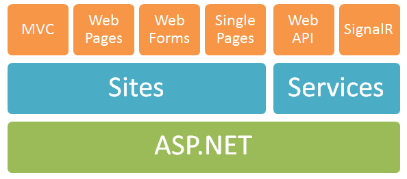

# RESTful API using Web API - Tutorial
## Requires
- Visual Studio 2012
## License
- Apache License, Version 2.0
## Technologies
- ASP.NET
- REST
- Entity Framework
- ASP.NET Web API
## Topics
- REST
- Web Services
- Entity Framework
- ASP.NET Web API
- Web API
## Updated
- 12/16/2013
## Description

<h1><strong>Introduction</strong></h1>

The ASP.NET Web API shipped with ASP.NET MVC4, it has been around more than one year and half. It is considered a framework for building HTTP services which can be consumed by broad&nbsp;range of clients such as browsers, smart
 phones, and desktop applications. It is not considered as a part of the MVC framework, it is part of the core ASP.NET platform and can be used in MVC projects,&nbsp;ASP.NET&nbsp;WebForms, or as stand alone web service.

Today with the increase of using smart phones and the trend of building Single Page Apps (SPA); having a light weight Web API which exposes your services data to clients is very important.&nbsp;ASP.NET&nbsp;Web API will help
 you out of the box in creating RESTFul compliant&nbsp;services using features of HTTP like (URIs, request/response, headers, versioning, and different content formats).

<h1>What we'll build in this sample?</h1>

We&rsquo;ll be building RESTful API for eLearning system, this API allows students to enroll in different courses, allows tutors to view students enrolled in each course, do CRUD operations on courses and students, and many
 more operations.

We&rsquo;ll discuss and implement different ASP.NET Web API features such as:

<ul>
<li>Using different routing configuration, controllers, resources association, formatting response, and filters.
</li><li>Implementing Dependency Injection using Ninject.
</li><li>Apply results pagination using different formatting techniques.
</li><li>Implementing complex CRUD operations on multiple resources.
</li><li>Securing Web API by using Basic authentication, forcing SSL.
</li><li>Implementing API Versioning using different techniques (URL versioning, by query string, by version header, and by accept header).
</li><li>Implement resources cashing. </li></ul>

I broke down this series into multiple posts, posts are:

<ul>
<li><a title="Building the Database Model using Entity Framework Code First" href="http://bitoftech.net/2013/11/25/building-database-model-entityframework-code-first" target="_blank">Building the Database Model using Entity Framework
 Code First &ndash; Part 1</a>. </li><li><a title="Applying the Repository Pattern for the Data Access Layer" href="http://bitoftech.net/2013/11/25/applying-repository-pattern-data-access-layer" target="_blank">Applying the Repository Pattern for the Data Access Layer
 &ndash; Part 2</a>. </li><li><a title="Getting started with ASP.Net Web API" href="http://bitoftech.net/2013/11/25/getting-started-asp-net-web-api" target="_blank">Getting started with ASP.Net Web API&nbsp;- Part 3</a>.
</li><li><a title="Implement Model Factory, Dependency Injection and Configuring Formatters" href="http://bitoftech.net/2013/11/25/implement-model-factory-dependency-injection-configuring-formatters-web-api" target="_blank">Implement
 Model Factory, Dependency Injection and Configuring Formatters&nbsp;- Part 4</a>.
</li><li><a title="Implement HTTP actions POST, PUT, and DELETE In Web API" href="http://bitoftech.net/2013/11/25/implement-http-actions-post-put-delete-web-api" target="_blank">Implement HTTP actions POST, PUT, and DELETE In Web API&nbsp;-
 Part 5</a>. </li><li><a title="Implement Resources Association ASP.Net Web API" href="http://bitoftech.net/2013/11/25/implement-resources-association-asp-net-web-api" target="_blank">Implement Resources Association&nbsp;- Part 6</a>.
</li><li><a title="Implement Resources Pagination ASP.Net Web API" href="http://bitoftech.net/2013/11/25/implement-resources-pagination-asp-net-web-api" target="_blank">Implement Resources Pagination&nbsp;- Part 7</a>.
</li><li><a title="enforce https asp net web api basic authentication" href="http://bitoftech.net/2013/12/03/enforce-https-asp-net-web-api-basic-authentication/" target="_blank">Securing Web API &ndash; Part 8</a>.
</li><li><a title="asp net web api versioning strategy" href="http://bitoftech.net/2013/12/16/asp-net-web-api-versioning-strategy/" target="_blank">Preparing Web API for Versioning &ndash; Part 9.</a>
</li><li><a title="asp net web api versioning accept header query string" href="http://bitoftech.net/2013/12/16/asp-net-web-api-versioning-accept-header-query-string/" target="_blank">Different techniques to Implement Versioning &ndash;
 Part 10</a>.<em> 
</em></li><li>Cashing resources using eTags &ndash; Part 11.&nbsp;(<em>Coming Soon)</em>
</li></ul>

&nbsp;

<h1>Requirements</h1>
<ul>
<li>Visual Studio 2012, Visual Studio 2010 SP1, Visual Web Developer 2010 SP1.ASP.NET
</li><li>MVC 4 - Already installed in Visual Studio 2012.
</li><li>IIS 7.5 Express.SQL </li><li>Server LocalDB (SqlLocalDB.MSI) or SQLExpress.
</li></ul>

&nbsp;

<h1>More Information</h1>

For detailed step by step instructions where you can follow with this code sample, please visit:<a title="Detailed Tutorial for Building ASP.Net Web API RESTful Service" href="http://bitoftech.net/2013/11/25/detailed-tutorial-building-asp-net-web-api-restful-service/">&nbsp;Detailed
 Tutorial for Building ASP.Net Web API RESTful Service</a>

