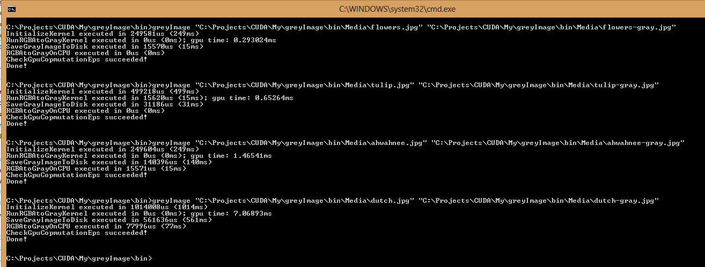
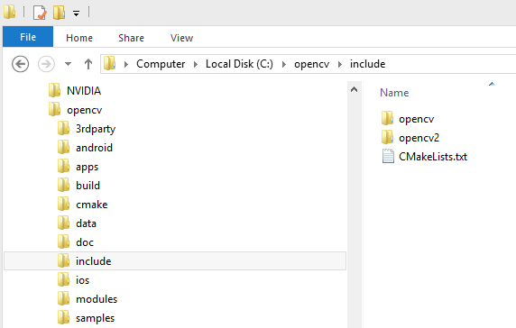
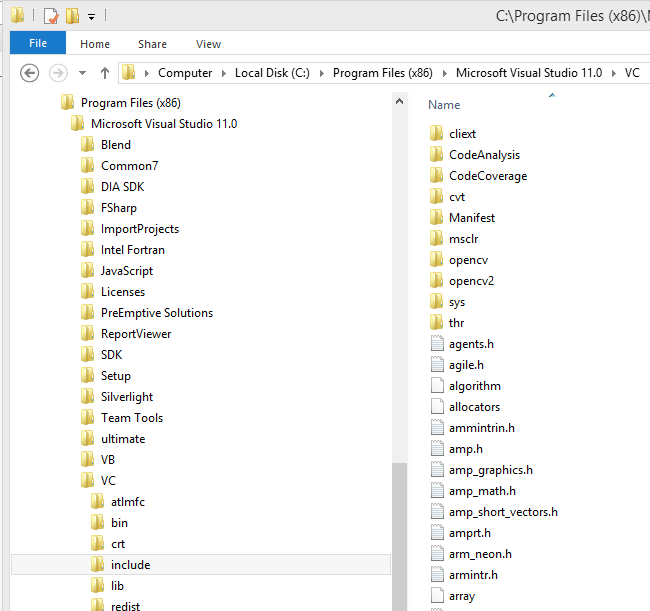
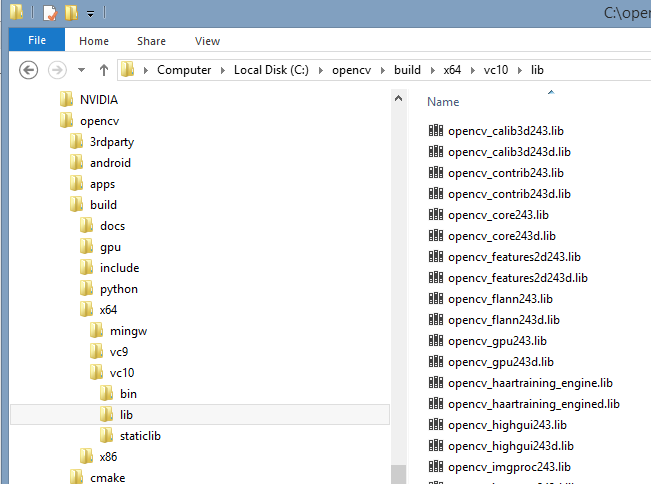
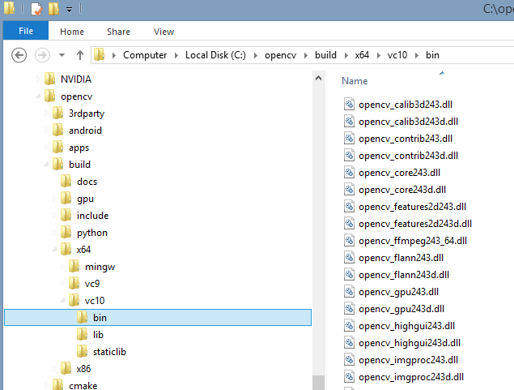
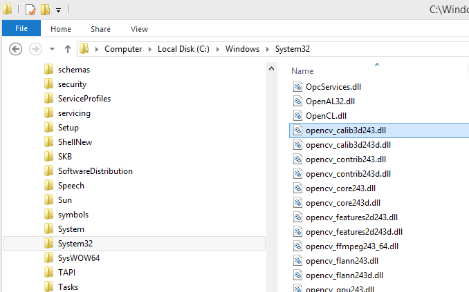

# RGBA to Gray image conversion with CUDA 5
## Requires
- Visual Studio 2012
## License
- Apache License, Version 2.0
## Technologies
- C++
- Parallel Programming
- CUDA
## Topics
- Parallel Programming
- CUDA
- GPGPU
## Updated
- 02/25/2013
## Description

<h1>Introduction</h1>

We will demonstrate a simple conversion from RGBA to grayscale image using CUDA 5, we will build on a
<a title="CUDA 5.0 and Visual Studio 2012 Configuration" href="http://code.msdn.microsoft.com/vstudio/CUDA-50-and-Visual-Studio-20e71aa1" target="_blank">
previous example</a> of a simple CUDA kernel. For example, the following RGB picture of flowers

will look like this after running the filter:

and to execute the application we will call it like this:

&nbsp;

This code will work with RGBA images where each channel (Red, Green, Blue, and Alpha) is represented by one byte (8-bits) and a range of values between 0 and 255 (2^8 - 1) for a total of 4-bytes per pixel.&nbsp;

Gray scale images are represented by a single intensity value per pixel where each pixel is only 1 byte, so after conversion we will have an image with only one channel and a pixel size of 1 byte.

Human eyes&nbsp;are more sensitive to green and least to blue. For that reason we will use weighted formula (<a href="http://en.wikipedia.org/wiki/Grayscale">http://en.wikipedia.org/wiki/Grayscale</a>):

I = 0.2126 * R &#43; 0.7152 * G &#43; 0.0722 * B

&nbsp;

<h1>Building the Sample</h1>

Required prerequisites are: CUDA 5.0, NSight 3.0 RC1, <a title="OpenCV download" href="http://opencv.org/downloads.html" target="_blank">
OpenCV</a>, Visual Studio 2012

<h1>Description</h1>

Start with configuring CUDA and OpenCV. The project will require the following header files and libraries:

&nbsp;

C&#43;&#43;

Edit|Remove

cplusplus
<pre class="hidden">#pragma once

#define NOMINMAX			// Use standard library min/max

#include &lt;cassert&gt;
#include &lt;chrono&gt;
#include &lt;cmath&gt;
#include &lt;iomanip&gt;
#include &lt;iostream&gt;
#include &lt;string&gt;

#include &lt;opencv2\core\core.hpp&gt;
#include &lt;opencv2\highgui\highgui.hpp&gt;
#include &lt;opencv2\opencv.hpp&gt;

#include &lt;cuda.h&gt;
#include &lt;cuda_runtime.h&gt;
#include &lt;cuda_runtime_api.h&gt;

// My headers
#include &quot;GpuTimer.h&quot;
#include &quot;Utilities.h&quot;

// Load libraries
#pragma comment(lib, &quot;cudart&quot;)

// opencv requires debug libraries when running indebug mode
#if _DEBUG
#pragma comment(lib, &quot;opencv_core243d&quot;)
#pragma comment(lib, &quot;opencv_imgproc243d&quot;)
#pragma comment(lib, &quot;opencv_highgui243d&quot;)
#pragma comment(lib, &quot;opencv_ml243d&quot;)
#pragma comment(lib, &quot;opencv_video243d&quot;)
#pragma comment(lib, &quot;opencv_features2d243d&quot;)
#pragma comment(lib, &quot;opencv_calib3d243d&quot;)
#pragma comment(lib, &quot;opencv_objdetect243d&quot;)
#pragma comment(lib, &quot;opencv_contrib243d&quot;)
#pragma comment(lib, &quot;opencv_legacy243d&quot;)
#pragma comment(lib, &quot;opencv_flann243d&quot;)
#else
#pragma comment(lib, &quot;opencv_core243&quot;)
#pragma comment(lib, &quot;opencv_imgproc243&quot;)
#pragma comment(lib, &quot;opencv_highgui243&quot;)
#pragma comment(lib, &quot;opencv_ml243&quot;)
#pragma comment(lib, &quot;opencv_video243&quot;)
#pragma comment(lib, &quot;opencv_features2d243&quot;)
#pragma comment(lib, &quot;opencv_calib3d243&quot;)
#pragma comment(lib, &quot;opencv_objdetect243&quot;)
#pragma comment(lib, &quot;opencv_contrib243&quot;)
#pragma comment(lib, &quot;opencv_legacy243&quot;)
#pragma comment(lib, &quot;opencv_flann243&quot;)
#endif</pre>

<pre class="cplusplus">#pragma&nbsp;once&nbsp;
&nbsp;
#define&nbsp;NOMINMAX&nbsp;&nbsp;&nbsp;&nbsp;&nbsp;&nbsp;&nbsp;&nbsp;&nbsp;&nbsp;&nbsp;&nbsp;//&nbsp;Use&nbsp;standard&nbsp;library&nbsp;min/max&nbsp;
&nbsp;
#include&nbsp;&lt;cassert&gt;&nbsp;
#include&nbsp;&lt;chrono&gt;&nbsp;
#include&nbsp;&lt;cmath&gt;&nbsp;
#include&nbsp;&lt;iomanip&gt;&nbsp;
#include&nbsp;&lt;iostream&gt;&nbsp;
#include&nbsp;&lt;string&gt;&nbsp;
&nbsp;
#include&nbsp;&lt;opencv2\core\core.hpp&gt;&nbsp;
#include&nbsp;&lt;opencv2\highgui\highgui.hpp&gt;&nbsp;
#include&nbsp;&lt;opencv2\opencv.hpp&gt;&nbsp;
&nbsp;
#include&nbsp;&lt;cuda.h&gt;&nbsp;
#include&nbsp;&lt;cuda_runtime.h&gt;&nbsp;
#include&nbsp;&lt;cuda_runtime_api.h&gt;&nbsp;
&nbsp;
//&nbsp;My&nbsp;headers&nbsp;
#include&nbsp;&quot;GpuTimer.h&quot;&nbsp;
#include&nbsp;&quot;Utilities.h&quot;&nbsp;
&nbsp;
//&nbsp;Load&nbsp;libraries&nbsp;
#pragma&nbsp;comment(lib,&nbsp;&quot;cudart&quot;)&nbsp;
&nbsp;
//&nbsp;opencv&nbsp;requires&nbsp;debug&nbsp;libraries&nbsp;when&nbsp;running&nbsp;indebug&nbsp;mode&nbsp;
#if&nbsp;_DEBUG&nbsp;
#pragma&nbsp;comment(lib,&nbsp;&quot;opencv_core243d&quot;)&nbsp;
#pragma&nbsp;comment(lib,&nbsp;&quot;opencv_imgproc243d&quot;)&nbsp;
#pragma&nbsp;comment(lib,&nbsp;&quot;opencv_highgui243d&quot;)&nbsp;
#pragma&nbsp;comment(lib,&nbsp;&quot;opencv_ml243d&quot;)&nbsp;
#pragma&nbsp;comment(lib,&nbsp;&quot;opencv_video243d&quot;)&nbsp;
#pragma&nbsp;comment(lib,&nbsp;&quot;opencv_features2d243d&quot;)&nbsp;
#pragma&nbsp;comment(lib,&nbsp;&quot;opencv_calib3d243d&quot;)&nbsp;
#pragma&nbsp;comment(lib,&nbsp;&quot;opencv_objdetect243d&quot;)&nbsp;
#pragma&nbsp;comment(lib,&nbsp;&quot;opencv_contrib243d&quot;)&nbsp;
#pragma&nbsp;comment(lib,&nbsp;&quot;opencv_legacy243d&quot;)&nbsp;
#pragma&nbsp;comment(lib,&nbsp;&quot;opencv_flann243d&quot;)&nbsp;
#else&nbsp;
#pragma&nbsp;comment(lib,&nbsp;&quot;opencv_core243&quot;)&nbsp;
#pragma&nbsp;comment(lib,&nbsp;&quot;opencv_imgproc243&quot;)&nbsp;
#pragma&nbsp;comment(lib,&nbsp;&quot;opencv_highgui243&quot;)&nbsp;
#pragma&nbsp;comment(lib,&nbsp;&quot;opencv_ml243&quot;)&nbsp;
#pragma&nbsp;comment(lib,&nbsp;&quot;opencv_video243&quot;)&nbsp;
#pragma&nbsp;comment(lib,&nbsp;&quot;opencv_features2d243&quot;)&nbsp;
#pragma&nbsp;comment(lib,&nbsp;&quot;opencv_calib3d243&quot;)&nbsp;
#pragma&nbsp;comment(lib,&nbsp;&quot;opencv_objdetect243&quot;)&nbsp;
#pragma&nbsp;comment(lib,&nbsp;&quot;opencv_contrib243&quot;)&nbsp;
#pragma&nbsp;comment(lib,&nbsp;&quot;opencv_legacy243&quot;)&nbsp;
#pragma&nbsp;comment(lib,&nbsp;&quot;opencv_flann243&quot;)&nbsp;
#endif</pre>

&nbsp;

The easiest way to configure OpenCV is to copy header files, lib files, and dlls to the appropriate folders on Windows.

Copy include files to Visual Studio VC include folder

&nbsp;

&nbsp;

&nbsp;

&nbsp;

lib files go to arm64 folder (we are building for x64 architecture).

&nbsp;

&nbsp;

And dlls go to system32 folder.

&nbsp;

&nbsp;

Note that OpenCV requires debug libraries (end with letter d) when running in debug mode.

We'll create a console application where our main function will get RGB and gray image paths from the input arguments and call into a helper class to do all the processing.

&nbsp;

C&#43;&#43;

Edit|Remove

cplusplus
<pre class="hidden">// Main entry into the application
int main(int argc, char** argv)
{
	string imagePath;
	string outputPath;

	if (argc &gt; 2)
	{
		imagePath = string(argv[1]);
		outputPath = string(argv[2]);
	}
	else
	{
		cerr &lt;&lt; &quot;Please provide input and output image files as arguments to this application.&quot; &lt;&lt; endl;
		exit(1);
	}

	Image image;

	try
	{
		image.ConvertRGBAtoGray(imagePath, outputPath);
	}
	catch(exception&amp; e)
	{
		cerr &lt;&lt; endl &lt;&lt; &quot;ERROR: &quot; &lt;&lt; e.what() &lt;&lt; endl;
		exit(1);
	}

	cout &lt;&lt; &quot;Done!&quot; &lt;&lt; endl &lt;&lt; endl;
	return 0;
}
</pre>

<pre class="cplusplus">//&nbsp;Main&nbsp;entry&nbsp;into&nbsp;the&nbsp;application&nbsp;
int&nbsp;main(int&nbsp;argc,&nbsp;char**&nbsp;argv)&nbsp;
{&nbsp;
&nbsp;&nbsp;&nbsp;&nbsp;string&nbsp;imagePath;&nbsp;
&nbsp;&nbsp;&nbsp;&nbsp;string&nbsp;outputPath;&nbsp;
&nbsp;
&nbsp;&nbsp;&nbsp;&nbsp;if&nbsp;(argc&nbsp;&gt;&nbsp;2)&nbsp;
&nbsp;&nbsp;&nbsp;&nbsp;{&nbsp;
&nbsp;&nbsp;&nbsp;&nbsp;&nbsp;&nbsp;&nbsp;&nbsp;imagePath&nbsp;=&nbsp;string(argv[1]);&nbsp;
&nbsp;&nbsp;&nbsp;&nbsp;&nbsp;&nbsp;&nbsp;&nbsp;outputPath&nbsp;=&nbsp;string(argv[2]);&nbsp;
&nbsp;&nbsp;&nbsp;&nbsp;}&nbsp;
&nbsp;&nbsp;&nbsp;&nbsp;else&nbsp;
&nbsp;&nbsp;&nbsp;&nbsp;{&nbsp;
&nbsp;&nbsp;&nbsp;&nbsp;&nbsp;&nbsp;&nbsp;&nbsp;cerr&nbsp;&lt;&lt;&nbsp;&quot;Please&nbsp;provide&nbsp;input&nbsp;and&nbsp;output&nbsp;image&nbsp;files&nbsp;as&nbsp;arguments&nbsp;to&nbsp;this&nbsp;application.&quot;&nbsp;&lt;&lt;&nbsp;endl;&nbsp;
&nbsp;&nbsp;&nbsp;&nbsp;&nbsp;&nbsp;&nbsp;&nbsp;exit(1);&nbsp;
&nbsp;&nbsp;&nbsp;&nbsp;}&nbsp;
&nbsp;
&nbsp;&nbsp;&nbsp;&nbsp;Image&nbsp;image;&nbsp;
&nbsp;
&nbsp;&nbsp;&nbsp;&nbsp;try&nbsp;
&nbsp;&nbsp;&nbsp;&nbsp;{&nbsp;
&nbsp;&nbsp;&nbsp;&nbsp;&nbsp;&nbsp;&nbsp;&nbsp;image.ConvertRGBAtoGray(imagePath,&nbsp;outputPath);&nbsp;
&nbsp;&nbsp;&nbsp;&nbsp;}&nbsp;
&nbsp;&nbsp;&nbsp;&nbsp;catch(exception&amp;&nbsp;e)&nbsp;
&nbsp;&nbsp;&nbsp;&nbsp;{&nbsp;
&nbsp;&nbsp;&nbsp;&nbsp;&nbsp;&nbsp;&nbsp;&nbsp;cerr&nbsp;&lt;&lt;&nbsp;endl&nbsp;&lt;&lt;&nbsp;&quot;ERROR:&nbsp;&quot;&nbsp;&lt;&lt;&nbsp;e.what()&nbsp;&lt;&lt;&nbsp;endl;&nbsp;
&nbsp;&nbsp;&nbsp;&nbsp;&nbsp;&nbsp;&nbsp;&nbsp;exit(1);&nbsp;
&nbsp;&nbsp;&nbsp;&nbsp;}&nbsp;
&nbsp;
&nbsp;&nbsp;&nbsp;&nbsp;cout&nbsp;&lt;&lt;&nbsp;&quot;Done!&quot;&nbsp;&lt;&lt;&nbsp;endl&nbsp;&lt;&lt;&nbsp;endl;&nbsp;
&nbsp;&nbsp;&nbsp;&nbsp;return&nbsp;0;&nbsp;
}&nbsp;
</pre>

&nbsp;

The image class will contain representation of images on the host (CPU) and the device (GPU) and one function to do the conversion from RGBA to gray.

C&#43;&#43;

Edit|Remove

cplusplus
<pre class="hidden">namespace Bisque
{
	using cv::Mat;
	using std::string;

	// class Image
	class Image
	{
	public:
		Image(void);
		~Image(void);

		void ConvertRGBAtoGray(const string&amp; imagePath, const string&amp; outputPath);

	private:
		struct ImageHandle
		{
			Mat rgba;
			Mat gray;
		};

		// struct KernelMap
		struct KernelMap
		{
			uchar4*			rgba;				// rgba image: 4 bytes per image
			unsigned char*	gray;				// gray image: 1 byte per image
		};

	private:
		void RGBAtoGrayOnCPU		(unsigned char* gray, const uchar4* const rgba, int rows, int cols);
		void InitializeKernel		(KernelMap&amp; host, KernelMap&amp; device, const string&amp; imagePath);
		void SaveGrayImageToDisk	(const string&amp; imagePath);
		void VerifyGpuComputation	(const uchar4* const rgba);

	private:
		KernelMap		m_device;
		ImageHandle		m_host;
	};
}</pre>

<pre class="cplusplus">namespace&nbsp;Bisque&nbsp;
{&nbsp;
&nbsp;&nbsp;&nbsp;&nbsp;using&nbsp;cv::Mat;&nbsp;
&nbsp;&nbsp;&nbsp;&nbsp;using&nbsp;std::string;&nbsp;
&nbsp;
&nbsp;&nbsp;&nbsp;&nbsp;//&nbsp;class&nbsp;Image&nbsp;
&nbsp;&nbsp;&nbsp;&nbsp;class&nbsp;Image&nbsp;
&nbsp;&nbsp;&nbsp;&nbsp;{&nbsp;
&nbsp;&nbsp;&nbsp;&nbsp;public:&nbsp;
&nbsp;&nbsp;&nbsp;&nbsp;&nbsp;&nbsp;&nbsp;&nbsp;Image(void);&nbsp;
&nbsp;&nbsp;&nbsp;&nbsp;&nbsp;&nbsp;&nbsp;&nbsp;~Image(void);&nbsp;
&nbsp;
&nbsp;&nbsp;&nbsp;&nbsp;&nbsp;&nbsp;&nbsp;&nbsp;void&nbsp;ConvertRGBAtoGray(const&nbsp;string&amp;&nbsp;imagePath,&nbsp;const&nbsp;string&amp;&nbsp;outputPath);&nbsp;
&nbsp;
&nbsp;&nbsp;&nbsp;&nbsp;private:&nbsp;
&nbsp;&nbsp;&nbsp;&nbsp;&nbsp;&nbsp;&nbsp;&nbsp;struct&nbsp;ImageHandle&nbsp;
&nbsp;&nbsp;&nbsp;&nbsp;&nbsp;&nbsp;&nbsp;&nbsp;{&nbsp;
&nbsp;&nbsp;&nbsp;&nbsp;&nbsp;&nbsp;&nbsp;&nbsp;&nbsp;&nbsp;&nbsp;&nbsp;Mat&nbsp;rgba;&nbsp;
&nbsp;&nbsp;&nbsp;&nbsp;&nbsp;&nbsp;&nbsp;&nbsp;&nbsp;&nbsp;&nbsp;&nbsp;Mat&nbsp;gray;&nbsp;
&nbsp;&nbsp;&nbsp;&nbsp;&nbsp;&nbsp;&nbsp;&nbsp;};&nbsp;
&nbsp;
&nbsp;&nbsp;&nbsp;&nbsp;&nbsp;&nbsp;&nbsp;&nbsp;//&nbsp;struct&nbsp;KernelMap&nbsp;
&nbsp;&nbsp;&nbsp;&nbsp;&nbsp;&nbsp;&nbsp;&nbsp;struct&nbsp;KernelMap&nbsp;
&nbsp;&nbsp;&nbsp;&nbsp;&nbsp;&nbsp;&nbsp;&nbsp;{&nbsp;
&nbsp;&nbsp;&nbsp;&nbsp;&nbsp;&nbsp;&nbsp;&nbsp;&nbsp;&nbsp;&nbsp;&nbsp;uchar4*&nbsp;&nbsp;&nbsp;&nbsp;&nbsp;&nbsp;&nbsp;&nbsp;&nbsp;&nbsp;&nbsp;&nbsp;rgba;&nbsp;&nbsp;&nbsp;&nbsp;&nbsp;&nbsp;&nbsp;&nbsp;&nbsp;&nbsp;&nbsp;&nbsp;&nbsp;&nbsp;&nbsp;&nbsp;//&nbsp;rgba&nbsp;image:&nbsp;4&nbsp;bytes&nbsp;per&nbsp;image&nbsp;
&nbsp;&nbsp;&nbsp;&nbsp;&nbsp;&nbsp;&nbsp;&nbsp;&nbsp;&nbsp;&nbsp;&nbsp;unsigned&nbsp;char*&nbsp;&nbsp;&nbsp;&nbsp;gray;&nbsp;&nbsp;&nbsp;&nbsp;&nbsp;&nbsp;&nbsp;&nbsp;&nbsp;&nbsp;&nbsp;&nbsp;&nbsp;&nbsp;&nbsp;&nbsp;//&nbsp;gray&nbsp;image:&nbsp;1&nbsp;byte&nbsp;per&nbsp;image&nbsp;
&nbsp;&nbsp;&nbsp;&nbsp;&nbsp;&nbsp;&nbsp;&nbsp;};&nbsp;
&nbsp;
&nbsp;&nbsp;&nbsp;&nbsp;private:&nbsp;
&nbsp;&nbsp;&nbsp;&nbsp;&nbsp;&nbsp;&nbsp;&nbsp;void&nbsp;RGBAtoGrayOnCPU&nbsp;&nbsp;&nbsp;&nbsp;&nbsp;&nbsp;&nbsp;&nbsp;(unsigned&nbsp;char*&nbsp;gray,&nbsp;const&nbsp;uchar4*&nbsp;const&nbsp;rgba,&nbsp;int&nbsp;rows,&nbsp;int&nbsp;cols);&nbsp;
&nbsp;&nbsp;&nbsp;&nbsp;&nbsp;&nbsp;&nbsp;&nbsp;void&nbsp;InitializeKernel&nbsp;&nbsp;&nbsp;&nbsp;&nbsp;&nbsp;&nbsp;&nbsp;(KernelMap&amp;&nbsp;host,&nbsp;KernelMap&amp;&nbsp;device,&nbsp;const&nbsp;string&amp;&nbsp;imagePath);&nbsp;
&nbsp;&nbsp;&nbsp;&nbsp;&nbsp;&nbsp;&nbsp;&nbsp;void&nbsp;SaveGrayImageToDisk&nbsp;&nbsp;&nbsp;&nbsp;(const&nbsp;string&amp;&nbsp;imagePath);&nbsp;
&nbsp;&nbsp;&nbsp;&nbsp;&nbsp;&nbsp;&nbsp;&nbsp;void&nbsp;VerifyGpuComputation&nbsp;&nbsp;&nbsp;&nbsp;(const&nbsp;uchar4*&nbsp;const&nbsp;rgba);&nbsp;
&nbsp;
&nbsp;&nbsp;&nbsp;&nbsp;private:&nbsp;
&nbsp;&nbsp;&nbsp;&nbsp;&nbsp;&nbsp;&nbsp;&nbsp;KernelMap&nbsp;&nbsp;&nbsp;&nbsp;&nbsp;&nbsp;&nbsp;&nbsp;m_device;&nbsp;
&nbsp;&nbsp;&nbsp;&nbsp;&nbsp;&nbsp;&nbsp;&nbsp;ImageHandle&nbsp;&nbsp;&nbsp;&nbsp;&nbsp;&nbsp;&nbsp;&nbsp;m_host;&nbsp;
&nbsp;&nbsp;&nbsp;&nbsp;};&nbsp;
}</pre>

&nbsp;The convert to gray function has to do the following 3 things:

<ol>
<li>

Initialize kernel and copy RGBA image to the GPU memory;

</li><li>

Execute CUDA kernel;

</li><li>

Copy gray image from the GPU back to main memory.

</li></ol>

C&#43;&#43;

Edit|Remove

cplusplus
<pre class="hidden">//Converts r8g8b8a8 image to one channel gray
void Image::ConvertRGBAtoGray(const string&amp; imagePath, const string&amp; outputPath)
{
	// Load image and initialize kernel
	KernelMap host;
	KernelMap device;

	InitializeKernel(host, device, imagePath);

	// Run kernel: convert rgba image to gray
	RunRGBAtoGrayKernel(
		device.gray, 
		device.rgba, 
		m_host.rgba.rows, 
		m_host.rgba.cols
		);

	// Save gray image to disk
	SaveGrayImageToDisk(outputPath);

#if 1			// Change to 1 to enable
	// Validate GPU convertion against CPU result.
	// Only turn it when you want to run validation because CPU calculation will be slow.
	VerifyGpuComputation(host.rgba);
#endif

	// Release cuda
	hr = cudaFree(m_device.gray);
	hr = cudaFree(m_device.rgba);
}
</pre>

<pre class="cplusplus">//Converts&nbsp;r8g8b8a8&nbsp;image&nbsp;to&nbsp;one&nbsp;channel&nbsp;gray&nbsp;
void&nbsp;Image::ConvertRGBAtoGray(const&nbsp;string&amp;&nbsp;imagePath,&nbsp;const&nbsp;string&amp;&nbsp;outputPath)&nbsp;
{&nbsp;
&nbsp;&nbsp;&nbsp;&nbsp;//&nbsp;Load&nbsp;image&nbsp;and&nbsp;initialize&nbsp;kernel&nbsp;
&nbsp;&nbsp;&nbsp;&nbsp;KernelMap&nbsp;host;&nbsp;
&nbsp;&nbsp;&nbsp;&nbsp;KernelMap&nbsp;device;&nbsp;
&nbsp;
&nbsp;&nbsp;&nbsp;&nbsp;InitializeKernel(host,&nbsp;device,&nbsp;imagePath);&nbsp;
&nbsp;
&nbsp;&nbsp;&nbsp;&nbsp;//&nbsp;Run&nbsp;kernel:&nbsp;convert&nbsp;rgba&nbsp;image&nbsp;to&nbsp;gray&nbsp;
&nbsp;&nbsp;&nbsp;&nbsp;RunRGBAtoGrayKernel(&nbsp;
&nbsp;&nbsp;&nbsp;&nbsp;&nbsp;&nbsp;&nbsp;&nbsp;device.gray,&nbsp;&nbsp;
&nbsp;&nbsp;&nbsp;&nbsp;&nbsp;&nbsp;&nbsp;&nbsp;device.rgba,&nbsp;&nbsp;
&nbsp;&nbsp;&nbsp;&nbsp;&nbsp;&nbsp;&nbsp;&nbsp;m_host.rgba.rows,&nbsp;&nbsp;
&nbsp;&nbsp;&nbsp;&nbsp;&nbsp;&nbsp;&nbsp;&nbsp;m_host.rgba.cols&nbsp;
&nbsp;&nbsp;&nbsp;&nbsp;&nbsp;&nbsp;&nbsp;&nbsp;);&nbsp;
&nbsp;
&nbsp;&nbsp;&nbsp;&nbsp;//&nbsp;Save&nbsp;gray&nbsp;image&nbsp;to&nbsp;disk&nbsp;
&nbsp;&nbsp;&nbsp;&nbsp;SaveGrayImageToDisk(outputPath);&nbsp;
&nbsp;
#if&nbsp;1&nbsp;&nbsp;&nbsp;&nbsp;&nbsp;&nbsp;&nbsp;&nbsp;&nbsp;&nbsp;&nbsp;&nbsp;//&nbsp;Change&nbsp;to&nbsp;1&nbsp;to&nbsp;enable&nbsp;
&nbsp;&nbsp;&nbsp;&nbsp;//&nbsp;Validate&nbsp;GPU&nbsp;convertion&nbsp;against&nbsp;CPU&nbsp;result.&nbsp;
&nbsp;&nbsp;&nbsp;&nbsp;//&nbsp;Only&nbsp;turn&nbsp;it&nbsp;when&nbsp;you&nbsp;want&nbsp;to&nbsp;run&nbsp;validation&nbsp;because&nbsp;CPU&nbsp;calculation&nbsp;will&nbsp;be&nbsp;slow.&nbsp;
&nbsp;&nbsp;&nbsp;&nbsp;VerifyGpuComputation(host.rgba);&nbsp;
#endif&nbsp;
&nbsp;
&nbsp;&nbsp;&nbsp;&nbsp;//&nbsp;Release&nbsp;cuda&nbsp;
&nbsp;&nbsp;&nbsp;&nbsp;hr&nbsp;=&nbsp;cudaFree(m_device.gray);&nbsp;
&nbsp;&nbsp;&nbsp;&nbsp;hr&nbsp;=&nbsp;cudaFree(m_device.rgba);&nbsp;
}&nbsp;
</pre>

&nbsp;

In the kernel.cu CUDA file, we have to allocate number of parallel executions on which we will process each pixel in the image and call actual kernel

&nbsp;

C&#43;&#43;

Edit|Remove

cplusplus
<pre class="hidden">// Runs r8g8b8a8 to gray kernel
void RunRGBAtoGrayKernel(
		unsigned char*	gray,				// gray image: 1 byte per image --&gt; this will be returned from this function
		uchar4*			rgba,				// rgba image: 4 bytes per image
		int				rows,				// image size: number of rows
		int				cols				// image size: number of columns
	)
{
	const char* func = &quot;RunGrayKernel&quot;;

	cudaError hr = cudaSuccess;

	int x = static_cast&lt;int&gt;(ceilf(static_cast&lt;float&gt;(cols) / BLOCK_WIDTH));
	int y = static_cast&lt;int&gt;(ceilf(static_cast&lt;float&gt;(rows) / BLOCK_WIDTH));

	const dim3 grid (x, y, 1);								// number of blocks
	const dim3 block(BLOCK_WIDTH, BLOCK_WIDTH, 1);			// block width: number of threads per block
		
	rgba_to_grayscale&lt;&lt;&lt;grid, block&gt;&gt;&gt;(gray, rgba, rows, cols);

	hr = cudaDeviceSynchronize();																CHECK_CUDA_ERROR(hr, func, &quot;rgba_to_grayscale failed.&quot;);
}
</pre>

<pre class="cplusplus">//&nbsp;Runs&nbsp;r8g8b8a8&nbsp;to&nbsp;gray&nbsp;kernel&nbsp;
void&nbsp;RunRGBAtoGrayKernel(&nbsp;
&nbsp;&nbsp;&nbsp;&nbsp;&nbsp;&nbsp;&nbsp;&nbsp;unsigned&nbsp;char*&nbsp;&nbsp;&nbsp;&nbsp;gray,&nbsp;&nbsp;&nbsp;&nbsp;&nbsp;&nbsp;&nbsp;&nbsp;&nbsp;&nbsp;&nbsp;&nbsp;&nbsp;&nbsp;&nbsp;&nbsp;//&nbsp;gray&nbsp;image:&nbsp;1&nbsp;byte&nbsp;per&nbsp;image&nbsp;--&gt;&nbsp;this&nbsp;will&nbsp;be&nbsp;returned&nbsp;from&nbsp;this&nbsp;function&nbsp;
&nbsp;&nbsp;&nbsp;&nbsp;&nbsp;&nbsp;&nbsp;&nbsp;uchar4*&nbsp;&nbsp;&nbsp;&nbsp;&nbsp;&nbsp;&nbsp;&nbsp;&nbsp;&nbsp;&nbsp;&nbsp;rgba,&nbsp;&nbsp;&nbsp;&nbsp;&nbsp;&nbsp;&nbsp;&nbsp;&nbsp;&nbsp;&nbsp;&nbsp;&nbsp;&nbsp;&nbsp;&nbsp;//&nbsp;rgba&nbsp;image:&nbsp;4&nbsp;bytes&nbsp;per&nbsp;image&nbsp;
&nbsp;&nbsp;&nbsp;&nbsp;&nbsp;&nbsp;&nbsp;&nbsp;int&nbsp;&nbsp;&nbsp;&nbsp;&nbsp;&nbsp;&nbsp;&nbsp;&nbsp;&nbsp;&nbsp;&nbsp;&nbsp;&nbsp;&nbsp;&nbsp;rows,&nbsp;&nbsp;&nbsp;&nbsp;&nbsp;&nbsp;&nbsp;&nbsp;&nbsp;&nbsp;&nbsp;&nbsp;&nbsp;&nbsp;&nbsp;&nbsp;//&nbsp;image&nbsp;size:&nbsp;number&nbsp;of&nbsp;rows&nbsp;
&nbsp;&nbsp;&nbsp;&nbsp;&nbsp;&nbsp;&nbsp;&nbsp;int&nbsp;&nbsp;&nbsp;&nbsp;&nbsp;&nbsp;&nbsp;&nbsp;&nbsp;&nbsp;&nbsp;&nbsp;&nbsp;&nbsp;&nbsp;&nbsp;cols&nbsp;&nbsp;&nbsp;&nbsp;&nbsp;&nbsp;&nbsp;&nbsp;&nbsp;&nbsp;&nbsp;&nbsp;&nbsp;&nbsp;&nbsp;&nbsp;//&nbsp;image&nbsp;size:&nbsp;number&nbsp;of&nbsp;columns&nbsp;
&nbsp;&nbsp;&nbsp;&nbsp;)&nbsp;
{&nbsp;
&nbsp;&nbsp;&nbsp;&nbsp;const&nbsp;char*&nbsp;func&nbsp;=&nbsp;&quot;RunGrayKernel&quot;;&nbsp;
&nbsp;
&nbsp;&nbsp;&nbsp;&nbsp;cudaError&nbsp;hr&nbsp;=&nbsp;cudaSuccess;&nbsp;
&nbsp;
&nbsp;&nbsp;&nbsp;&nbsp;int&nbsp;x&nbsp;=&nbsp;static_cast&lt;int&gt;(ceilf(static_cast&lt;float&gt;(cols)&nbsp;/&nbsp;BLOCK_WIDTH));&nbsp;
&nbsp;&nbsp;&nbsp;&nbsp;int&nbsp;y&nbsp;=&nbsp;static_cast&lt;int&gt;(ceilf(static_cast&lt;float&gt;(rows)&nbsp;/&nbsp;BLOCK_WIDTH));&nbsp;
&nbsp;
&nbsp;&nbsp;&nbsp;&nbsp;const&nbsp;dim3&nbsp;grid&nbsp;(x,&nbsp;y,&nbsp;1);&nbsp;&nbsp;&nbsp;&nbsp;&nbsp;&nbsp;&nbsp;&nbsp;&nbsp;&nbsp;&nbsp;&nbsp;&nbsp;&nbsp;&nbsp;&nbsp;&nbsp;&nbsp;&nbsp;&nbsp;&nbsp;&nbsp;&nbsp;&nbsp;&nbsp;&nbsp;&nbsp;&nbsp;&nbsp;&nbsp;&nbsp;&nbsp;//&nbsp;number&nbsp;of&nbsp;blocks&nbsp;
&nbsp;&nbsp;&nbsp;&nbsp;const&nbsp;dim3&nbsp;block(BLOCK_WIDTH,&nbsp;BLOCK_WIDTH,&nbsp;1);&nbsp;&nbsp;&nbsp;&nbsp;&nbsp;&nbsp;&nbsp;&nbsp;&nbsp;&nbsp;&nbsp;&nbsp;//&nbsp;block&nbsp;width:&nbsp;number&nbsp;of&nbsp;threads&nbsp;per&nbsp;block&nbsp;
&nbsp;&nbsp;&nbsp;&nbsp;&nbsp;&nbsp;&nbsp;&nbsp;&nbsp;
&nbsp;&nbsp;&nbsp;&nbsp;rgba_to_grayscale&lt;&lt;&lt;grid,&nbsp;block&gt;&gt;&gt;(gray,&nbsp;rgba,&nbsp;rows,&nbsp;cols);&nbsp;
&nbsp;
&nbsp;&nbsp;&nbsp;&nbsp;hr&nbsp;=&nbsp;cudaDeviceSynchronize();&nbsp;&nbsp;&nbsp;&nbsp;&nbsp;&nbsp;&nbsp;&nbsp;&nbsp;&nbsp;&nbsp;&nbsp;&nbsp;&nbsp;&nbsp;&nbsp;&nbsp;&nbsp;&nbsp;&nbsp;&nbsp;&nbsp;&nbsp;&nbsp;&nbsp;&nbsp;&nbsp;&nbsp;&nbsp;&nbsp;&nbsp;&nbsp;&nbsp;&nbsp;&nbsp;&nbsp;&nbsp;&nbsp;&nbsp;&nbsp;&nbsp;&nbsp;&nbsp;&nbsp;&nbsp;&nbsp;&nbsp;&nbsp;&nbsp;&nbsp;&nbsp;&nbsp;&nbsp;&nbsp;&nbsp;&nbsp;&nbsp;&nbsp;&nbsp;&nbsp;&nbsp;&nbsp;&nbsp;&nbsp;CHECK_CUDA_ERROR(hr,&nbsp;func,&nbsp;&quot;rgba_to_grayscale&nbsp;failed.&quot;);&nbsp;
}&nbsp;
</pre>

&nbsp;

Here, before calling the kernel, we have to decide on the number of threads that we want to process the image on. Naturally, we want threads to be the same or close to the image size: x corresponding to image rows, and y to image
 columns. That's what this code does where M is number of threads per block, I selected 32. Variable block below means block width, or number of threads per block. Variable grid is number of blocks. To remind, GPU runs blocks of threads on Streaming Multiprocessors
 where a block can have up to 1024 threads. Block of threads executes on the same SM.

C&#43;&#43;

Edit|Remove

cplusplus
<pre class="hidden">	int x = static_cast&lt;int&gt;(ceilf(static_cast&lt;float&gt;(cols) / BLOCK_WIDTH));
	int y = static_cast&lt;int&gt;(ceilf(static_cast&lt;float&gt;(rows) / BLOCK_WIDTH));

	const dim3 grid (x, y, 1);								// number of blocks
	const dim3 block(BLOCK_WIDTH, BLOCK_WIDTH, 1);			// block width: number of threads per block
		
	rgba_to_grayscale&lt;&lt;&lt;grid, block&gt;&gt;&gt;(gray, rgba, rows, cols);
</pre>

<pre class="cplusplus">&nbsp;&nbsp;&nbsp;&nbsp;int&nbsp;x&nbsp;=&nbsp;static_cast&lt;int&gt;(ceilf(static_cast&lt;float&gt;(cols)&nbsp;/&nbsp;BLOCK_WIDTH));&nbsp;
&nbsp;&nbsp;&nbsp;&nbsp;int&nbsp;y&nbsp;=&nbsp;static_cast&lt;int&gt;(ceilf(static_cast&lt;float&gt;(rows)&nbsp;/&nbsp;BLOCK_WIDTH));&nbsp;
&nbsp;
&nbsp;&nbsp;&nbsp;&nbsp;const&nbsp;dim3&nbsp;grid&nbsp;(x,&nbsp;y,&nbsp;1);&nbsp;&nbsp;&nbsp;&nbsp;&nbsp;&nbsp;&nbsp;&nbsp;&nbsp;&nbsp;&nbsp;&nbsp;&nbsp;&nbsp;&nbsp;&nbsp;&nbsp;&nbsp;&nbsp;&nbsp;&nbsp;&nbsp;&nbsp;&nbsp;&nbsp;&nbsp;&nbsp;&nbsp;&nbsp;&nbsp;&nbsp;&nbsp;//&nbsp;number&nbsp;of&nbsp;blocks&nbsp;
&nbsp;&nbsp;&nbsp;&nbsp;const&nbsp;dim3&nbsp;block(BLOCK_WIDTH,&nbsp;BLOCK_WIDTH,&nbsp;1);&nbsp;&nbsp;&nbsp;&nbsp;&nbsp;&nbsp;&nbsp;&nbsp;&nbsp;&nbsp;&nbsp;&nbsp;//&nbsp;block&nbsp;width:&nbsp;number&nbsp;of&nbsp;threads&nbsp;per&nbsp;block&nbsp;
&nbsp;&nbsp;&nbsp;&nbsp;&nbsp;&nbsp;&nbsp;&nbsp;&nbsp;
&nbsp;&nbsp;&nbsp;&nbsp;rgba_to_grayscale&lt;&lt;&lt;grid,&nbsp;block&gt;&gt;&gt;(gray,&nbsp;rgba,&nbsp;rows,&nbsp;cols);&nbsp;
</pre>

In the kernel, we have to compute pixel location from block id along x and y coordinates, block width (32 threads per block), and thread id within the block.

&nbsp;

C&#43;&#43;

Edit|Remove

cplusplus
<pre class="hidden">// Converts RGBA image to gray scale intensity using the following formula:
// I = 0.2126 * R &#43; 0.7152 * G &#43; 0.0722 * B
__global__ 
void rgba_to_grayscale(unsigned char* const gray, const uchar4* const rgba, int rows, int cols)
{
	int r			=  blockIdx.y * blockDim.y &#43; threadIdx.y;		// current row
	int c			=  blockIdx.x * blockDim.x &#43; threadIdx.x;		// current column

	if ((r &lt; rows) &amp;&amp; (c &lt; cols))
	{
		int idx			= c &#43; cols * r;		// current pixel index

		uchar4 pixel	= rgba[idx];
		float intensity = 0.2126f * pixel.x &#43; 0.7152f * pixel.y &#43; 0.0722f * pixel.z;

		gray[idx]		= (unsigned char)intensity;
	}
}
</pre>

<pre class="cplusplus">//&nbsp;Converts&nbsp;RGBA&nbsp;image&nbsp;to&nbsp;gray&nbsp;scale&nbsp;intensity&nbsp;using&nbsp;the&nbsp;following&nbsp;formula:&nbsp;
//&nbsp;I&nbsp;=&nbsp;0.2126&nbsp;*&nbsp;R&nbsp;&#43;&nbsp;0.7152&nbsp;*&nbsp;G&nbsp;&#43;&nbsp;0.0722&nbsp;*&nbsp;B&nbsp;
__global__&nbsp;&nbsp;
void&nbsp;rgba_to_grayscale(unsigned&nbsp;char*&nbsp;const&nbsp;gray,&nbsp;const&nbsp;uchar4*&nbsp;const&nbsp;rgba,&nbsp;int&nbsp;rows,&nbsp;int&nbsp;cols)&nbsp;
{&nbsp;
&nbsp;&nbsp;&nbsp;&nbsp;int&nbsp;r&nbsp;&nbsp;&nbsp;&nbsp;&nbsp;&nbsp;&nbsp;&nbsp;&nbsp;&nbsp;&nbsp;&nbsp;=&nbsp;&nbsp;blockIdx.y&nbsp;*&nbsp;blockDim.y&nbsp;&#43;&nbsp;threadIdx.y;&nbsp;&nbsp;&nbsp;&nbsp;&nbsp;&nbsp;&nbsp;&nbsp;//&nbsp;current&nbsp;row&nbsp;
&nbsp;&nbsp;&nbsp;&nbsp;int&nbsp;c&nbsp;&nbsp;&nbsp;&nbsp;&nbsp;&nbsp;&nbsp;&nbsp;&nbsp;&nbsp;&nbsp;&nbsp;=&nbsp;&nbsp;blockIdx.x&nbsp;*&nbsp;blockDim.x&nbsp;&#43;&nbsp;threadIdx.x;&nbsp;&nbsp;&nbsp;&nbsp;&nbsp;&nbsp;&nbsp;&nbsp;//&nbsp;current&nbsp;column&nbsp;
&nbsp;
&nbsp;&nbsp;&nbsp;&nbsp;if&nbsp;((r&nbsp;&lt;&nbsp;rows)&nbsp;&amp;&amp;&nbsp;(c&nbsp;&lt;&nbsp;cols))&nbsp;
&nbsp;&nbsp;&nbsp;&nbsp;{&nbsp;
&nbsp;&nbsp;&nbsp;&nbsp;&nbsp;&nbsp;&nbsp;&nbsp;int&nbsp;idx&nbsp;&nbsp;&nbsp;&nbsp;&nbsp;&nbsp;&nbsp;&nbsp;&nbsp;&nbsp;&nbsp;&nbsp;=&nbsp;c&nbsp;&#43;&nbsp;cols&nbsp;*&nbsp;r;&nbsp;&nbsp;&nbsp;&nbsp;&nbsp;&nbsp;&nbsp;&nbsp;//&nbsp;current&nbsp;pixel&nbsp;index&nbsp;
&nbsp;
&nbsp;&nbsp;&nbsp;&nbsp;&nbsp;&nbsp;&nbsp;&nbsp;uchar4&nbsp;pixel&nbsp;&nbsp;&nbsp;&nbsp;=&nbsp;rgba[idx];&nbsp;
&nbsp;&nbsp;&nbsp;&nbsp;&nbsp;&nbsp;&nbsp;&nbsp;float&nbsp;intensity&nbsp;=&nbsp;0.2126f&nbsp;*&nbsp;pixel.x&nbsp;&#43;&nbsp;0.7152f&nbsp;*&nbsp;pixel.y&nbsp;&#43;&nbsp;0.0722f&nbsp;*&nbsp;pixel.z;&nbsp;
&nbsp;
&nbsp;&nbsp;&nbsp;&nbsp;&nbsp;&nbsp;&nbsp;&nbsp;gray[idx]&nbsp;&nbsp;&nbsp;&nbsp;&nbsp;&nbsp;&nbsp;&nbsp;=&nbsp;(unsigned&nbsp;char)intensity;&nbsp;
&nbsp;&nbsp;&nbsp;&nbsp;}&nbsp;
}&nbsp;
</pre>

&nbsp;

Finally, we check conversion results by runnig the same calculation on CPU and comparing pixels.

&nbsp;

<h1>Source Code Files</h1>
<dl><dt>program.cpp - main function.</dt></dl>

image.h and image.cpp - responsible for loading and saving images, initializing CUDA kernel and managing memory;

utilities - checks runtime errors and compares pixels from GPU conversion to reference conversion on CPU;

gputimer - events to measure execution time on the GPU in milliseconds

&nbsp;

&nbsp;

<dl></dl>
