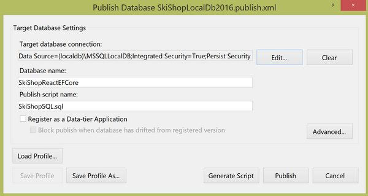
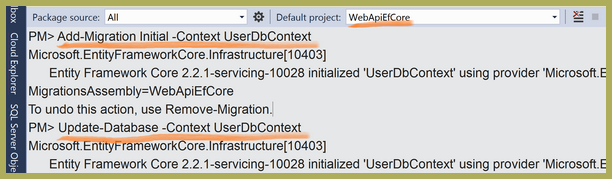
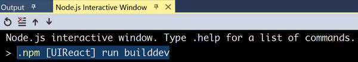
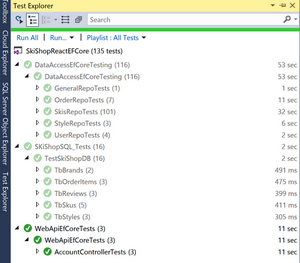
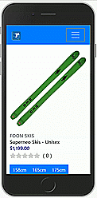
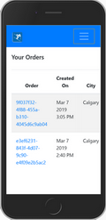
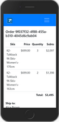
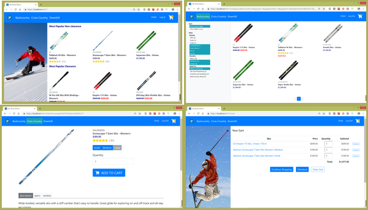
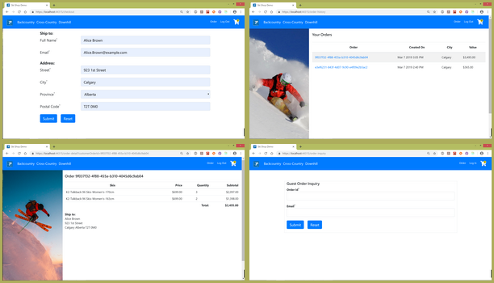

# React Universal SPA with Redux Supported by EF Core on SQL Server
## Requires
- Visual Studio 2017
## License
- Apache License, Version 2.0
## Technologies
- SQL Server
- ReactJS
- ASP.NET Core
- EF Core
- Redux
## Topics
- Data Access
- Test Driven Development
- Database
- Web API
- Universal Web App
## Updated
- 03/13/2019
## Description

<h1>Introduction</h1>

This ski shop web app is like most online stores that have&nbsp;

<ol>
<li>An authentication function for login/logout.
</li><li>A navigation system where customers can browse skis with page controls filtered by category, brand, gender, what they are ideal for and sorted by price, check their descriptions, tech specs and reviews, as well as add their
 own reviews. </li><li>A shopping cart where customers can add, remove skis and update quantities
</li><li>A checkout system where users or guests can fill in their shipping details, place their orders, or get messages if any item is sold out or over stock.
</li><li>An order system where users or guests can review their orders.
</li></ol>

On the backend, we use

<ul>
<li>T-SQL to create a database on the MS SQL Server 2016 (LocalDB in this sample, also works on Express or other versions) and to seed its data.
</li><li>EF Core to query the database and map the results back to C# models.
</li><li>ASP.NET Core to create a Web API that passes data between the server and client sides.
</li><li>ASP.NET Core Identity to authenticate users
</li><li>SSDT SQL Server unit tests on SQL Server
</li><li>XUnit to test data access and Web API
</li></ul>

The client-side ES6 code is bundled by webpack for the development environment which covers:

<ul>
<li>Component-based UI </li><li>Navigation system with navigation history management
</li><li>App state management </li><li>API result cache and async data flow 
</li><li>Responsive design for desktop, tablet and mobile screens
</li><li>Type checking </li><li>Dynamically<strong> </strong>loading components and packages
</li><li>Hot Module Replacement (HMR) </li></ul>

&nbsp;

<h1>Prerequirements:</h1>
<ul>
<li>Visual Studio 2017 </li><li>VS Code (recommended) </li><li>SQL Server 2016 or up (LocalDB, Express or other versions)
</li><li>Node.js </li><li>ASP.Net Core 2.2.0 or up </li></ul>
<h1>Running the Sample</h1>

It will take a while for VS2017 to automatically install all the npm and .NET dependencies when you first open the app. &nbsp;

Step 1: publish the database (and the test database)

The publish profiles in the folder SkiShopSQL-&gt;Publishes &nbsp;work for SQL Server 2016 LocalDB. Please update the data source if you use SQL Server 2016 Express or other versions.

Step 2:&nbsp;Create the identity database using NuGet Package Manager Console&nbsp;

Please select &ldquo;WebApiEfCore&rdquo; as the Starup project first.

Step 3: Make webpack bundles

TOOLS -&gt; Node.js Tools -&gt; Node.js Interactive Window

Please check package.json for more scripts for bundle analysis and type checking.

Step 4 Run testing code in Test Explorer

All tests point to the test database.

 

<object width="350" height="300" data="data:application/x-silverlight-2," type="application/x-silverlight-2"> <param name="source" value="/Content/Common/videoplayer.xap" /> <param name="initParams" value="deferredLoad=false,duration=0,m=https://i1.code.msdn.s-msft.com/react-redux-spa-on-asp-net-e910901f/image/file/220179/1/skishopreactefcore.wmv,autostart=false,autohide=true,showembed=true"
 /> <param name="background" value="#00FFFFFF" /> <param name="minRuntimeVersion" value="3.0.40624.0" /> <param name="enableHtmlAccess" value="true" /> <param name="src" value="https://i1.code.msdn.s-msft.com/react-redux-spa-on-asp-net-e910901f/image/file/220179/1/skishopreactefcore.wmv"
 /> <param name="id" value="220179" /> <param name="name" value="SkiShopReactEFCore.wmv" />
 </object>  
<a id="https://i1.code.msdn.s-msft.com/react-redux-spa-on-asp-net-e910901f/image/file/220179/1/skishopreactefcore.wmv" href="https://i1.code.msdn.s-msft.com/react-redux-spa-on-asp-net-e910901f/image/file/220179/1/skishopreactefcore.wmv">Download
 video</a>

or go to&nbsp;

<a href="https://www.youtube.com/watch?v=laXNkReBlDo&t=40s">https://www.youtube.com/watch?v=laXNkReBlDo&amp;t=40s</a>

&nbsp;

Pictures

&nbsp; &nbsp; &nbsp; &nbsp; &nbsp; &nbsp; &nbsp; &nbsp; &nbsp; &nbsp; &nbsp; &nbsp;&nbsp;&nbsp;
 &nbsp; &nbsp; &nbsp; &nbsp; &nbsp; &nbsp; &nbsp; &nbsp; &nbsp; &nbsp; &nbsp; &nbsp;

&nbsp; &nbsp;&nbsp;&nbsp; &nbsp; &nbsp;&nbsp;&nbsp;
 &nbsp; &nbsp;&nbsp;&nbsp; &nbsp; &nbsp;&nbsp;

&nbsp;

<h1>Sample Codes:</h1>

Login.jsx

JavaScript

Edit|Remove

js
<pre class="hidden">import React from 'react';
import { Formik, Form, Field } from 'formik';
import * as Yup from 'yup';

import FormErrorMsg from '../../viewComponents/formErrorMsg/FormErrorMsg';
import selectDefaultCategory from '../../reduxStore/helpers/selectDefaultCategory';

class Login extends React.Component {
    constructor(props) {
        super(props);
    }

    redirectToLastPage() {
        const { user, history } = this.props;

        if (user &amp;&amp; user.userId &gt; 0) history.goBack();
    }

    componentDidMount() {
        const { selectedCategoryId, selectCategory } = this.props;

        selectDefaultCategory(selectedCategoryId, selectCategory);

        this.redirectToLastPage();
    }

    componentDidUpdate() {
        this.redirectToLastPage();
    }

    render() {
        const { user, login} = this.props;

        return (
            &lt;div className=&quot;container h-100 mt-5 border align-content-center&quot;&gt;
                &lt;h4 className=&quot;mb-2&quot;&gt;Log in&lt;/h4&gt;
                &lt;Formik
                    initialValues={{
                        email: '',
                        password: ''
                    }}
                    validationSchema={loginSchema}
                    onSubmit={(values, actions) =&gt; {
                        const loginModel = {
                            email: values.email,
                            password: values.password,
                            rememberMe: true,
                            lockoutFailure: true
                        }

                        login(loginModel);

                        actions.setSubmitting(false);
                    }}
                    render={({ status, isSubmitting }) =&gt; (
                        &lt;Form&gt;
                            &lt;FieldGroup labelName=&quot;Email&quot; fieldName=&quot;email&quot; fieldType=&quot;email&quot; /&gt;
                            &lt;FieldGroup labelName=&quot;Password&quot; fieldName=&quot;password&quot; fieldType=&quot;password&quot; /&gt;
                            {status &amp;&amp; status.msg &amp;&amp; &lt;div className=&quot;text-danger&quot;&gt;{status.msg}&lt;/div&gt;}
                            {user &amp;&amp; user.userId === -1 &amp;&amp; &lt;div className=&quot;text-danger mb-3&quot;&gt;{user.screenName}&lt;/div&gt;}
                            &lt;button type=&quot;submit&quot; className=&quot;btn btn-primary mb-3&quot; disabled={isSubmitting}&gt;
                                Submit
                            &lt;/button&gt;
                        &lt;/Form&gt;
                    )
                    }
                &gt;
                &lt;/Formik&gt;
            &lt;/div&gt;
        );
    }
} 

const loginSchema = Yup.object().shape({
    email: Yup.string()
        .email('Invalid email')
        .required('Required'),
    password: Yup.string()
        .required('Required')
});

const FieldGroup = ({ labelName, fieldName, fieldType }) =&gt; (
    &lt;div className=&quot;form-group&quot;&gt;
        &lt;strong&gt;{labelName}&lt;sup&gt;*&lt;/sup&gt;&lt;/strong&gt;
        &lt;Field name={fieldName} type={fieldType} className=&quot;form-control&quot; /&gt;
        &lt;FormErrorMsg name={fieldName} /&gt;
    &lt;/div&gt;
);

export default Login;</pre>

<pre class="js">import&nbsp;React&nbsp;from&nbsp;'react';&nbsp;
import&nbsp;{&nbsp;Formik,&nbsp;Form,&nbsp;Field&nbsp;}&nbsp;from&nbsp;'formik';&nbsp;
import&nbsp;*&nbsp;as&nbsp;Yup&nbsp;from&nbsp;'yup';&nbsp;
&nbsp;
import&nbsp;FormErrorMsg&nbsp;from&nbsp;'../../viewComponents/formErrorMsg/FormErrorMsg';&nbsp;
import&nbsp;selectDefaultCategory&nbsp;from&nbsp;'../../reduxStore/helpers/selectDefaultCategory';&nbsp;
&nbsp;
class&nbsp;Login&nbsp;extends&nbsp;React.Component&nbsp;{&nbsp;
&nbsp;&nbsp;&nbsp;&nbsp;constructor(props)&nbsp;{&nbsp;
&nbsp;&nbsp;&nbsp;&nbsp;&nbsp;&nbsp;&nbsp;&nbsp;super(props);&nbsp;
&nbsp;&nbsp;&nbsp;&nbsp;}&nbsp;
&nbsp;
&nbsp;&nbsp;&nbsp;&nbsp;redirectToLastPage()&nbsp;{&nbsp;
&nbsp;&nbsp;&nbsp;&nbsp;&nbsp;&nbsp;&nbsp;&nbsp;const&nbsp;{&nbsp;user,&nbsp;history&nbsp;}&nbsp;=&nbsp;this.props;&nbsp;
&nbsp;
&nbsp;&nbsp;&nbsp;&nbsp;&nbsp;&nbsp;&nbsp;&nbsp;if&nbsp;(user&nbsp;&amp;&amp;&nbsp;user.userId&nbsp;&gt;&nbsp;0)&nbsp;history.goBack();&nbsp;
&nbsp;&nbsp;&nbsp;&nbsp;}&nbsp;
&nbsp;
&nbsp;&nbsp;&nbsp;&nbsp;componentDidMount()&nbsp;{&nbsp;
&nbsp;&nbsp;&nbsp;&nbsp;&nbsp;&nbsp;&nbsp;&nbsp;const&nbsp;{&nbsp;selectedCategoryId,&nbsp;selectCategory&nbsp;}&nbsp;=&nbsp;this.props;&nbsp;
&nbsp;
&nbsp;&nbsp;&nbsp;&nbsp;&nbsp;&nbsp;&nbsp;&nbsp;selectDefaultCategory(selectedCategoryId,&nbsp;selectCategory);&nbsp;
&nbsp;
&nbsp;&nbsp;&nbsp;&nbsp;&nbsp;&nbsp;&nbsp;&nbsp;this.redirectToLastPage();&nbsp;
&nbsp;&nbsp;&nbsp;&nbsp;}&nbsp;
&nbsp;
&nbsp;&nbsp;&nbsp;&nbsp;componentDidUpdate()&nbsp;{&nbsp;
&nbsp;&nbsp;&nbsp;&nbsp;&nbsp;&nbsp;&nbsp;&nbsp;this.redirectToLastPage();&nbsp;
&nbsp;&nbsp;&nbsp;&nbsp;}&nbsp;
&nbsp;
&nbsp;&nbsp;&nbsp;&nbsp;render()&nbsp;{&nbsp;
&nbsp;&nbsp;&nbsp;&nbsp;&nbsp;&nbsp;&nbsp;&nbsp;const&nbsp;{&nbsp;user,&nbsp;login}&nbsp;=&nbsp;this.props;&nbsp;
&nbsp;
&nbsp;&nbsp;&nbsp;&nbsp;&nbsp;&nbsp;&nbsp;&nbsp;return&nbsp;(&nbsp;
&nbsp;&nbsp;&nbsp;&nbsp;&nbsp;&nbsp;&nbsp;&nbsp;&nbsp;&nbsp;&nbsp;&nbsp;&lt;div&nbsp;className=&quot;container&nbsp;h-100&nbsp;mt-5&nbsp;border&nbsp;align-content-center&quot;&gt;&nbsp;
&nbsp;&nbsp;&nbsp;&nbsp;&nbsp;&nbsp;&nbsp;&nbsp;&nbsp;&nbsp;&nbsp;&nbsp;&nbsp;&nbsp;&nbsp;&nbsp;&lt;h4&nbsp;className=&quot;mb-2&quot;&gt;Log&nbsp;in&lt;/h4&gt;&nbsp;
&nbsp;&nbsp;&nbsp;&nbsp;&nbsp;&nbsp;&nbsp;&nbsp;&nbsp;&nbsp;&nbsp;&nbsp;&nbsp;&nbsp;&nbsp;&nbsp;&lt;Formik&nbsp;
&nbsp;&nbsp;&nbsp;&nbsp;&nbsp;&nbsp;&nbsp;&nbsp;&nbsp;&nbsp;&nbsp;&nbsp;&nbsp;&nbsp;&nbsp;&nbsp;&nbsp;&nbsp;&nbsp;&nbsp;initialValues={{&nbsp;
&nbsp;&nbsp;&nbsp;&nbsp;&nbsp;&nbsp;&nbsp;&nbsp;&nbsp;&nbsp;&nbsp;&nbsp;&nbsp;&nbsp;&nbsp;&nbsp;&nbsp;&nbsp;&nbsp;&nbsp;&nbsp;&nbsp;&nbsp;&nbsp;email:&nbsp;'',&nbsp;
&nbsp;&nbsp;&nbsp;&nbsp;&nbsp;&nbsp;&nbsp;&nbsp;&nbsp;&nbsp;&nbsp;&nbsp;&nbsp;&nbsp;&nbsp;&nbsp;&nbsp;&nbsp;&nbsp;&nbsp;&nbsp;&nbsp;&nbsp;&nbsp;password:&nbsp;''&nbsp;
&nbsp;&nbsp;&nbsp;&nbsp;&nbsp;&nbsp;&nbsp;&nbsp;&nbsp;&nbsp;&nbsp;&nbsp;&nbsp;&nbsp;&nbsp;&nbsp;&nbsp;&nbsp;&nbsp;&nbsp;}}&nbsp;
&nbsp;&nbsp;&nbsp;&nbsp;&nbsp;&nbsp;&nbsp;&nbsp;&nbsp;&nbsp;&nbsp;&nbsp;&nbsp;&nbsp;&nbsp;&nbsp;&nbsp;&nbsp;&nbsp;&nbsp;validationSchema={loginSchema}&nbsp;
&nbsp;&nbsp;&nbsp;&nbsp;&nbsp;&nbsp;&nbsp;&nbsp;&nbsp;&nbsp;&nbsp;&nbsp;&nbsp;&nbsp;&nbsp;&nbsp;&nbsp;&nbsp;&nbsp;&nbsp;onSubmit={(values,&nbsp;actions)&nbsp;=&gt;&nbsp;{&nbsp;
&nbsp;&nbsp;&nbsp;&nbsp;&nbsp;&nbsp;&nbsp;&nbsp;&nbsp;&nbsp;&nbsp;&nbsp;&nbsp;&nbsp;&nbsp;&nbsp;&nbsp;&nbsp;&nbsp;&nbsp;&nbsp;&nbsp;&nbsp;&nbsp;const&nbsp;loginModel&nbsp;=&nbsp;{&nbsp;
&nbsp;&nbsp;&nbsp;&nbsp;&nbsp;&nbsp;&nbsp;&nbsp;&nbsp;&nbsp;&nbsp;&nbsp;&nbsp;&nbsp;&nbsp;&nbsp;&nbsp;&nbsp;&nbsp;&nbsp;&nbsp;&nbsp;&nbsp;&nbsp;&nbsp;&nbsp;&nbsp;&nbsp;email:&nbsp;values.email,&nbsp;
&nbsp;&nbsp;&nbsp;&nbsp;&nbsp;&nbsp;&nbsp;&nbsp;&nbsp;&nbsp;&nbsp;&nbsp;&nbsp;&nbsp;&nbsp;&nbsp;&nbsp;&nbsp;&nbsp;&nbsp;&nbsp;&nbsp;&nbsp;&nbsp;&nbsp;&nbsp;&nbsp;&nbsp;password:&nbsp;values.password,&nbsp;
&nbsp;&nbsp;&nbsp;&nbsp;&nbsp;&nbsp;&nbsp;&nbsp;&nbsp;&nbsp;&nbsp;&nbsp;&nbsp;&nbsp;&nbsp;&nbsp;&nbsp;&nbsp;&nbsp;&nbsp;&nbsp;&nbsp;&nbsp;&nbsp;&nbsp;&nbsp;&nbsp;&nbsp;rememberMe:&nbsp;true,&nbsp;
&nbsp;&nbsp;&nbsp;&nbsp;&nbsp;&nbsp;&nbsp;&nbsp;&nbsp;&nbsp;&nbsp;&nbsp;&nbsp;&nbsp;&nbsp;&nbsp;&nbsp;&nbsp;&nbsp;&nbsp;&nbsp;&nbsp;&nbsp;&nbsp;&nbsp;&nbsp;&nbsp;&nbsp;lockoutFailure:&nbsp;true&nbsp;
&nbsp;&nbsp;&nbsp;&nbsp;&nbsp;&nbsp;&nbsp;&nbsp;&nbsp;&nbsp;&nbsp;&nbsp;&nbsp;&nbsp;&nbsp;&nbsp;&nbsp;&nbsp;&nbsp;&nbsp;&nbsp;&nbsp;&nbsp;&nbsp;}&nbsp;
&nbsp;
&nbsp;&nbsp;&nbsp;&nbsp;&nbsp;&nbsp;&nbsp;&nbsp;&nbsp;&nbsp;&nbsp;&nbsp;&nbsp;&nbsp;&nbsp;&nbsp;&nbsp;&nbsp;&nbsp;&nbsp;&nbsp;&nbsp;&nbsp;&nbsp;login(loginModel);&nbsp;
&nbsp;
&nbsp;&nbsp;&nbsp;&nbsp;&nbsp;&nbsp;&nbsp;&nbsp;&nbsp;&nbsp;&nbsp;&nbsp;&nbsp;&nbsp;&nbsp;&nbsp;&nbsp;&nbsp;&nbsp;&nbsp;&nbsp;&nbsp;&nbsp;&nbsp;actions.setSubmitting(false);&nbsp;
&nbsp;&nbsp;&nbsp;&nbsp;&nbsp;&nbsp;&nbsp;&nbsp;&nbsp;&nbsp;&nbsp;&nbsp;&nbsp;&nbsp;&nbsp;&nbsp;&nbsp;&nbsp;&nbsp;&nbsp;}}&nbsp;
&nbsp;&nbsp;&nbsp;&nbsp;&nbsp;&nbsp;&nbsp;&nbsp;&nbsp;&nbsp;&nbsp;&nbsp;&nbsp;&nbsp;&nbsp;&nbsp;&nbsp;&nbsp;&nbsp;&nbsp;render={({&nbsp;status,&nbsp;isSubmitting&nbsp;})&nbsp;=&gt;&nbsp;(&nbsp;
&nbsp;&nbsp;&nbsp;&nbsp;&nbsp;&nbsp;&nbsp;&nbsp;&nbsp;&nbsp;&nbsp;&nbsp;&nbsp;&nbsp;&nbsp;&nbsp;&nbsp;&nbsp;&nbsp;&nbsp;&nbsp;&nbsp;&nbsp;&nbsp;&lt;Form&gt;&nbsp;
&nbsp;&nbsp;&nbsp;&nbsp;&nbsp;&nbsp;&nbsp;&nbsp;&nbsp;&nbsp;&nbsp;&nbsp;&nbsp;&nbsp;&nbsp;&nbsp;&nbsp;&nbsp;&nbsp;&nbsp;&nbsp;&nbsp;&nbsp;&nbsp;&nbsp;&nbsp;&nbsp;&nbsp;&lt;FieldGroup&nbsp;labelName=&quot;Email&quot;&nbsp;fieldName=&quot;email&quot;&nbsp;fieldType=&quot;email&quot;&nbsp;/&gt;&nbsp;
&nbsp;&nbsp;&nbsp;&nbsp;&nbsp;&nbsp;&nbsp;&nbsp;&nbsp;&nbsp;&nbsp;&nbsp;&nbsp;&nbsp;&nbsp;&nbsp;&nbsp;&nbsp;&nbsp;&nbsp;&nbsp;&nbsp;&nbsp;&nbsp;&nbsp;&nbsp;&nbsp;&nbsp;&lt;FieldGroup&nbsp;labelName=&quot;Password&quot;&nbsp;fieldName=&quot;password&quot;&nbsp;fieldType=&quot;password&quot;&nbsp;/&gt;&nbsp;
&nbsp;&nbsp;&nbsp;&nbsp;&nbsp;&nbsp;&nbsp;&nbsp;&nbsp;&nbsp;&nbsp;&nbsp;&nbsp;&nbsp;&nbsp;&nbsp;&nbsp;&nbsp;&nbsp;&nbsp;&nbsp;&nbsp;&nbsp;&nbsp;&nbsp;&nbsp;&nbsp;&nbsp;{status&nbsp;&amp;&amp;&nbsp;status.msg&nbsp;&amp;&amp;&nbsp;&lt;div&nbsp;className=&quot;text-danger&quot;&gt;{status.msg}&lt;/div&gt;}&nbsp;
&nbsp;&nbsp;&nbsp;&nbsp;&nbsp;&nbsp;&nbsp;&nbsp;&nbsp;&nbsp;&nbsp;&nbsp;&nbsp;&nbsp;&nbsp;&nbsp;&nbsp;&nbsp;&nbsp;&nbsp;&nbsp;&nbsp;&nbsp;&nbsp;&nbsp;&nbsp;&nbsp;&nbsp;{user&nbsp;&amp;&amp;&nbsp;user.userId&nbsp;===&nbsp;-1&nbsp;&amp;&amp;&nbsp;&lt;div&nbsp;className=&quot;text-danger&nbsp;mb-3&quot;&gt;{user.screenName}&lt;/div&gt;}&nbsp;
&nbsp;&nbsp;&nbsp;&nbsp;&nbsp;&nbsp;&nbsp;&nbsp;&nbsp;&nbsp;&nbsp;&nbsp;&nbsp;&nbsp;&nbsp;&nbsp;&nbsp;&nbsp;&nbsp;&nbsp;&nbsp;&nbsp;&nbsp;&nbsp;&nbsp;&nbsp;&nbsp;&nbsp;&lt;button&nbsp;type=&quot;submit&quot;&nbsp;className=&quot;btn&nbsp;btn-primary&nbsp;mb-3&quot;&nbsp;disabled={isSubmitting}&gt;&nbsp;
&nbsp;&nbsp;&nbsp;&nbsp;&nbsp;&nbsp;&nbsp;&nbsp;&nbsp;&nbsp;&nbsp;&nbsp;&nbsp;&nbsp;&nbsp;&nbsp;&nbsp;&nbsp;&nbsp;&nbsp;&nbsp;&nbsp;&nbsp;&nbsp;&nbsp;&nbsp;&nbsp;&nbsp;&nbsp;&nbsp;&nbsp;&nbsp;Submit&nbsp;
&nbsp;&nbsp;&nbsp;&nbsp;&nbsp;&nbsp;&nbsp;&nbsp;&nbsp;&nbsp;&nbsp;&nbsp;&nbsp;&nbsp;&nbsp;&nbsp;&nbsp;&nbsp;&nbsp;&nbsp;&nbsp;&nbsp;&nbsp;&nbsp;&nbsp;&nbsp;&nbsp;&nbsp;&lt;/button&gt;&nbsp;
&nbsp;&nbsp;&nbsp;&nbsp;&nbsp;&nbsp;&nbsp;&nbsp;&nbsp;&nbsp;&nbsp;&nbsp;&nbsp;&nbsp;&nbsp;&nbsp;&nbsp;&nbsp;&nbsp;&nbsp;&nbsp;&nbsp;&nbsp;&nbsp;&lt;/Form&gt;&nbsp;
&nbsp;&nbsp;&nbsp;&nbsp;&nbsp;&nbsp;&nbsp;&nbsp;&nbsp;&nbsp;&nbsp;&nbsp;&nbsp;&nbsp;&nbsp;&nbsp;&nbsp;&nbsp;&nbsp;&nbsp;)&nbsp;
&nbsp;&nbsp;&nbsp;&nbsp;&nbsp;&nbsp;&nbsp;&nbsp;&nbsp;&nbsp;&nbsp;&nbsp;&nbsp;&nbsp;&nbsp;&nbsp;&nbsp;&nbsp;&nbsp;&nbsp;}&nbsp;
&nbsp;&nbsp;&nbsp;&nbsp;&nbsp;&nbsp;&nbsp;&nbsp;&nbsp;&nbsp;&nbsp;&nbsp;&nbsp;&nbsp;&nbsp;&nbsp;&gt;&nbsp;
&nbsp;&nbsp;&nbsp;&nbsp;&nbsp;&nbsp;&nbsp;&nbsp;&nbsp;&nbsp;&nbsp;&nbsp;&nbsp;&nbsp;&nbsp;&nbsp;&lt;/Formik&gt;&nbsp;
&nbsp;&nbsp;&nbsp;&nbsp;&nbsp;&nbsp;&nbsp;&nbsp;&nbsp;&nbsp;&nbsp;&nbsp;&lt;/div&gt;&nbsp;
&nbsp;&nbsp;&nbsp;&nbsp;&nbsp;&nbsp;&nbsp;&nbsp;);&nbsp;
&nbsp;&nbsp;&nbsp;&nbsp;}&nbsp;
}&nbsp;&nbsp;
&nbsp;
const&nbsp;loginSchema&nbsp;=&nbsp;Yup.object().shape({&nbsp;
&nbsp;&nbsp;&nbsp;&nbsp;email:&nbsp;Yup.string()&nbsp;
&nbsp;&nbsp;&nbsp;&nbsp;&nbsp;&nbsp;&nbsp;&nbsp;.email('Invalid&nbsp;email')&nbsp;
&nbsp;&nbsp;&nbsp;&nbsp;&nbsp;&nbsp;&nbsp;&nbsp;.required('Required'),&nbsp;
&nbsp;&nbsp;&nbsp;&nbsp;password:&nbsp;Yup.string()&nbsp;
&nbsp;&nbsp;&nbsp;&nbsp;&nbsp;&nbsp;&nbsp;&nbsp;.required('Required')&nbsp;
});&nbsp;
&nbsp;
const&nbsp;FieldGroup&nbsp;=&nbsp;({&nbsp;labelName,&nbsp;fieldName,&nbsp;fieldType&nbsp;})&nbsp;=&gt;&nbsp;(&nbsp;
&nbsp;&nbsp;&nbsp;&nbsp;&lt;div&nbsp;className=&quot;form-group&quot;&gt;&nbsp;
&nbsp;&nbsp;&nbsp;&nbsp;&nbsp;&nbsp;&nbsp;&nbsp;&lt;strong&gt;{labelName}&lt;sup&gt;*&lt;/sup&gt;&lt;/strong&gt;&nbsp;
&nbsp;&nbsp;&nbsp;&nbsp;&nbsp;&nbsp;&nbsp;&nbsp;&lt;Field&nbsp;name={fieldName}&nbsp;type={fieldType}&nbsp;className=&quot;form-control&quot;&nbsp;/&gt;&nbsp;
&nbsp;&nbsp;&nbsp;&nbsp;&nbsp;&nbsp;&nbsp;&nbsp;&lt;FormErrorMsg&nbsp;name={fieldName}&nbsp;/&gt;&nbsp;
&nbsp;&nbsp;&nbsp;&nbsp;&lt;/div&gt;&nbsp;
);&nbsp;
&nbsp;
export&nbsp;default&nbsp;Login;</pre>

<h1><strong>RoadMap</strong></h1>
<ul>
<li>Turn it into a progressive web app </li><li>Add Jest testing on the client side </li><li>Improve type checking on the client side
</li></ul>
&nbsp;

<h1 class="endscriptcode">Updates:</h1>

March 7, 2019

Upgrade to V2

August 22 2017:

Fixed StylesByCategory.jsxWhen no genders/idealFors are selected, they will be processed as ALL are selected.

November 22 2017

Fixed 404 error when refreshing or manually writing route.

