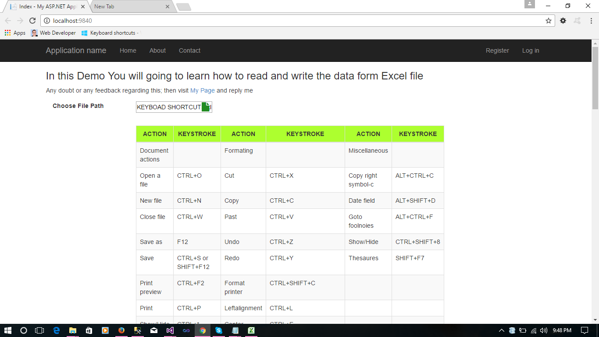

# Read and write Data From Excel file in MVC application.
## Requires
- Visual Studio 2013
## License
- MIT
## Technologies
- C#
- jQuery
- Javascript
- Bootstrap
- HTML5
- ASP.NET MVC 5
- Font-awesome.css
## Topics
- Read and write data from Excel file in MVC
- How to read excel file in java script
- Show excel file data inside web page.
## Updated
- 11/23/2016
## Description

<h1>Introduction</h1>

<em>In this sample we are going to learn how to read and write the Excel file in a Asp.Net MVC project.</em>

<h1>Building the Sample</h1>

<em>To build this sample you required Visual studio 2010 or above.</em>

<em>The above zip file contain one project file. 
</em>

Description

<em>Please follow the instruction before you run this project :-</em>

<em>1. Open the solution file using Visual studio.</em>

<em>2. Open the controller called as ImportExport in the controler folder.</em>

<em>3. Check that is thier any error or not.</em>

<em>4. In this controler i am using <strong>OfficeOpenXml
</strong>dll reference.</em>

<em>5. You find that dll inside reference folder in case you won't find that dll then download it from
<a href="https://1drv.ms/u/s!AvHs5oVtdBkbtgvZtrg4OzlGAf4y">Here</a>  
</em>

<strong><em>Note:- Without this dll we can not run this project</em></strong>

<em>6. The index page contain the Html code and Java script code.</em>

&nbsp;

<em>In this demo i am reading the excel file inside controller and then returning JSON result to view.</em>

<em>Inside view i am reading all the data and showing the data inside table. 
</em>

<strong><em> 
</em></strong>

<strong>Controller code :-</strong>

C#

Edit|Remove

csharp

<pre class="csharp">public&nbsp;class&nbsp;ImportExportController&nbsp;:&nbsp;Controller&nbsp;
&nbsp;&nbsp;&nbsp;&nbsp;{&nbsp;
&nbsp;&nbsp;&nbsp;&nbsp;&nbsp;&nbsp;&nbsp;&nbsp;//&nbsp;GET:&nbsp;ImportExport&nbsp;
&nbsp;&nbsp;&nbsp;&nbsp;&nbsp;&nbsp;&nbsp;&nbsp;public&nbsp;ActionResult&nbsp;Index()&nbsp;
&nbsp;&nbsp;&nbsp;&nbsp;&nbsp;&nbsp;&nbsp;&nbsp;{&nbsp;
&nbsp;&nbsp;&nbsp;&nbsp;&nbsp;&nbsp;&nbsp;&nbsp;&nbsp;&nbsp;&nbsp;&nbsp;return&nbsp;View();&nbsp;
&nbsp;&nbsp;&nbsp;&nbsp;&nbsp;&nbsp;&nbsp;&nbsp;}&nbsp;
&nbsp;&nbsp;&nbsp;&nbsp;&nbsp;&nbsp;&nbsp;&nbsp;public&nbsp;JsonResult&nbsp;UploadFile()&nbsp;
&nbsp;&nbsp;&nbsp;&nbsp;&nbsp;&nbsp;&nbsp;&nbsp;{&nbsp;
&nbsp;&nbsp;&nbsp;&nbsp;&nbsp;&nbsp;&nbsp;&nbsp;&nbsp;&nbsp;&nbsp;&nbsp;if&nbsp;(Request.Files.Count&nbsp;&gt;&nbsp;0)&nbsp;
&nbsp;&nbsp;&nbsp;&nbsp;&nbsp;&nbsp;&nbsp;&nbsp;&nbsp;&nbsp;&nbsp;&nbsp;{&nbsp;
&nbsp;&nbsp;&nbsp;&nbsp;&nbsp;&nbsp;&nbsp;&nbsp;&nbsp;&nbsp;&nbsp;&nbsp;&nbsp;&nbsp;&nbsp;&nbsp;try&nbsp;
&nbsp;&nbsp;&nbsp;&nbsp;&nbsp;&nbsp;&nbsp;&nbsp;&nbsp;&nbsp;&nbsp;&nbsp;&nbsp;&nbsp;&nbsp;&nbsp;{&nbsp;
&nbsp;&nbsp;&nbsp;&nbsp;&nbsp;&nbsp;&nbsp;&nbsp;&nbsp;&nbsp;&nbsp;&nbsp;&nbsp;&nbsp;&nbsp;&nbsp;&nbsp;&nbsp;&nbsp;&nbsp;object[,]&nbsp;obj&nbsp;=&nbsp;null;&nbsp;
&nbsp;&nbsp;&nbsp;&nbsp;&nbsp;&nbsp;&nbsp;&nbsp;&nbsp;&nbsp;&nbsp;&nbsp;&nbsp;&nbsp;&nbsp;&nbsp;&nbsp;&nbsp;&nbsp;&nbsp;int&nbsp;noOfCol&nbsp;=&nbsp;0;&nbsp;
&nbsp;&nbsp;&nbsp;&nbsp;&nbsp;&nbsp;&nbsp;&nbsp;&nbsp;&nbsp;&nbsp;&nbsp;&nbsp;&nbsp;&nbsp;&nbsp;&nbsp;&nbsp;&nbsp;&nbsp;int&nbsp;noOfRow&nbsp;=&nbsp;0;&nbsp;
&nbsp;&nbsp;&nbsp;&nbsp;&nbsp;&nbsp;&nbsp;&nbsp;&nbsp;&nbsp;&nbsp;&nbsp;&nbsp;&nbsp;&nbsp;&nbsp;&nbsp;&nbsp;&nbsp;&nbsp;HttpFileCollectionBase&nbsp;file&nbsp;=&nbsp;Request.Files;&nbsp;
&nbsp;&nbsp;&nbsp;&nbsp;&nbsp;&nbsp;&nbsp;&nbsp;&nbsp;&nbsp;&nbsp;&nbsp;&nbsp;&nbsp;&nbsp;&nbsp;&nbsp;&nbsp;&nbsp;&nbsp;if&nbsp;((file&nbsp;!=&nbsp;null)&nbsp;&amp;&amp;&nbsp;(file.Count&nbsp;&gt;&nbsp;0))&nbsp;
&nbsp;&nbsp;&nbsp;&nbsp;&nbsp;&nbsp;&nbsp;&nbsp;&nbsp;&nbsp;&nbsp;&nbsp;&nbsp;&nbsp;&nbsp;&nbsp;&nbsp;&nbsp;&nbsp;&nbsp;{&nbsp;
&nbsp;&nbsp;&nbsp;&nbsp;&nbsp;&nbsp;&nbsp;&nbsp;&nbsp;&nbsp;&nbsp;&nbsp;&nbsp;&nbsp;&nbsp;&nbsp;&nbsp;&nbsp;&nbsp;&nbsp;&nbsp;&nbsp;&nbsp;&nbsp;//string&nbsp;fileName&nbsp;=&nbsp;file.FileName;&nbsp;
&nbsp;&nbsp;&nbsp;&nbsp;&nbsp;&nbsp;&nbsp;&nbsp;&nbsp;&nbsp;&nbsp;&nbsp;&nbsp;&nbsp;&nbsp;&nbsp;&nbsp;&nbsp;&nbsp;&nbsp;&nbsp;&nbsp;&nbsp;&nbsp;//string&nbsp;fileContentType&nbsp;=&nbsp;file.ContentType;&nbsp;
&nbsp;&nbsp;&nbsp;&nbsp;&nbsp;&nbsp;&nbsp;&nbsp;&nbsp;&nbsp;&nbsp;&nbsp;&nbsp;&nbsp;&nbsp;&nbsp;&nbsp;&nbsp;&nbsp;&nbsp;&nbsp;&nbsp;&nbsp;&nbsp;byte[]&nbsp;fileBytes&nbsp;=&nbsp;new&nbsp;byte[Request.ContentLength];&nbsp;
&nbsp;&nbsp;&nbsp;&nbsp;&nbsp;&nbsp;&nbsp;&nbsp;&nbsp;&nbsp;&nbsp;&nbsp;&nbsp;&nbsp;&nbsp;&nbsp;&nbsp;&nbsp;&nbsp;&nbsp;&nbsp;&nbsp;&nbsp;&nbsp;var&nbsp;data&nbsp;=&nbsp;Request.InputStream.Read(fileBytes,&nbsp;0,&nbsp;Convert.ToInt32(Request.ContentLength));&nbsp;
&nbsp;&nbsp;&nbsp;&nbsp;&nbsp;&nbsp;&nbsp;&nbsp;&nbsp;&nbsp;&nbsp;&nbsp;&nbsp;&nbsp;&nbsp;&nbsp;&nbsp;&nbsp;&nbsp;&nbsp;&nbsp;&nbsp;&nbsp;&nbsp;//&nbsp;var&nbsp;usersList&nbsp;=&nbsp;new&nbsp;List&lt;Users&gt;();&nbsp;
&nbsp;&nbsp;&nbsp;&nbsp;&nbsp;&nbsp;&nbsp;&nbsp;&nbsp;&nbsp;&nbsp;&nbsp;&nbsp;&nbsp;&nbsp;&nbsp;&nbsp;&nbsp;&nbsp;&nbsp;&nbsp;&nbsp;&nbsp;&nbsp;//using&nbsp;(var&nbsp;package&nbsp;=&nbsp;new&nbsp;ExcelPackage())&nbsp;
&nbsp;&nbsp;&nbsp;&nbsp;&nbsp;&nbsp;&nbsp;&nbsp;&nbsp;&nbsp;&nbsp;&nbsp;&nbsp;&nbsp;&nbsp;&nbsp;&nbsp;&nbsp;&nbsp;&nbsp;&nbsp;&nbsp;&nbsp;&nbsp;using&nbsp;(var&nbsp;package&nbsp;=&nbsp;new&nbsp;ExcelPackage(Request.InputStream))&nbsp;
&nbsp;&nbsp;&nbsp;&nbsp;&nbsp;&nbsp;&nbsp;&nbsp;&nbsp;&nbsp;&nbsp;&nbsp;&nbsp;&nbsp;&nbsp;&nbsp;&nbsp;&nbsp;&nbsp;&nbsp;&nbsp;&nbsp;&nbsp;&nbsp;{&nbsp;
&nbsp;&nbsp;&nbsp;&nbsp;&nbsp;&nbsp;&nbsp;&nbsp;&nbsp;&nbsp;&nbsp;&nbsp;&nbsp;&nbsp;&nbsp;&nbsp;&nbsp;&nbsp;&nbsp;&nbsp;&nbsp;&nbsp;&nbsp;&nbsp;&nbsp;&nbsp;&nbsp;&nbsp;var&nbsp;currentSheet&nbsp;=&nbsp;package.Workbook.Worksheets;&nbsp;
&nbsp;&nbsp;&nbsp;&nbsp;&nbsp;&nbsp;&nbsp;&nbsp;&nbsp;&nbsp;&nbsp;&nbsp;&nbsp;&nbsp;&nbsp;&nbsp;&nbsp;&nbsp;&nbsp;&nbsp;&nbsp;&nbsp;&nbsp;&nbsp;&nbsp;&nbsp;&nbsp;&nbsp;var&nbsp;workSheet&nbsp;=&nbsp;currentSheet.First();&nbsp;
&nbsp;&nbsp;&nbsp;&nbsp;&nbsp;&nbsp;&nbsp;&nbsp;&nbsp;&nbsp;&nbsp;&nbsp;&nbsp;&nbsp;&nbsp;&nbsp;&nbsp;&nbsp;&nbsp;&nbsp;&nbsp;&nbsp;&nbsp;&nbsp;&nbsp;&nbsp;&nbsp;&nbsp;noOfCol&nbsp;=&nbsp;workSheet.Dimension.End.Column;&nbsp;
&nbsp;&nbsp;&nbsp;&nbsp;&nbsp;&nbsp;&nbsp;&nbsp;&nbsp;&nbsp;&nbsp;&nbsp;&nbsp;&nbsp;&nbsp;&nbsp;&nbsp;&nbsp;&nbsp;&nbsp;&nbsp;&nbsp;&nbsp;&nbsp;&nbsp;&nbsp;&nbsp;&nbsp;noOfRow&nbsp;=&nbsp;workSheet.Dimension.End.Row;&nbsp;
&nbsp;&nbsp;&nbsp;&nbsp;&nbsp;&nbsp;&nbsp;&nbsp;&nbsp;&nbsp;&nbsp;&nbsp;&nbsp;&nbsp;&nbsp;&nbsp;&nbsp;&nbsp;&nbsp;&nbsp;&nbsp;&nbsp;&nbsp;&nbsp;&nbsp;&nbsp;&nbsp;&nbsp;obj&nbsp;=&nbsp;new&nbsp;object[noOfRow,&nbsp;noOfCol];&nbsp;
&nbsp;&nbsp;&nbsp;&nbsp;&nbsp;&nbsp;&nbsp;&nbsp;&nbsp;&nbsp;&nbsp;&nbsp;&nbsp;&nbsp;&nbsp;&nbsp;&nbsp;&nbsp;&nbsp;&nbsp;&nbsp;&nbsp;&nbsp;&nbsp;&nbsp;&nbsp;&nbsp;&nbsp;obj&nbsp;=&nbsp;(object[,])workSheet.Cells.Value;&nbsp;
&nbsp;&nbsp;&nbsp;&nbsp;&nbsp;&nbsp;&nbsp;&nbsp;&nbsp;&nbsp;&nbsp;&nbsp;&nbsp;&nbsp;&nbsp;&nbsp;&nbsp;&nbsp;&nbsp;&nbsp;&nbsp;&nbsp;&nbsp;&nbsp;}&nbsp;
&nbsp;&nbsp;&nbsp;&nbsp;&nbsp;&nbsp;&nbsp;&nbsp;&nbsp;&nbsp;&nbsp;&nbsp;&nbsp;&nbsp;&nbsp;&nbsp;&nbsp;&nbsp;&nbsp;&nbsp;}&nbsp;
&nbsp;&nbsp;&nbsp;&nbsp;&nbsp;&nbsp;&nbsp;&nbsp;&nbsp;&nbsp;&nbsp;&nbsp;&nbsp;&nbsp;&nbsp;&nbsp;&nbsp;&nbsp;&nbsp;&nbsp;return&nbsp;Json(new&nbsp;{&nbsp;data&nbsp;=&nbsp;obj,&nbsp;row&nbsp;=&nbsp;noOfRow,&nbsp;col&nbsp;=&nbsp;noOfCol&nbsp;},&nbsp;JsonRequestBehavior.AllowGet);&nbsp;
&nbsp;&nbsp;&nbsp;&nbsp;&nbsp;&nbsp;&nbsp;&nbsp;&nbsp;&nbsp;&nbsp;&nbsp;&nbsp;&nbsp;&nbsp;&nbsp;}&nbsp;
&nbsp;&nbsp;&nbsp;&nbsp;&nbsp;&nbsp;&nbsp;&nbsp;&nbsp;&nbsp;&nbsp;&nbsp;&nbsp;&nbsp;&nbsp;&nbsp;catch&nbsp;(Exception&nbsp;ex)&nbsp;
&nbsp;&nbsp;&nbsp;&nbsp;&nbsp;&nbsp;&nbsp;&nbsp;&nbsp;&nbsp;&nbsp;&nbsp;&nbsp;&nbsp;&nbsp;&nbsp;{&nbsp;
&nbsp;
&nbsp;&nbsp;&nbsp;&nbsp;&nbsp;&nbsp;&nbsp;&nbsp;&nbsp;&nbsp;&nbsp;&nbsp;&nbsp;&nbsp;&nbsp;&nbsp;}&nbsp;
&nbsp;&nbsp;&nbsp;&nbsp;&nbsp;&nbsp;&nbsp;&nbsp;&nbsp;&nbsp;&nbsp;&nbsp;&nbsp;&nbsp;&nbsp;&nbsp;&nbsp;
&nbsp;&nbsp;&nbsp;&nbsp;&nbsp;&nbsp;&nbsp;&nbsp;&nbsp;&nbsp;&nbsp;&nbsp;}&nbsp;
&nbsp;&nbsp;&nbsp;&nbsp;&nbsp;&nbsp;&nbsp;&nbsp;&nbsp;&nbsp;&nbsp;&nbsp;return&nbsp;Json(&quot;&quot;,&nbsp;JsonRequestBehavior.AllowGet);&nbsp;
&nbsp;&nbsp;&nbsp;&nbsp;&nbsp;&nbsp;&nbsp;&nbsp;}&nbsp;
&nbsp;&nbsp;&nbsp;&nbsp;}</pre>

<h1>Source Code Files</h1>

<strong>Index.cshtml Code :-</strong>

&lt;head&gt; 
 
&nbsp;&nbsp;&nbsp; &lt;script src=&quot;~/Scripts/jquery-1.10.2.js&quot;&gt;&lt;/script&gt; 
&nbsp;&nbsp;&nbsp; &lt;link href=&quot;~/Content/bootstrap.css&quot; rel=&quot;stylesheet&quot; /&gt; 
&nbsp;&nbsp;&nbsp; &lt;link href=&quot;~/Content/font-awesome.css&quot; rel=&quot;stylesheet&quot; /&gt; 
&nbsp;&nbsp;&nbsp; &lt;title&gt;ImportFrom Excel&lt;/title&gt; 
&lt;/head&gt; 
 
@*&lt;h2&gt;Upload Excel file and Export the excel data to Dropdownlist&lt;/h2&gt;*@ 
&lt;h3&gt;In this Demo You will going to learn how to read and write the data form Excel file&lt;/h3&gt; 
&lt;span&gt;Any doubt or any feedback regarding this; then visit &lt;a href=&quot;https://suryabest.wordpress.com/about/&quot;&gt; My Page &lt;/a&gt;and reply me.&lt;/span&gt;&nbsp;&nbsp;&nbsp;&nbsp;
 
 
&lt;div class=&quot;row&quot; style=&quot;padding:15px&quot;&gt; 
&nbsp;&nbsp;&nbsp; &lt;div class=&quot;col-lg-2 col-md-2 col-sm-6 col-xs-6&quot; id=&quot;filePathtxt&quot;&gt; 
&nbsp;&nbsp;&nbsp;&nbsp;&nbsp;&nbsp;&nbsp; &lt;label class=&quot;Flabel&quot;&gt;Choose File Path&lt;/label&gt; 
&nbsp;&nbsp;&nbsp; &lt;/div&gt; 
&nbsp;&nbsp;&nbsp; &lt;div class=&quot;col-lg-4 col-md-4 col-sm-6 col-xs-6&quot; id=&quot;filePathInput&quot;&gt; 
&nbsp;&nbsp;&nbsp;&nbsp;&nbsp;&nbsp;  
&nbsp;&nbsp;&nbsp;&nbsp;&nbsp;&nbsp;&nbsp; @using (Html.BeginForm(&quot;UploadFile&quot;, &quot;ImportExport&quot;, FormMethod.Post, new { enctype = &quot;multipart/form-data&quot; })) 
&nbsp;&nbsp;&nbsp;&nbsp;&nbsp;&nbsp;&nbsp; { 
&nbsp;&nbsp;&nbsp;&nbsp;&nbsp;&nbsp;&nbsp;&nbsp;&nbsp;&nbsp;&nbsp; &lt;input type=&quot;text&quot; class=&quot;&quot; id=&quot;txtfile&quot; for=&quot;uploadXML&quot; /&gt; 
&nbsp;&nbsp;&nbsp;&nbsp;&nbsp;&nbsp;&nbsp;&nbsp;&nbsp;&nbsp;&nbsp; &lt;i id=&quot;btnFileLoad&quot; class=&quot;fileUpload fa fa-file pull-right&quot; area-hidden=&quot;true&quot; onclick=&quot;return fileLoad()&quot; style=&quot;margin-top:2px;font-size:21px;position:relative;cursor:pointer;color:forestgreen;left:-172px&quot;&gt; 
 
&nbsp;&nbsp;&nbsp;&nbsp;&nbsp;&nbsp;&nbsp;&nbsp;&nbsp;&nbsp;&nbsp; &lt;/i&gt; 
&nbsp;&nbsp;&nbsp;&nbsp;&nbsp;&nbsp;&nbsp;&nbsp;&nbsp;&nbsp;&nbsp; &lt;input type=&quot;file&quot; class=&quot;upload&quot; name=&quot;UploadedFile&quot; id=&quot;fileLoadDoc&quot; accept=&quot;.xlsx&quot; /&gt; 
&nbsp;&nbsp;&nbsp;&nbsp;&nbsp;&nbsp;&nbsp; } 
&nbsp;&nbsp;&nbsp;&nbsp;&nbsp;&nbsp;&nbsp; &lt;table class=&quot;table table-bordered table-responsive table-striped&quot;&gt; 
&nbsp;&nbsp;&nbsp;&nbsp;&nbsp;&nbsp;&nbsp;&nbsp;&nbsp;&nbsp;&nbsp; &lt;thead class=&quot;head&quot;&gt; 
&nbsp;&nbsp;&nbsp;&nbsp;&nbsp;&nbsp;&nbsp;&nbsp;&nbsp;&nbsp;&nbsp; &lt;/thead&gt; 
&nbsp;&nbsp;&nbsp;&nbsp;&nbsp;&nbsp;&nbsp;&nbsp;&nbsp;&nbsp;&nbsp; &lt;tbody class=&quot;body&quot;&gt;&lt;/tbody&gt; 
&nbsp;&nbsp;&nbsp;&nbsp;&nbsp;&nbsp;&nbsp; &lt;/table&gt; 
&nbsp;&nbsp;&nbsp;&nbsp;&nbsp;&nbsp;&nbsp; &lt;label id=&quot;message&quot;&gt;&lt;/label&gt; 
&nbsp;&nbsp;&nbsp; &lt;/div&gt; 
&lt;/div&gt;

<ul>
</ul>
<h1>Output Of the Sample</h1>

<em></em>

