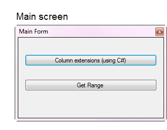
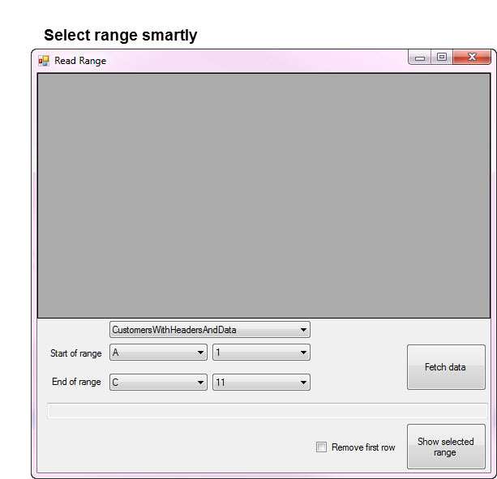
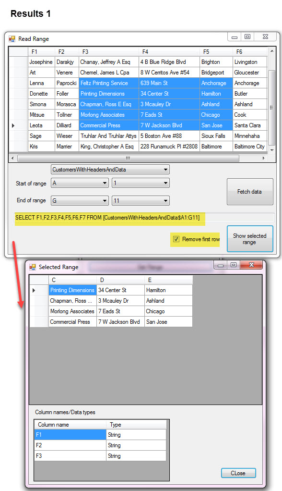
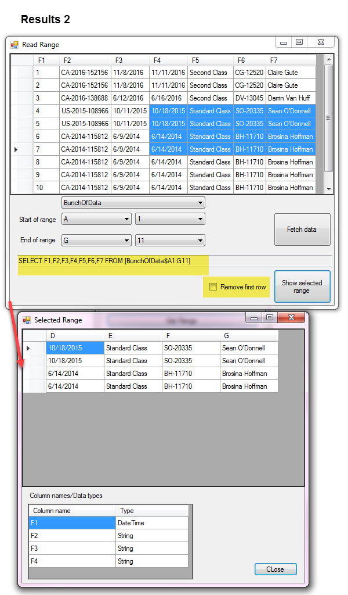
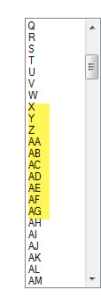
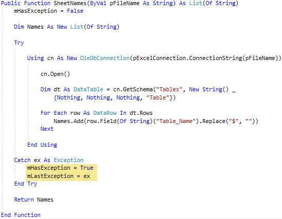

# Read ranges in Excel using OleDb data provider (VB.NET)
## Requires
- Visual Studio 2017
## License
- MIT
## Technologies
- C#
- Excel
- VB.Net
- OLEDB
- Language extensions
## Topics
- Excel
- Data Access
- Exception handling
- Excel read range
## Updated
- 01/18/2018
## Description

<h1>Introduction</h1>

This code sample is going to cover how to select a range of cells from a Excel WorkSheet using OleDb data provider. A developer wants to read WorkSheet data in a range e.g. A1 to C10 for example, how is this done and what kind
 of problems can arise when attempting to read a range will be discussed along with how to work through problems. Note that the code samples provided can&rsquo;t solve every issue without me writing very complex code to cover all issues/problems you may have.
 One can look at many different ways data was entered into Worksheets, mixed data, missing data or perhaps attempting to read where there is no data.

All data used in the code samples resides in a single Excel file with several work sheets with data, no data and various columns. If an exception is thrown (and there will be as I planned on this) they are captured in a property
 from a class so the form calling a class method can report back to the form what happened.

&nbsp;

<strong>EDIT</strong> After posting this code sample a question came up, how can I read a sheet with spaces in the sheet name? The answer is the apostrophes that are obtained from the name via GetSchema need to be removed. So
 until I upload the fix here it is, replace ExcelOperations.SheetNames with the following.

Visual Basic

Edit|Remove

vb
<pre class="hidden">Public Function SheetNames(ByVal pFileName As String) As List(Of String)
    mHasException = False

    Dim Names As New List(Of String)

    Try

        Using cn As New OleDbConnection(pExcelConnection.ConnectionString(pFileName))

            cn.Open()

            Dim dt As DataTable = cn.GetSchema(&quot;Tables&quot;, New String() _
                {Nothing, Nothing, Nothing, &quot;Table&quot;})

            For Each row As DataRow In dt.Rows
                Names.Add(row.Field(Of String)(&quot;Table_Name&quot;).Replace(&quot;$&quot;, &quot;&quot;).Replace(&quot;'&quot;, &quot;&quot;))
            Next

        End Using

    Catch ex As Exception
        mHasException = True
        mLastException = ex
    End Try

    Return Names

End Function</pre>

<pre class="js">Public&nbsp;Function&nbsp;SheetNames(ByVal&nbsp;pFileName&nbsp;As&nbsp;String)&nbsp;As&nbsp;List(Of&nbsp;String)&nbsp;
&nbsp;&nbsp;&nbsp;&nbsp;mHasException&nbsp;=&nbsp;False&nbsp;
&nbsp;
&nbsp;&nbsp;&nbsp;&nbsp;Dim&nbsp;Names&nbsp;As&nbsp;New&nbsp;List(Of&nbsp;String)&nbsp;
&nbsp;
&nbsp;&nbsp;&nbsp;&nbsp;Try&nbsp;
&nbsp;
&nbsp;&nbsp;&nbsp;&nbsp;&nbsp;&nbsp;&nbsp;&nbsp;Using&nbsp;cn&nbsp;As&nbsp;New&nbsp;OleDbConnection(pExcelConnection.ConnectionString(pFileName))&nbsp;
&nbsp;
&nbsp;&nbsp;&nbsp;&nbsp;&nbsp;&nbsp;&nbsp;&nbsp;&nbsp;&nbsp;&nbsp;&nbsp;cn.Open()&nbsp;
&nbsp;
&nbsp;&nbsp;&nbsp;&nbsp;&nbsp;&nbsp;&nbsp;&nbsp;&nbsp;&nbsp;&nbsp;&nbsp;Dim&nbsp;dt&nbsp;As&nbsp;DataTable&nbsp;=&nbsp;cn.GetSchema(&quot;Tables&quot;,&nbsp;New&nbsp;String()&nbsp;_&nbsp;
&nbsp;&nbsp;&nbsp;&nbsp;&nbsp;&nbsp;&nbsp;&nbsp;&nbsp;&nbsp;&nbsp;&nbsp;&nbsp;&nbsp;&nbsp;&nbsp;{Nothing,&nbsp;Nothing,&nbsp;Nothing,&nbsp;&quot;Table&quot;})&nbsp;
&nbsp;
&nbsp;&nbsp;&nbsp;&nbsp;&nbsp;&nbsp;&nbsp;&nbsp;&nbsp;&nbsp;&nbsp;&nbsp;For&nbsp;Each&nbsp;row&nbsp;As&nbsp;DataRow&nbsp;In&nbsp;dt.Rows&nbsp;
&nbsp;&nbsp;&nbsp;&nbsp;&nbsp;&nbsp;&nbsp;&nbsp;&nbsp;&nbsp;&nbsp;&nbsp;&nbsp;&nbsp;&nbsp;&nbsp;Names.Add(row.Field(Of&nbsp;String)(&quot;Table_Name&quot;).Replace(&quot;$&quot;,&nbsp;&quot;&quot;).Replace(&quot;'&quot;,&nbsp;&quot;&quot;))&nbsp;
&nbsp;&nbsp;&nbsp;&nbsp;&nbsp;&nbsp;&nbsp;&nbsp;&nbsp;&nbsp;&nbsp;&nbsp;Next&nbsp;
&nbsp;
&nbsp;&nbsp;&nbsp;&nbsp;&nbsp;&nbsp;&nbsp;&nbsp;End&nbsp;Using&nbsp;
&nbsp;
&nbsp;&nbsp;&nbsp;&nbsp;Catch&nbsp;ex&nbsp;As&nbsp;Exception&nbsp;
&nbsp;&nbsp;&nbsp;&nbsp;&nbsp;&nbsp;&nbsp;&nbsp;mHasException&nbsp;=&nbsp;True&nbsp;
&nbsp;&nbsp;&nbsp;&nbsp;&nbsp;&nbsp;&nbsp;&nbsp;mLastException&nbsp;=&nbsp;ex&nbsp;
&nbsp;&nbsp;&nbsp;&nbsp;End&nbsp;Try&nbsp;
&nbsp;
&nbsp;&nbsp;&nbsp;&nbsp;Return&nbsp;Names&nbsp;
&nbsp;
End&nbsp;Function</pre>

&nbsp;

<h1>Description</h1>

Screenshots shown below will help visualize what
I will discuss below the screenshots.

&nbsp;

&nbsp;

Let's get going.&nbsp;

&nbsp;

You are tasked with creating a form which will display Excel data where the user will select an Excel file, you present them with a list of sheets in the selected Excel file.

They press a button to load data followed by creating a selection in (for this example) a DataGridView control.

What if they want a sub-set on load rather than load all the data in a workSheet at once (I've had this requirement in the past). In the above screen shot &quot;Select a range smartly&quot; provides good code samples on how to permit
 a user to select a range via ComboBox controls.

&nbsp;Well it looks simple yet it's not. We need to write some methods to create data for the ComboBoxes and test them. In the screenshot
 &quot;special Extensions&quot; form is solely there for when I created these extensons to create a list of letters what would equate to Excel column letters e.g.

Note only can we have single and double letters for column names but even triple letters. So after creating the methods to create the Excel letter I created a reveral method to change an Excel column letter to a numeric column
 indexer e.g. A =1 and 1 = A.

The first ComboBox creates the letters, second creates the indexers and the third back to letters.

Every time you work in Visual Studio with VB.NET you are using C# which is what the .NET Framework was created in. With that said I created
 the above methods in C# in a C# class project and call them from VB.NET.&nbsp;

&nbsp;

C#

Edit|Remove

csharp
<pre class="hidden">using System;
using System.Linq;

namespace ExcelExtensionsCS
{
    public static class Extensions
    {
        /// &lt;summary&gt;
        /// Get column letter from ordinal
        /// &lt;/summary&gt;
        /// &lt;param name=&quot;pIndex&quot;&gt;&lt;/param&gt;
        /// &lt;returns&gt;&lt;/returns&gt;
        public static string ExcelColumnNameFromNumber(this int pIndex)
        {
            var chars = Enumerable.Range(0, 26)
                .Select((i) =&gt; ((char)(Convert.ToInt32('A') &#43; i)).ToString()).ToArray();

            pIndex -= 1;

            string columnName = null;
            var quotient = pIndex / 26;

            if (quotient &gt; 0)
            {
                columnName = ExcelColumnNameFromNumber(quotient) &#43; chars[pIndex % 26];
            }
            else
            {
                columnName = chars[pIndex % 26].ToString();
            }

            return columnName;

        }
        /// &lt;summary&gt;
        /// Convert excel column letter to it's ordinal position
        /// &lt;/summary&gt;
        /// &lt;param name=&quot;pColumnName&quot;&gt;&lt;/param&gt;
        /// &lt;returns&gt;&lt;/returns&gt;
        public static int ExcelColumnNameToNumber(this string pColumnName)
        {
            if (string.IsNullOrEmpty(pColumnName))
            {
                throw new ArgumentNullException(&quot;pColumnName&quot;);
            }

            pColumnName = pColumnName.ToUpperInvariant();

            int sum = 0;

            for (int i = 0; i &lt; pColumnName.Length; i&#43;&#43;)
            {
                sum *= 26;
                sum &#43;= (pColumnName[i] - 'A' &#43; 1);
            }

            return sum;
        }
    }
}
</pre>

<pre class="csharp">using&nbsp;System;&nbsp;
using&nbsp;System.Linq;&nbsp;
&nbsp;
namespace&nbsp;ExcelExtensionsCS&nbsp;
{&nbsp;
&nbsp;&nbsp;&nbsp;&nbsp;public&nbsp;static&nbsp;class&nbsp;Extensions&nbsp;
&nbsp;&nbsp;&nbsp;&nbsp;{&nbsp;
&nbsp;&nbsp;&nbsp;&nbsp;&nbsp;&nbsp;&nbsp;&nbsp;///&nbsp;&lt;summary&gt;&nbsp;
&nbsp;&nbsp;&nbsp;&nbsp;&nbsp;&nbsp;&nbsp;&nbsp;///&nbsp;Get&nbsp;column&nbsp;letter&nbsp;from&nbsp;ordinal&nbsp;
&nbsp;&nbsp;&nbsp;&nbsp;&nbsp;&nbsp;&nbsp;&nbsp;///&nbsp;&lt;/summary&gt;&nbsp;
&nbsp;&nbsp;&nbsp;&nbsp;&nbsp;&nbsp;&nbsp;&nbsp;///&nbsp;&lt;param&nbsp;name=&quot;pIndex&quot;&gt;&lt;/param&gt;&nbsp;
&nbsp;&nbsp;&nbsp;&nbsp;&nbsp;&nbsp;&nbsp;&nbsp;///&nbsp;&lt;returns&gt;&lt;/returns&gt;&nbsp;
&nbsp;&nbsp;&nbsp;&nbsp;&nbsp;&nbsp;&nbsp;&nbsp;public&nbsp;static&nbsp;string&nbsp;ExcelColumnNameFromNumber(this&nbsp;int&nbsp;pIndex)&nbsp;
&nbsp;&nbsp;&nbsp;&nbsp;&nbsp;&nbsp;&nbsp;&nbsp;{&nbsp;
&nbsp;&nbsp;&nbsp;&nbsp;&nbsp;&nbsp;&nbsp;&nbsp;&nbsp;&nbsp;&nbsp;&nbsp;var&nbsp;chars&nbsp;=&nbsp;Enumerable.Range(0,&nbsp;26)&nbsp;
&nbsp;&nbsp;&nbsp;&nbsp;&nbsp;&nbsp;&nbsp;&nbsp;&nbsp;&nbsp;&nbsp;&nbsp;&nbsp;&nbsp;&nbsp;&nbsp;.Select((i)&nbsp;=&gt;&nbsp;((char)(Convert.ToInt32('A')&nbsp;&#43;&nbsp;i)).ToString()).ToArray();&nbsp;
&nbsp;
&nbsp;&nbsp;&nbsp;&nbsp;&nbsp;&nbsp;&nbsp;&nbsp;&nbsp;&nbsp;&nbsp;&nbsp;pIndex&nbsp;-=&nbsp;1;&nbsp;
&nbsp;
&nbsp;&nbsp;&nbsp;&nbsp;&nbsp;&nbsp;&nbsp;&nbsp;&nbsp;&nbsp;&nbsp;&nbsp;string&nbsp;columnName&nbsp;=&nbsp;null;&nbsp;
&nbsp;&nbsp;&nbsp;&nbsp;&nbsp;&nbsp;&nbsp;&nbsp;&nbsp;&nbsp;&nbsp;&nbsp;var&nbsp;quotient&nbsp;=&nbsp;pIndex&nbsp;/&nbsp;26;&nbsp;
&nbsp;
&nbsp;&nbsp;&nbsp;&nbsp;&nbsp;&nbsp;&nbsp;&nbsp;&nbsp;&nbsp;&nbsp;&nbsp;if&nbsp;(quotient&nbsp;&gt;&nbsp;0)&nbsp;
&nbsp;&nbsp;&nbsp;&nbsp;&nbsp;&nbsp;&nbsp;&nbsp;&nbsp;&nbsp;&nbsp;&nbsp;{&nbsp;
&nbsp;&nbsp;&nbsp;&nbsp;&nbsp;&nbsp;&nbsp;&nbsp;&nbsp;&nbsp;&nbsp;&nbsp;&nbsp;&nbsp;&nbsp;&nbsp;columnName&nbsp;=&nbsp;ExcelColumnNameFromNumber(quotient)&nbsp;&#43;&nbsp;chars[pIndex&nbsp;%&nbsp;26];&nbsp;
&nbsp;&nbsp;&nbsp;&nbsp;&nbsp;&nbsp;&nbsp;&nbsp;&nbsp;&nbsp;&nbsp;&nbsp;}&nbsp;
&nbsp;&nbsp;&nbsp;&nbsp;&nbsp;&nbsp;&nbsp;&nbsp;&nbsp;&nbsp;&nbsp;&nbsp;else&nbsp;
&nbsp;&nbsp;&nbsp;&nbsp;&nbsp;&nbsp;&nbsp;&nbsp;&nbsp;&nbsp;&nbsp;&nbsp;{&nbsp;
&nbsp;&nbsp;&nbsp;&nbsp;&nbsp;&nbsp;&nbsp;&nbsp;&nbsp;&nbsp;&nbsp;&nbsp;&nbsp;&nbsp;&nbsp;&nbsp;columnName&nbsp;=&nbsp;chars[pIndex&nbsp;%&nbsp;26].ToString();&nbsp;
&nbsp;&nbsp;&nbsp;&nbsp;&nbsp;&nbsp;&nbsp;&nbsp;&nbsp;&nbsp;&nbsp;&nbsp;}&nbsp;
&nbsp;
&nbsp;&nbsp;&nbsp;&nbsp;&nbsp;&nbsp;&nbsp;&nbsp;&nbsp;&nbsp;&nbsp;&nbsp;return&nbsp;columnName;&nbsp;
&nbsp;
&nbsp;&nbsp;&nbsp;&nbsp;&nbsp;&nbsp;&nbsp;&nbsp;}&nbsp;
&nbsp;&nbsp;&nbsp;&nbsp;&nbsp;&nbsp;&nbsp;&nbsp;///&nbsp;&lt;summary&gt;&nbsp;
&nbsp;&nbsp;&nbsp;&nbsp;&nbsp;&nbsp;&nbsp;&nbsp;///&nbsp;Convert&nbsp;excel&nbsp;column&nbsp;letter&nbsp;to&nbsp;it's&nbsp;ordinal&nbsp;position&nbsp;
&nbsp;&nbsp;&nbsp;&nbsp;&nbsp;&nbsp;&nbsp;&nbsp;///&nbsp;&lt;/summary&gt;&nbsp;
&nbsp;&nbsp;&nbsp;&nbsp;&nbsp;&nbsp;&nbsp;&nbsp;///&nbsp;&lt;param&nbsp;name=&quot;pColumnName&quot;&gt;&lt;/param&gt;&nbsp;
&nbsp;&nbsp;&nbsp;&nbsp;&nbsp;&nbsp;&nbsp;&nbsp;///&nbsp;&lt;returns&gt;&lt;/returns&gt;&nbsp;
&nbsp;&nbsp;&nbsp;&nbsp;&nbsp;&nbsp;&nbsp;&nbsp;public&nbsp;static&nbsp;int&nbsp;ExcelColumnNameToNumber(this&nbsp;string&nbsp;pColumnName)&nbsp;
&nbsp;&nbsp;&nbsp;&nbsp;&nbsp;&nbsp;&nbsp;&nbsp;{&nbsp;
&nbsp;&nbsp;&nbsp;&nbsp;&nbsp;&nbsp;&nbsp;&nbsp;&nbsp;&nbsp;&nbsp;&nbsp;if&nbsp;(string.IsNullOrEmpty(pColumnName))&nbsp;
&nbsp;&nbsp;&nbsp;&nbsp;&nbsp;&nbsp;&nbsp;&nbsp;&nbsp;&nbsp;&nbsp;&nbsp;{&nbsp;
&nbsp;&nbsp;&nbsp;&nbsp;&nbsp;&nbsp;&nbsp;&nbsp;&nbsp;&nbsp;&nbsp;&nbsp;&nbsp;&nbsp;&nbsp;&nbsp;throw&nbsp;new&nbsp;ArgumentNullException(&quot;pColumnName&quot;);&nbsp;
&nbsp;&nbsp;&nbsp;&nbsp;&nbsp;&nbsp;&nbsp;&nbsp;&nbsp;&nbsp;&nbsp;&nbsp;}&nbsp;
&nbsp;
&nbsp;&nbsp;&nbsp;&nbsp;&nbsp;&nbsp;&nbsp;&nbsp;&nbsp;&nbsp;&nbsp;&nbsp;pColumnName&nbsp;=&nbsp;pColumnName.ToUpperInvariant();&nbsp;
&nbsp;
&nbsp;&nbsp;&nbsp;&nbsp;&nbsp;&nbsp;&nbsp;&nbsp;&nbsp;&nbsp;&nbsp;&nbsp;int&nbsp;sum&nbsp;=&nbsp;0;&nbsp;
&nbsp;
&nbsp;&nbsp;&nbsp;&nbsp;&nbsp;&nbsp;&nbsp;&nbsp;&nbsp;&nbsp;&nbsp;&nbsp;for&nbsp;(int&nbsp;i&nbsp;=&nbsp;0;&nbsp;i&nbsp;&lt;&nbsp;pColumnName.Length;&nbsp;i&#43;&#43;)&nbsp;
&nbsp;&nbsp;&nbsp;&nbsp;&nbsp;&nbsp;&nbsp;&nbsp;&nbsp;&nbsp;&nbsp;&nbsp;{&nbsp;
&nbsp;&nbsp;&nbsp;&nbsp;&nbsp;&nbsp;&nbsp;&nbsp;&nbsp;&nbsp;&nbsp;&nbsp;&nbsp;&nbsp;&nbsp;&nbsp;sum&nbsp;*=&nbsp;26;&nbsp;
&nbsp;&nbsp;&nbsp;&nbsp;&nbsp;&nbsp;&nbsp;&nbsp;&nbsp;&nbsp;&nbsp;&nbsp;&nbsp;&nbsp;&nbsp;&nbsp;sum&nbsp;&#43;=&nbsp;(pColumnName[i]&nbsp;-&nbsp;'A'&nbsp;&#43;&nbsp;1);&nbsp;
&nbsp;&nbsp;&nbsp;&nbsp;&nbsp;&nbsp;&nbsp;&nbsp;&nbsp;&nbsp;&nbsp;&nbsp;}&nbsp;
&nbsp;
&nbsp;&nbsp;&nbsp;&nbsp;&nbsp;&nbsp;&nbsp;&nbsp;&nbsp;&nbsp;&nbsp;&nbsp;return&nbsp;sum;&nbsp;
&nbsp;&nbsp;&nbsp;&nbsp;&nbsp;&nbsp;&nbsp;&nbsp;}&nbsp;
&nbsp;&nbsp;&nbsp;&nbsp;}&nbsp;
}&nbsp;
</pre>

Moving on to the fun part which is reading in a work sheet using the ComboBox controls to select a range sight unseen then afterwards you can select contiguous DataGridView cells and populate another
 DataGridView where in the first DataGridview I show column names as Fx as we are reading sheets with a setting HDR which means to treat the first row in the work sheet as data while HDR=Yes would read the first row as column names.

.

So column A is F1, B is F2 etc.

.

When you push data to the second DataGridView I revert from Fx to A, B,C etc. If you selected say F2 and F3 which equate to B and C I show B and C in the second DataGridView.

.

&nbsp;I use two DataGridView controls to consolidate every thing were in a real application there would be one
 or the other, not both.

.

All data we collect resides in either a DataTable or a concrete class, no&nbsp;anonymous types. Yes we have returned to VB.NET.

.

Visual Basic

Edit|Remove

vb
<pre class="hidden">Public Class ExcelRangeCellData
    Public Property Row As Integer
    Public Property Col As Integer
    Public Overrides Function ToString() As String
        Return $&quot;{Row},{Col}&quot;
    End Function
End Class</pre>

<pre class="vb">Public&nbsp;Class&nbsp;ExcelRangeCellData&nbsp;
&nbsp;&nbsp;&nbsp;&nbsp;Public&nbsp;Property&nbsp;Row&nbsp;As&nbsp;Integer&nbsp;
&nbsp;&nbsp;&nbsp;&nbsp;Public&nbsp;Property&nbsp;Col&nbsp;As&nbsp;Integer&nbsp;
&nbsp;&nbsp;&nbsp;&nbsp;Public&nbsp;Overrides&nbsp;Function&nbsp;ToString()&nbsp;As&nbsp;String&nbsp;
&nbsp;&nbsp;&nbsp;&nbsp;&nbsp;&nbsp;&nbsp;&nbsp;Return&nbsp;$&quot;{Row},{Col}&quot;&nbsp;
&nbsp;&nbsp;&nbsp;&nbsp;End&nbsp;Function&nbsp;
End&nbsp;Class</pre>

And&nbsp;

Visual Basic

Edit|Remove

vb
<pre class="hidden">Imports ExcelExtensionsCS
''' &lt;summary&gt;
''' Responsible as a container for selected Excel range. Note the
''' read-only properties assist with creating the field list e.g.
''' SELECT F1,F2, F2 
''' 
''' Note the use of ExcelColumnNameToNumber which is a C# language
''' extension method (what, C#). I used C# because VB.NET developers
''' need to get use to mixing it up with C# rather than taking perfectly
''' good code and converting it which in this case serves no purpose
''' other than &quot;hey I have some cool code&quot;.
''' 
''' Properties are self-explanatory.
''' &lt;/summary&gt;
Public Class ExcelRangeItem
    ''' &lt;summary&gt;
    ''' Start of range column letter
    ''' &lt;/summary&gt;
    ''' &lt;returns&gt;&lt;/returns&gt;
    Public Property StartColumn As String
    Public ReadOnly Property StartColumnIndex As Integer
        Get
            Return StartColumn.ExcelColumnNameToNumber
        End Get
    End Property
    ''' &lt;summary&gt;
    ''' Start row combined with StartColumn e.g. A1 where 1 is the start row
    ''' &lt;/summary&gt;
    ''' &lt;returns&gt;&lt;/returns&gt;
    Public Property StartRow As Integer
    Public Property EndColumn As String
    Public ReadOnly Property EndColumnIndex As Integer
        Get
            Return EndColumn.ExcelColumnNameToNumber
        End Get
    End Property
    Public Property EndRow As Integer
    ''' &lt;summary&gt;
    ''' Show our range so when and if you debug and hit a break-point
    ''' you can see the range selected.
    ''' &lt;/summary&gt;
    ''' &lt;returns&gt;&lt;/returns&gt;
    Public Overrides Function ToString() As String
        Return $&quot;{StartColumn}{StartRow}:{EndColumn}{EndRow}&quot;
    End Function

End Class
</pre>

<pre class="vb">Imports&nbsp;ExcelExtensionsCS&nbsp;
'''&nbsp;&lt;summary&gt;&nbsp;
'''&nbsp;Responsible&nbsp;as&nbsp;a&nbsp;container&nbsp;for&nbsp;selected&nbsp;Excel&nbsp;range.&nbsp;Note&nbsp;the&nbsp;
'''&nbsp;read-only&nbsp;properties&nbsp;assist&nbsp;with&nbsp;creating&nbsp;the&nbsp;field&nbsp;list&nbsp;e.g.&nbsp;
'''&nbsp;SELECT&nbsp;F1,F2,&nbsp;F2&nbsp;&nbsp;
'''&nbsp;&nbsp;
'''&nbsp;Note&nbsp;the&nbsp;use&nbsp;of&nbsp;ExcelColumnNameToNumber&nbsp;which&nbsp;is&nbsp;a&nbsp;C#&nbsp;language&nbsp;
'''&nbsp;extension&nbsp;method&nbsp;(what,&nbsp;C#).&nbsp;I&nbsp;used&nbsp;C#&nbsp;because&nbsp;VB.NET&nbsp;developers&nbsp;
'''&nbsp;need&nbsp;to&nbsp;get&nbsp;use&nbsp;to&nbsp;mixing&nbsp;it&nbsp;up&nbsp;with&nbsp;C#&nbsp;rather&nbsp;than&nbsp;taking&nbsp;perfectly&nbsp;
'''&nbsp;good&nbsp;code&nbsp;and&nbsp;converting&nbsp;it&nbsp;which&nbsp;in&nbsp;this&nbsp;case&nbsp;serves&nbsp;no&nbsp;purpose&nbsp;
'''&nbsp;other&nbsp;than&nbsp;&quot;hey&nbsp;I&nbsp;have&nbsp;some&nbsp;cool&nbsp;code&quot;.&nbsp;
'''&nbsp;&nbsp;
'''&nbsp;Properties&nbsp;are&nbsp;self-explanatory.&nbsp;
'''&nbsp;&lt;/summary&gt;&nbsp;
Public&nbsp;Class&nbsp;ExcelRangeItem&nbsp;
&nbsp;&nbsp;&nbsp;&nbsp;'''&nbsp;&lt;summary&gt;&nbsp;
&nbsp;&nbsp;&nbsp;&nbsp;'''&nbsp;Start&nbsp;of&nbsp;range&nbsp;column&nbsp;letter&nbsp;
&nbsp;&nbsp;&nbsp;&nbsp;'''&nbsp;&lt;/summary&gt;&nbsp;
&nbsp;&nbsp;&nbsp;&nbsp;'''&nbsp;&lt;returns&gt;&lt;/returns&gt;&nbsp;
&nbsp;&nbsp;&nbsp;&nbsp;Public&nbsp;Property&nbsp;StartColumn&nbsp;As&nbsp;String&nbsp;
&nbsp;&nbsp;&nbsp;&nbsp;Public&nbsp;ReadOnly&nbsp;Property&nbsp;StartColumnIndex&nbsp;As&nbsp;Integer&nbsp;
&nbsp;&nbsp;&nbsp;&nbsp;&nbsp;&nbsp;&nbsp;&nbsp;Get&nbsp;
&nbsp;&nbsp;&nbsp;&nbsp;&nbsp;&nbsp;&nbsp;&nbsp;&nbsp;&nbsp;&nbsp;&nbsp;Return&nbsp;StartColumn.ExcelColumnNameToNumber&nbsp;
&nbsp;&nbsp;&nbsp;&nbsp;&nbsp;&nbsp;&nbsp;&nbsp;End&nbsp;Get&nbsp;
&nbsp;&nbsp;&nbsp;&nbsp;End&nbsp;Property&nbsp;
&nbsp;&nbsp;&nbsp;&nbsp;'''&nbsp;&lt;summary&gt;&nbsp;
&nbsp;&nbsp;&nbsp;&nbsp;'''&nbsp;Start&nbsp;row&nbsp;combined&nbsp;with&nbsp;StartColumn&nbsp;e.g.&nbsp;A1&nbsp;where&nbsp;1&nbsp;is&nbsp;the&nbsp;start&nbsp;row&nbsp;
&nbsp;&nbsp;&nbsp;&nbsp;'''&nbsp;&lt;/summary&gt;&nbsp;
&nbsp;&nbsp;&nbsp;&nbsp;'''&nbsp;&lt;returns&gt;&lt;/returns&gt;&nbsp;
&nbsp;&nbsp;&nbsp;&nbsp;Public&nbsp;Property&nbsp;StartRow&nbsp;As&nbsp;Integer&nbsp;
&nbsp;&nbsp;&nbsp;&nbsp;Public&nbsp;Property&nbsp;EndColumn&nbsp;As&nbsp;String&nbsp;
&nbsp;&nbsp;&nbsp;&nbsp;Public&nbsp;ReadOnly&nbsp;Property&nbsp;EndColumnIndex&nbsp;As&nbsp;Integer&nbsp;
&nbsp;&nbsp;&nbsp;&nbsp;&nbsp;&nbsp;&nbsp;&nbsp;Get&nbsp;
&nbsp;&nbsp;&nbsp;&nbsp;&nbsp;&nbsp;&nbsp;&nbsp;&nbsp;&nbsp;&nbsp;&nbsp;Return&nbsp;EndColumn.ExcelColumnNameToNumber&nbsp;
&nbsp;&nbsp;&nbsp;&nbsp;&nbsp;&nbsp;&nbsp;&nbsp;End&nbsp;Get&nbsp;
&nbsp;&nbsp;&nbsp;&nbsp;End&nbsp;Property&nbsp;
&nbsp;&nbsp;&nbsp;&nbsp;Public&nbsp;Property&nbsp;EndRow&nbsp;As&nbsp;Integer&nbsp;
&nbsp;&nbsp;&nbsp;&nbsp;'''&nbsp;&lt;summary&gt;&nbsp;
&nbsp;&nbsp;&nbsp;&nbsp;'''&nbsp;Show&nbsp;our&nbsp;range&nbsp;so&nbsp;when&nbsp;and&nbsp;if&nbsp;you&nbsp;debug&nbsp;and&nbsp;hit&nbsp;a&nbsp;break-point&nbsp;
&nbsp;&nbsp;&nbsp;&nbsp;'''&nbsp;you&nbsp;can&nbsp;see&nbsp;the&nbsp;range&nbsp;selected.&nbsp;
&nbsp;&nbsp;&nbsp;&nbsp;'''&nbsp;&lt;/summary&gt;&nbsp;
&nbsp;&nbsp;&nbsp;&nbsp;'''&nbsp;&lt;returns&gt;&lt;/returns&gt;&nbsp;
&nbsp;&nbsp;&nbsp;&nbsp;Public&nbsp;Overrides&nbsp;Function&nbsp;ToString()&nbsp;As&nbsp;String&nbsp;
&nbsp;&nbsp;&nbsp;&nbsp;&nbsp;&nbsp;&nbsp;&nbsp;Return&nbsp;$&quot;{StartColumn}{StartRow}:{EndColumn}{EndRow}&quot;&nbsp;
&nbsp;&nbsp;&nbsp;&nbsp;End&nbsp;Function&nbsp;
&nbsp;
End&nbsp;Class&nbsp;
</pre>

Reading data is extremely simple as shown below. All the hard work is taking selections of rows and column and converting them from Fx to letter and reversing them.

.

Visual Basic

Edit|Remove

vb
<pre class="hidden">Imports System.Data.OleDb
Imports KarensBaseClasses
Imports ExcelConnectionLibraryCS

Public Class ExcelOperations
    Inherits BaseExceptionProperties

    Private pExcelConnection = New Utils()
    ''' &lt;summary&gt;
    ''' Get used rows from a work sheet. N0 guarantees
    ''' that this is completly dependable as no rows
    ''' can show up as one row. Yet another issue with OleDb.
    ''' &lt;/summary&gt;
    ''' &lt;param name=&quot;pFileName&quot;&gt;&lt;/param&gt;
    ''' &lt;param name=&quot;pSheetName&quot;&gt;&lt;/param&gt;
    ''' &lt;returns&gt;&lt;/returns&gt;
    Public Function UsedRows(ByVal pFileName As String, ByVal pSheetName As String) As Integer

        mHasException = False

        Dim rowCount As Integer = 0

        Try

            Using cn As New OleDbConnection(pExcelConnection.ConnectionString(pFileName))
                Using cmd As New OleDbCommand With {.Connection = cn}
                    cmd.CommandText = $&quot;SELECT * FROM [{pSheetName}$]&quot;
                    cn.Open()
                    Dim dt As New DataTable
                    dt.Load(cmd.ExecuteReader)
                    rowCount = dt.Rows.Count
                End Using
            End Using

        Catch ex As Exception
            mHasException = True
            mLastException = ex
        End Try

        Return rowCount

    End Function
    Public Function CreateRangeString(
        ByVal pStartColumn As String,
        ByVal pStartRow As Integer,
        ByVal pEndColumn As String,
        ByVal pEndRow As Integer) As ExcelRangeItem

        Return New ExcelRangeItem With
            {
                .StartColumn = pStartColumn,
                .StartRow = pStartRow,
                .EndColumn = pEndColumn,
                .EndRow = pEndRow
            }

    End Function
    ''' &lt;summary&gt;
    ''' Get available sheet names
    ''' &lt;/summary&gt;
    ''' &lt;param name=&quot;pFileName&quot;&gt;&lt;/param&gt;
    ''' &lt;returns&gt;&lt;/returns&gt;
    Public Function SheetNames(ByVal pFileName As String) As List(Of String)
        mHasException = False

        Dim Names As New List(Of String)

        Try

            Using cn As New OleDbConnection(pExcelConnection.ConnectionString(pFileName))

                cn.Open()

                Dim dt As DataTable = cn.GetSchema(&quot;Tables&quot;, New String() _
                    {Nothing, Nothing, Nothing, &quot;Table&quot;})

                For Each row As DataRow In dt.Rows
                    Names.Add(row.Field(Of String)(&quot;Table_Name&quot;).Replace(&quot;$&quot;, &quot;&quot;))
                Next

            End Using

        Catch ex As Exception
            mHasException = True
            mLastException = ex
        End Try

        Return Names

    End Function
    ''' &lt;summary&gt;
    ''' Read sheet data based on range selected.
    ''' &lt;/summary&gt;
    ''' &lt;param name=&quot;pFileName&quot;&gt;&lt;/param&gt;
    ''' &lt;param name=&quot;pQuery&quot;&gt;&lt;/param&gt;
    ''' &lt;returns&gt;&lt;/returns&gt;
    Public Function ReadData(ByVal pFileName As String, ByVal pQuery As String) As DataTable

        mHasException = False

        Dim dt As New DataTable

        Try
            Using cn As New OleDbConnection
                cn.ConnectionString = pExcelConnection.ConnectionString(pFileName)
                Using cmd As New OleDbCommand With {.Connection = cn, .CommandText = pQuery}
                    cn.Open()
                    dt.Load(cmd.ExecuteReader)
                End Using

            End Using
        Catch ex As Exception
            mHasException = True
            mLastException = ex
        End Try

        Return dt

    End Function

End Class
</pre>

<pre class="vb">Imports&nbsp;System.Data.OleDb&nbsp;
Imports&nbsp;KarensBaseClasses&nbsp;
Imports&nbsp;ExcelConnectionLibraryCS&nbsp;
&nbsp;
Public&nbsp;Class&nbsp;ExcelOperations&nbsp;
&nbsp;&nbsp;&nbsp;&nbsp;Inherits&nbsp;BaseExceptionProperties&nbsp;
&nbsp;
&nbsp;&nbsp;&nbsp;&nbsp;Private&nbsp;pExcelConnection&nbsp;=&nbsp;New&nbsp;Utils()&nbsp;
&nbsp;&nbsp;&nbsp;&nbsp;'''&nbsp;&lt;summary&gt;&nbsp;
&nbsp;&nbsp;&nbsp;&nbsp;'''&nbsp;Get&nbsp;used&nbsp;rows&nbsp;from&nbsp;a&nbsp;work&nbsp;sheet.&nbsp;N0&nbsp;guarantees&nbsp;
&nbsp;&nbsp;&nbsp;&nbsp;'''&nbsp;that&nbsp;this&nbsp;is&nbsp;completly&nbsp;dependable&nbsp;as&nbsp;no&nbsp;rows&nbsp;
&nbsp;&nbsp;&nbsp;&nbsp;'''&nbsp;can&nbsp;show&nbsp;up&nbsp;as&nbsp;one&nbsp;row.&nbsp;Yet&nbsp;another&nbsp;issue&nbsp;with&nbsp;OleDb.&nbsp;
&nbsp;&nbsp;&nbsp;&nbsp;'''&nbsp;&lt;/summary&gt;&nbsp;
&nbsp;&nbsp;&nbsp;&nbsp;'''&nbsp;&lt;param&nbsp;name=&quot;pFileName&quot;&gt;&lt;/param&gt;&nbsp;
&nbsp;&nbsp;&nbsp;&nbsp;'''&nbsp;&lt;param&nbsp;name=&quot;pSheetName&quot;&gt;&lt;/param&gt;&nbsp;
&nbsp;&nbsp;&nbsp;&nbsp;'''&nbsp;&lt;returns&gt;&lt;/returns&gt;&nbsp;
&nbsp;&nbsp;&nbsp;&nbsp;Public&nbsp;Function&nbsp;UsedRows(ByVal&nbsp;pFileName&nbsp;As&nbsp;String,&nbsp;ByVal&nbsp;pSheetName&nbsp;As&nbsp;String)&nbsp;As&nbsp;Integer&nbsp;
&nbsp;
&nbsp;&nbsp;&nbsp;&nbsp;&nbsp;&nbsp;&nbsp;&nbsp;mHasException&nbsp;=&nbsp;False&nbsp;
&nbsp;
&nbsp;&nbsp;&nbsp;&nbsp;&nbsp;&nbsp;&nbsp;&nbsp;Dim&nbsp;rowCount&nbsp;As&nbsp;Integer&nbsp;=&nbsp;0&nbsp;
&nbsp;
&nbsp;&nbsp;&nbsp;&nbsp;&nbsp;&nbsp;&nbsp;&nbsp;Try&nbsp;
&nbsp;
&nbsp;&nbsp;&nbsp;&nbsp;&nbsp;&nbsp;&nbsp;&nbsp;&nbsp;&nbsp;&nbsp;&nbsp;Using&nbsp;cn&nbsp;As&nbsp;New&nbsp;OleDbConnection(pExcelConnection.ConnectionString(pFileName))&nbsp;
&nbsp;&nbsp;&nbsp;&nbsp;&nbsp;&nbsp;&nbsp;&nbsp;&nbsp;&nbsp;&nbsp;&nbsp;&nbsp;&nbsp;&nbsp;&nbsp;Using&nbsp;cmd&nbsp;As&nbsp;New&nbsp;OleDbCommand&nbsp;With&nbsp;{.Connection&nbsp;=&nbsp;cn}&nbsp;
&nbsp;&nbsp;&nbsp;&nbsp;&nbsp;&nbsp;&nbsp;&nbsp;&nbsp;&nbsp;&nbsp;&nbsp;&nbsp;&nbsp;&nbsp;&nbsp;&nbsp;&nbsp;&nbsp;&nbsp;cmd.CommandText&nbsp;=&nbsp;$&quot;SELECT&nbsp;*&nbsp;FROM&nbsp;[{pSheetName}$]&quot;&nbsp;
&nbsp;&nbsp;&nbsp;&nbsp;&nbsp;&nbsp;&nbsp;&nbsp;&nbsp;&nbsp;&nbsp;&nbsp;&nbsp;&nbsp;&nbsp;&nbsp;&nbsp;&nbsp;&nbsp;&nbsp;cn.Open()&nbsp;
&nbsp;&nbsp;&nbsp;&nbsp;&nbsp;&nbsp;&nbsp;&nbsp;&nbsp;&nbsp;&nbsp;&nbsp;&nbsp;&nbsp;&nbsp;&nbsp;&nbsp;&nbsp;&nbsp;&nbsp;Dim&nbsp;dt&nbsp;As&nbsp;New&nbsp;DataTable&nbsp;
&nbsp;&nbsp;&nbsp;&nbsp;&nbsp;&nbsp;&nbsp;&nbsp;&nbsp;&nbsp;&nbsp;&nbsp;&nbsp;&nbsp;&nbsp;&nbsp;&nbsp;&nbsp;&nbsp;&nbsp;dt.Load(cmd.ExecuteReader)&nbsp;
&nbsp;&nbsp;&nbsp;&nbsp;&nbsp;&nbsp;&nbsp;&nbsp;&nbsp;&nbsp;&nbsp;&nbsp;&nbsp;&nbsp;&nbsp;&nbsp;&nbsp;&nbsp;&nbsp;&nbsp;rowCount&nbsp;=&nbsp;dt.Rows.Count&nbsp;
&nbsp;&nbsp;&nbsp;&nbsp;&nbsp;&nbsp;&nbsp;&nbsp;&nbsp;&nbsp;&nbsp;&nbsp;&nbsp;&nbsp;&nbsp;&nbsp;End&nbsp;Using&nbsp;
&nbsp;&nbsp;&nbsp;&nbsp;&nbsp;&nbsp;&nbsp;&nbsp;&nbsp;&nbsp;&nbsp;&nbsp;End&nbsp;Using&nbsp;
&nbsp;
&nbsp;&nbsp;&nbsp;&nbsp;&nbsp;&nbsp;&nbsp;&nbsp;Catch&nbsp;ex&nbsp;As&nbsp;Exception&nbsp;
&nbsp;&nbsp;&nbsp;&nbsp;&nbsp;&nbsp;&nbsp;&nbsp;&nbsp;&nbsp;&nbsp;&nbsp;mHasException&nbsp;=&nbsp;True&nbsp;
&nbsp;&nbsp;&nbsp;&nbsp;&nbsp;&nbsp;&nbsp;&nbsp;&nbsp;&nbsp;&nbsp;&nbsp;mLastException&nbsp;=&nbsp;ex&nbsp;
&nbsp;&nbsp;&nbsp;&nbsp;&nbsp;&nbsp;&nbsp;&nbsp;End&nbsp;Try&nbsp;
&nbsp;
&nbsp;&nbsp;&nbsp;&nbsp;&nbsp;&nbsp;&nbsp;&nbsp;Return&nbsp;rowCount&nbsp;
&nbsp;
&nbsp;&nbsp;&nbsp;&nbsp;End&nbsp;Function&nbsp;
&nbsp;&nbsp;&nbsp;&nbsp;Public&nbsp;Function&nbsp;CreateRangeString(&nbsp;
&nbsp;&nbsp;&nbsp;&nbsp;&nbsp;&nbsp;&nbsp;&nbsp;ByVal&nbsp;pStartColumn&nbsp;As&nbsp;String,&nbsp;
&nbsp;&nbsp;&nbsp;&nbsp;&nbsp;&nbsp;&nbsp;&nbsp;ByVal&nbsp;pStartRow&nbsp;As&nbsp;Integer,&nbsp;
&nbsp;&nbsp;&nbsp;&nbsp;&nbsp;&nbsp;&nbsp;&nbsp;ByVal&nbsp;pEndColumn&nbsp;As&nbsp;String,&nbsp;
&nbsp;&nbsp;&nbsp;&nbsp;&nbsp;&nbsp;&nbsp;&nbsp;ByVal&nbsp;pEndRow&nbsp;As&nbsp;Integer)&nbsp;As&nbsp;ExcelRangeItem&nbsp;
&nbsp;
&nbsp;&nbsp;&nbsp;&nbsp;&nbsp;&nbsp;&nbsp;&nbsp;Return&nbsp;New&nbsp;ExcelRangeItem&nbsp;With&nbsp;
&nbsp;&nbsp;&nbsp;&nbsp;&nbsp;&nbsp;&nbsp;&nbsp;&nbsp;&nbsp;&nbsp;&nbsp;{&nbsp;
&nbsp;&nbsp;&nbsp;&nbsp;&nbsp;&nbsp;&nbsp;&nbsp;&nbsp;&nbsp;&nbsp;&nbsp;&nbsp;&nbsp;&nbsp;&nbsp;.StartColumn&nbsp;=&nbsp;pStartColumn,&nbsp;
&nbsp;&nbsp;&nbsp;&nbsp;&nbsp;&nbsp;&nbsp;&nbsp;&nbsp;&nbsp;&nbsp;&nbsp;&nbsp;&nbsp;&nbsp;&nbsp;.StartRow&nbsp;=&nbsp;pStartRow,&nbsp;
&nbsp;&nbsp;&nbsp;&nbsp;&nbsp;&nbsp;&nbsp;&nbsp;&nbsp;&nbsp;&nbsp;&nbsp;&nbsp;&nbsp;&nbsp;&nbsp;.EndColumn&nbsp;=&nbsp;pEndColumn,&nbsp;
&nbsp;&nbsp;&nbsp;&nbsp;&nbsp;&nbsp;&nbsp;&nbsp;&nbsp;&nbsp;&nbsp;&nbsp;&nbsp;&nbsp;&nbsp;&nbsp;.EndRow&nbsp;=&nbsp;pEndRow&nbsp;
&nbsp;&nbsp;&nbsp;&nbsp;&nbsp;&nbsp;&nbsp;&nbsp;&nbsp;&nbsp;&nbsp;&nbsp;}&nbsp;
&nbsp;
&nbsp;&nbsp;&nbsp;&nbsp;End&nbsp;Function&nbsp;
&nbsp;&nbsp;&nbsp;&nbsp;'''&nbsp;&lt;summary&gt;&nbsp;
&nbsp;&nbsp;&nbsp;&nbsp;'''&nbsp;Get&nbsp;available&nbsp;sheet&nbsp;names&nbsp;
&nbsp;&nbsp;&nbsp;&nbsp;'''&nbsp;&lt;/summary&gt;&nbsp;
&nbsp;&nbsp;&nbsp;&nbsp;'''&nbsp;&lt;param&nbsp;name=&quot;pFileName&quot;&gt;&lt;/param&gt;&nbsp;
&nbsp;&nbsp;&nbsp;&nbsp;'''&nbsp;&lt;returns&gt;&lt;/returns&gt;&nbsp;
&nbsp;&nbsp;&nbsp;&nbsp;Public&nbsp;Function&nbsp;SheetNames(ByVal&nbsp;pFileName&nbsp;As&nbsp;String)&nbsp;As&nbsp;List(Of&nbsp;String)&nbsp;
&nbsp;&nbsp;&nbsp;&nbsp;&nbsp;&nbsp;&nbsp;&nbsp;mHasException&nbsp;=&nbsp;False&nbsp;
&nbsp;
&nbsp;&nbsp;&nbsp;&nbsp;&nbsp;&nbsp;&nbsp;&nbsp;Dim&nbsp;Names&nbsp;As&nbsp;New&nbsp;List(Of&nbsp;String)&nbsp;
&nbsp;
&nbsp;&nbsp;&nbsp;&nbsp;&nbsp;&nbsp;&nbsp;&nbsp;Try&nbsp;
&nbsp;
&nbsp;&nbsp;&nbsp;&nbsp;&nbsp;&nbsp;&nbsp;&nbsp;&nbsp;&nbsp;&nbsp;&nbsp;Using&nbsp;cn&nbsp;As&nbsp;New&nbsp;OleDbConnection(pExcelConnection.ConnectionString(pFileName))&nbsp;
&nbsp;
&nbsp;&nbsp;&nbsp;&nbsp;&nbsp;&nbsp;&nbsp;&nbsp;&nbsp;&nbsp;&nbsp;&nbsp;&nbsp;&nbsp;&nbsp;&nbsp;cn.Open()&nbsp;
&nbsp;
&nbsp;&nbsp;&nbsp;&nbsp;&nbsp;&nbsp;&nbsp;&nbsp;&nbsp;&nbsp;&nbsp;&nbsp;&nbsp;&nbsp;&nbsp;&nbsp;Dim&nbsp;dt&nbsp;As&nbsp;DataTable&nbsp;=&nbsp;cn.GetSchema(&quot;Tables&quot;,&nbsp;New&nbsp;String()&nbsp;_&nbsp;
&nbsp;&nbsp;&nbsp;&nbsp;&nbsp;&nbsp;&nbsp;&nbsp;&nbsp;&nbsp;&nbsp;&nbsp;&nbsp;&nbsp;&nbsp;&nbsp;&nbsp;&nbsp;&nbsp;&nbsp;{Nothing,&nbsp;Nothing,&nbsp;Nothing,&nbsp;&quot;Table&quot;})&nbsp;
&nbsp;
&nbsp;&nbsp;&nbsp;&nbsp;&nbsp;&nbsp;&nbsp;&nbsp;&nbsp;&nbsp;&nbsp;&nbsp;&nbsp;&nbsp;&nbsp;&nbsp;For&nbsp;Each&nbsp;row&nbsp;As&nbsp;DataRow&nbsp;In&nbsp;dt.Rows&nbsp;
&nbsp;&nbsp;&nbsp;&nbsp;&nbsp;&nbsp;&nbsp;&nbsp;&nbsp;&nbsp;&nbsp;&nbsp;&nbsp;&nbsp;&nbsp;&nbsp;&nbsp;&nbsp;&nbsp;&nbsp;Names.Add(row.Field(Of&nbsp;String)(&quot;Table_Name&quot;).Replace(&quot;$&quot;,&nbsp;&quot;&quot;))&nbsp;
&nbsp;&nbsp;&nbsp;&nbsp;&nbsp;&nbsp;&nbsp;&nbsp;&nbsp;&nbsp;&nbsp;&nbsp;&nbsp;&nbsp;&nbsp;&nbsp;Next&nbsp;
&nbsp;
&nbsp;&nbsp;&nbsp;&nbsp;&nbsp;&nbsp;&nbsp;&nbsp;&nbsp;&nbsp;&nbsp;&nbsp;End&nbsp;Using&nbsp;
&nbsp;
&nbsp;&nbsp;&nbsp;&nbsp;&nbsp;&nbsp;&nbsp;&nbsp;Catch&nbsp;ex&nbsp;As&nbsp;Exception&nbsp;
&nbsp;&nbsp;&nbsp;&nbsp;&nbsp;&nbsp;&nbsp;&nbsp;&nbsp;&nbsp;&nbsp;&nbsp;mHasException&nbsp;=&nbsp;True&nbsp;
&nbsp;&nbsp;&nbsp;&nbsp;&nbsp;&nbsp;&nbsp;&nbsp;&nbsp;&nbsp;&nbsp;&nbsp;mLastException&nbsp;=&nbsp;ex&nbsp;
&nbsp;&nbsp;&nbsp;&nbsp;&nbsp;&nbsp;&nbsp;&nbsp;End&nbsp;Try&nbsp;
&nbsp;
&nbsp;&nbsp;&nbsp;&nbsp;&nbsp;&nbsp;&nbsp;&nbsp;Return&nbsp;Names&nbsp;
&nbsp;
&nbsp;&nbsp;&nbsp;&nbsp;End&nbsp;Function&nbsp;
&nbsp;&nbsp;&nbsp;&nbsp;'''&nbsp;&lt;summary&gt;&nbsp;
&nbsp;&nbsp;&nbsp;&nbsp;'''&nbsp;Read&nbsp;sheet&nbsp;data&nbsp;based&nbsp;on&nbsp;range&nbsp;selected.&nbsp;
&nbsp;&nbsp;&nbsp;&nbsp;'''&nbsp;&lt;/summary&gt;&nbsp;
&nbsp;&nbsp;&nbsp;&nbsp;'''&nbsp;&lt;param&nbsp;name=&quot;pFileName&quot;&gt;&lt;/param&gt;&nbsp;
&nbsp;&nbsp;&nbsp;&nbsp;'''&nbsp;&lt;param&nbsp;name=&quot;pQuery&quot;&gt;&lt;/param&gt;&nbsp;
&nbsp;&nbsp;&nbsp;&nbsp;'''&nbsp;&lt;returns&gt;&lt;/returns&gt;&nbsp;
&nbsp;&nbsp;&nbsp;&nbsp;Public&nbsp;Function&nbsp;ReadData(ByVal&nbsp;pFileName&nbsp;As&nbsp;String,&nbsp;ByVal&nbsp;pQuery&nbsp;As&nbsp;String)&nbsp;As&nbsp;DataTable&nbsp;
&nbsp;
&nbsp;&nbsp;&nbsp;&nbsp;&nbsp;&nbsp;&nbsp;&nbsp;mHasException&nbsp;=&nbsp;False&nbsp;
&nbsp;
&nbsp;&nbsp;&nbsp;&nbsp;&nbsp;&nbsp;&nbsp;&nbsp;Dim&nbsp;dt&nbsp;As&nbsp;New&nbsp;DataTable&nbsp;
&nbsp;
&nbsp;
&nbsp;&nbsp;&nbsp;&nbsp;&nbsp;&nbsp;&nbsp;&nbsp;Try&nbsp;
&nbsp;&nbsp;&nbsp;&nbsp;&nbsp;&nbsp;&nbsp;&nbsp;&nbsp;&nbsp;&nbsp;&nbsp;Using&nbsp;cn&nbsp;As&nbsp;New&nbsp;OleDbConnection&nbsp;
&nbsp;&nbsp;&nbsp;&nbsp;&nbsp;&nbsp;&nbsp;&nbsp;&nbsp;&nbsp;&nbsp;&nbsp;&nbsp;&nbsp;&nbsp;&nbsp;cn.ConnectionString&nbsp;=&nbsp;pExcelConnection.ConnectionString(pFileName)&nbsp;
&nbsp;&nbsp;&nbsp;&nbsp;&nbsp;&nbsp;&nbsp;&nbsp;&nbsp;&nbsp;&nbsp;&nbsp;&nbsp;&nbsp;&nbsp;&nbsp;Using&nbsp;cmd&nbsp;As&nbsp;New&nbsp;OleDbCommand&nbsp;With&nbsp;{.Connection&nbsp;=&nbsp;cn,&nbsp;.CommandText&nbsp;=&nbsp;pQuery}&nbsp;
&nbsp;&nbsp;&nbsp;&nbsp;&nbsp;&nbsp;&nbsp;&nbsp;&nbsp;&nbsp;&nbsp;&nbsp;&nbsp;&nbsp;&nbsp;&nbsp;&nbsp;&nbsp;&nbsp;&nbsp;cn.Open()&nbsp;
&nbsp;&nbsp;&nbsp;&nbsp;&nbsp;&nbsp;&nbsp;&nbsp;&nbsp;&nbsp;&nbsp;&nbsp;&nbsp;&nbsp;&nbsp;&nbsp;&nbsp;&nbsp;&nbsp;&nbsp;dt.Load(cmd.ExecuteReader)&nbsp;
&nbsp;&nbsp;&nbsp;&nbsp;&nbsp;&nbsp;&nbsp;&nbsp;&nbsp;&nbsp;&nbsp;&nbsp;&nbsp;&nbsp;&nbsp;&nbsp;End&nbsp;Using&nbsp;
&nbsp;
&nbsp;&nbsp;&nbsp;&nbsp;&nbsp;&nbsp;&nbsp;&nbsp;&nbsp;&nbsp;&nbsp;&nbsp;End&nbsp;Using&nbsp;
&nbsp;&nbsp;&nbsp;&nbsp;&nbsp;&nbsp;&nbsp;&nbsp;Catch&nbsp;ex&nbsp;As&nbsp;Exception&nbsp;
&nbsp;&nbsp;&nbsp;&nbsp;&nbsp;&nbsp;&nbsp;&nbsp;&nbsp;&nbsp;&nbsp;&nbsp;mHasException&nbsp;=&nbsp;True&nbsp;
&nbsp;&nbsp;&nbsp;&nbsp;&nbsp;&nbsp;&nbsp;&nbsp;&nbsp;&nbsp;&nbsp;&nbsp;mLastException&nbsp;=&nbsp;ex&nbsp;
&nbsp;&nbsp;&nbsp;&nbsp;&nbsp;&nbsp;&nbsp;&nbsp;End&nbsp;Try&nbsp;
&nbsp;
&nbsp;&nbsp;&nbsp;&nbsp;&nbsp;&nbsp;&nbsp;&nbsp;Return&nbsp;dt&nbsp;
&nbsp;
&nbsp;&nbsp;&nbsp;&nbsp;End&nbsp;Function&nbsp;
&nbsp;
End&nbsp;Class&nbsp;
</pre>

&nbsp;Side note, in the class above note that it inherits&nbsp;&nbsp;

.

Which permits us to do repeatable exception handling in tangent with try-catch statements. Simply include the following class and inherit from it.

.

Visual Basic

Edit|Remove

vb
<pre class="hidden">Public Class BaseExceptionProperties

    Protected mHasException As Boolean
    ''' &lt;summary&gt;
    ''' Indicate the last operation thrown an exception or not
    ''' &lt;/summary&gt;
    ''' &lt;returns&gt;&lt;/returns&gt;
    Public ReadOnly Property HasException() As Boolean
        Get
            Return mHasException
        End Get
    End Property
    Protected mLastException As Exception
    ''' &lt;summary&gt;
    ''' Provides access to the last exception thrown
    ''' &lt;/summary&gt;
    ''' &lt;returns&gt;&lt;/returns&gt;
    Public ReadOnly Property LastException() As Exception
        Get
            Return mLastException
        End Get
    End Property
    ''' &lt;summary&gt;
    ''' If you don't need the entire exception as in LastException this 
    ''' provides just the text of the exception
    ''' &lt;/summary&gt;
    ''' &lt;returns&gt;&lt;/returns&gt;
    Public ReadOnly Property LastExceptionMessage As String
        Get
            Return mLastException.Message
        End Get
    End Property
    ''' &lt;summary&gt;
    ''' Indicate for return of a function if there was an exception thrown or not.
    ''' &lt;/summary&gt;
    ''' &lt;returns&gt;&lt;/returns&gt;
    Public ReadOnly Property IsSuccessFul As Boolean
        Get
            Return Not mHasException
        End Get
    End Property
End Class
</pre>

<pre class="js">Public&nbsp;Class&nbsp;BaseExceptionProperties&nbsp;
&nbsp;
&nbsp;&nbsp;&nbsp;&nbsp;Protected&nbsp;mHasException&nbsp;As&nbsp;Boolean&nbsp;
&nbsp;&nbsp;&nbsp;&nbsp;'''&nbsp;&lt;summary&gt;&nbsp;
&nbsp;&nbsp;&nbsp;&nbsp;'''&nbsp;Indicate&nbsp;the&nbsp;last&nbsp;operation&nbsp;thrown&nbsp;an&nbsp;exception&nbsp;or&nbsp;not&nbsp;
&nbsp;&nbsp;&nbsp;&nbsp;'''&nbsp;&lt;/summary&gt;&nbsp;
&nbsp;&nbsp;&nbsp;&nbsp;'''&nbsp;&lt;returns&gt;&lt;/returns&gt;&nbsp;
&nbsp;&nbsp;&nbsp;&nbsp;Public&nbsp;ReadOnly&nbsp;Property&nbsp;HasException()&nbsp;As&nbsp;Boolean&nbsp;
&nbsp;&nbsp;&nbsp;&nbsp;&nbsp;&nbsp;&nbsp;&nbsp;Get&nbsp;
&nbsp;&nbsp;&nbsp;&nbsp;&nbsp;&nbsp;&nbsp;&nbsp;&nbsp;&nbsp;&nbsp;&nbsp;Return&nbsp;mHasException&nbsp;
&nbsp;&nbsp;&nbsp;&nbsp;&nbsp;&nbsp;&nbsp;&nbsp;End&nbsp;Get&nbsp;
&nbsp;&nbsp;&nbsp;&nbsp;End&nbsp;Property&nbsp;
&nbsp;&nbsp;&nbsp;&nbsp;Protected&nbsp;mLastException&nbsp;As&nbsp;Exception&nbsp;
&nbsp;&nbsp;&nbsp;&nbsp;'''&nbsp;&lt;summary&gt;&nbsp;
&nbsp;&nbsp;&nbsp;&nbsp;'''&nbsp;Provides&nbsp;access&nbsp;to&nbsp;the&nbsp;last&nbsp;exception&nbsp;thrown&nbsp;
&nbsp;&nbsp;&nbsp;&nbsp;'''&nbsp;&lt;/summary&gt;&nbsp;
&nbsp;&nbsp;&nbsp;&nbsp;'''&nbsp;&lt;returns&gt;&lt;/returns&gt;&nbsp;
&nbsp;&nbsp;&nbsp;&nbsp;Public&nbsp;ReadOnly&nbsp;Property&nbsp;LastException()&nbsp;As&nbsp;Exception&nbsp;
&nbsp;&nbsp;&nbsp;&nbsp;&nbsp;&nbsp;&nbsp;&nbsp;Get&nbsp;
&nbsp;&nbsp;&nbsp;&nbsp;&nbsp;&nbsp;&nbsp;&nbsp;&nbsp;&nbsp;&nbsp;&nbsp;Return&nbsp;mLastException&nbsp;
&nbsp;&nbsp;&nbsp;&nbsp;&nbsp;&nbsp;&nbsp;&nbsp;End&nbsp;Get&nbsp;
&nbsp;&nbsp;&nbsp;&nbsp;End&nbsp;Property&nbsp;
&nbsp;&nbsp;&nbsp;&nbsp;'''&nbsp;&lt;summary&gt;&nbsp;
&nbsp;&nbsp;&nbsp;&nbsp;'''&nbsp;If&nbsp;you&nbsp;don't&nbsp;need&nbsp;the&nbsp;entire&nbsp;exception&nbsp;as&nbsp;in&nbsp;LastException&nbsp;this&nbsp;&nbsp;
&nbsp;&nbsp;&nbsp;&nbsp;'''&nbsp;provides&nbsp;just&nbsp;the&nbsp;text&nbsp;of&nbsp;the&nbsp;exception&nbsp;
&nbsp;&nbsp;&nbsp;&nbsp;'''&nbsp;&lt;/summary&gt;&nbsp;
&nbsp;&nbsp;&nbsp;&nbsp;'''&nbsp;&lt;returns&gt;&lt;/returns&gt;&nbsp;
&nbsp;&nbsp;&nbsp;&nbsp;Public&nbsp;ReadOnly&nbsp;Property&nbsp;LastExceptionMessage&nbsp;As&nbsp;String&nbsp;
&nbsp;&nbsp;&nbsp;&nbsp;&nbsp;&nbsp;&nbsp;&nbsp;Get&nbsp;
&nbsp;&nbsp;&nbsp;&nbsp;&nbsp;&nbsp;&nbsp;&nbsp;&nbsp;&nbsp;&nbsp;&nbsp;Return&nbsp;mLastException.Message&nbsp;
&nbsp;&nbsp;&nbsp;&nbsp;&nbsp;&nbsp;&nbsp;&nbsp;End&nbsp;Get&nbsp;
&nbsp;&nbsp;&nbsp;&nbsp;End&nbsp;Property&nbsp;
&nbsp;&nbsp;&nbsp;&nbsp;'''&nbsp;&lt;summary&gt;&nbsp;
&nbsp;&nbsp;&nbsp;&nbsp;'''&nbsp;Indicate&nbsp;for&nbsp;return&nbsp;of&nbsp;a&nbsp;function&nbsp;if&nbsp;there&nbsp;was&nbsp;an&nbsp;exception&nbsp;thrown&nbsp;or&nbsp;not.&nbsp;
&nbsp;&nbsp;&nbsp;&nbsp;'''&nbsp;&lt;/summary&gt;&nbsp;
&nbsp;&nbsp;&nbsp;&nbsp;'''&nbsp;&lt;returns&gt;&lt;/returns&gt;&nbsp;
&nbsp;&nbsp;&nbsp;&nbsp;Public&nbsp;ReadOnly&nbsp;Property&nbsp;IsSuccessFul&nbsp;As&nbsp;Boolean&nbsp;
&nbsp;&nbsp;&nbsp;&nbsp;&nbsp;&nbsp;&nbsp;&nbsp;Get&nbsp;
&nbsp;&nbsp;&nbsp;&nbsp;&nbsp;&nbsp;&nbsp;&nbsp;&nbsp;&nbsp;&nbsp;&nbsp;Return&nbsp;Not&nbsp;mHasException&nbsp;
&nbsp;&nbsp;&nbsp;&nbsp;&nbsp;&nbsp;&nbsp;&nbsp;End&nbsp;Get&nbsp;
&nbsp;&nbsp;&nbsp;&nbsp;End&nbsp;Property&nbsp;
End&nbsp;Class&nbsp;
</pre>

<strong>Usage</strong>

<strong> 
</strong>

back on topic, after creating a SELECT statement with the ReadRange form you can copy the SQL into your code.

&nbsp;

&nbsp;

<h1 class="endscriptcode">In closing</h1>

There is a great deal of cool and useful code through out the solution, some easy to learn from while a few may be overwhelming&nbsp;to others. The more heavy duty&nbsp;overwhelming code need not be
 understood to use it, what is important is you &quot;know&quot; what the method is tasked to perform.

.

As you play with the various worksheets some will throw exceptions (which are captured so no crashing) depending on if you select data outside the range of cells in a worksheet or something does not
 fit what one might expect. This is real world and real world can be much worst yet learning how to deal with the basics will get you ready for the worst issues which include dealing with mix data in a range.&nbsp;

.

I showed code samples in windows forms but you could also use this code in applications for the web too, just can't use the forms but instead code would reside in one or more class projects.

&nbsp;&nbsp;&nbsp;

&nbsp;

&nbsp;

&nbsp;

 

 

 

