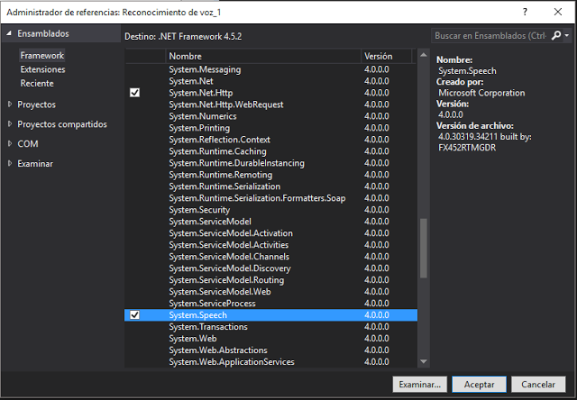

# Reconocimiento de Voz
## Requires
- Visual Studio 2015
## License
- MIT
## Technologies
- C#
- Visual C#
## Topics
- C#
- Windows Forms
## Updated
- 01/15/2017
## Description

<h1>Introduction</h1>

El software de la tecnolog&iacute;a de voz de escritorio de Windows ofrece una infraestructura de reconocimiento de voz b&aacute;sicas que digitaliza se&ntilde;ales ac&uacute;stica y recupera las palabras y los elementos
 de voz desde la entrada de audio.

Las aplicaciones utilizan el&nbsp;System.Speech.Recognition&nbsp;espacio de nombres para obtener acceso y ampliar esta tecnolog&iacute;a de reconocimiento de voz b&aacute;sica mediante la
 definici&oacute;n de algoritmos para identificar y actuar sobre los patrones de palabras o frases espec&iacute;ficas y administrar el comportamiento en tiempo de ejecuci&oacute;n de esta infraestructura de voz.

El reconocimiento de voz incluye un tiempo de ejecuci&oacute;n de voz, varias API de reconocimiento para programar el tiempo de ejecuci&oacute;n, gram&aacute;ticas listas para usar para el dictado y la b&uacute;squeda en Internet, y una interfaz de usuario
 predeterminada del sistema que ayuda a los usuarios a descubrir y usar las funciones de reconocimiento de voz.

<h2 id="configurar-la-fuente-de-audio">Configurar la fuente de audio</h2>

Comprueba que el dispositivo tenga un micr&oacute;fono o un equivalente.

Configura la funci&oacute;n&nbsp;Micr&oacute;fono&nbsp;del dispositivo (DeviceCapability) en el&nbsp;Manifiesto del paquete de la aplicaci&oacute;n&nbsp;(archivo&nbsp;package.appxmanifest) para obtener acceso a la fuente
 de audio del micr&oacute;fono. Esto permite que la aplicaci&oacute;n grabe audio con los micr&oacute;fonos conectados.

Consulta el tema sobre&nbsp;declaraciones de funcionalidades de aplicaci&oacute;n.

<h2 id="reconocer-la-entrada-de-voz">Reconocer la entrada de voz</h2>

Una&nbsp;<em>restricci&oacute;n</em>&nbsp;define las palabras y las frases (vocabulario) que una aplicaci&oacute;n reconoce en una entrada de voz. Las restricciones son fundamentales para el reconocimiento de voz y mejoran la precisi&oacute;n del reconocimiento
 de voz de tu aplicaci&oacute;n.

https://msdn.microsoft.com/es-sv/library/system.speech.recognition.aspx?tduid=(9e470a736dcc454cedb3e6175a4911fd)(256380)(2459594)(TnL5HPStwNw-QMsorr4C3E8RNLMzqgHxBg)() 

Description

&nbsp;

 

C#

Editar script|Remove

csharp
<pre class="hidden">using System;
using System.Collections.Generic;
using System.ComponentModel;
using System.Data;
using System.Drawing;
using System.Linq;
using System.Text;
using System.Threading.Tasks;
using System.Windows.Forms;
using System.Speech.Recognition; // Para el reconocimiento de voz

namespace Reconocimiento_de_voz_1
 {
 public partial class Form1 : Form
  {

  // Inicializamos motor de reconocimiento.
  SpeechRecognitionEngine reconocimiento_de_voz = new SpeechRecognitionEngine();

  string palabras;

  public Form1()
   {
   InitializeComponent();
   }  

  private void button1_Click(object sender, EventArgs e) //Boton escuchar. Configuraci&oacute;n del reconocimiento
   {
   //Inicia la escucha con el dispositivo de entrada de audio predeterminado
   reconocimiento_de_voz.SetInputToDefaultAudioDevice(); // Usaremos el microfono predeterminado del sistema
   reconocimiento_de_voz.LoadGrammar(new DictationGrammar()); //Carga la gramatica de Windows
   reconocimiento_de_voz.SpeechRecognized &#43;= te_escucho; // Controlador de eventos. Se ejecutara al reconocer
   reconocimiento_de_voz.RecognizeAsync(RecognizeMode.Multiple); //Iniciamos reconocimiento
   label1.Text = &quot;Te estoy escuchando cuentame: &quot;;

   }
  void te_escucho(object sender, SpeechRecognizedEventArgs e)
   {
   palabras = e.Result.Text; // La variable palabras del tipo string toma las palabras reconocidas.
   textBox1.Text = palabras; // Muestra las palabras reconocidas en el textbox
   }

  private void button3_Click(object sender, EventArgs e) // Boton detener escucha
   {
   reconocimiento_de_voz.RecognizeAsyncStop(); //Detiene la escucha
   textBox1.Clear(); //limpia el textbox
   }

  private void button2_Click(object sender, EventArgs e) // Boton Salir
   {
   Application.Exit();
   }
  }
 }
</pre>

<pre class="csharp">using&nbsp;System;&nbsp;
using&nbsp;System.Collections.Generic;&nbsp;
using&nbsp;System.ComponentModel;&nbsp;
using&nbsp;System.Data;&nbsp;
using&nbsp;System.Drawing;&nbsp;
using&nbsp;System.Linq;&nbsp;
using&nbsp;System.Text;&nbsp;
using&nbsp;System.Threading.Tasks;&nbsp;
using&nbsp;System.Windows.Forms;&nbsp;
using&nbsp;System.Speech.Recognition;&nbsp;//&nbsp;Para&nbsp;el&nbsp;reconocimiento&nbsp;de&nbsp;voz&nbsp;
&nbsp;
&nbsp;
namespace&nbsp;Reconocimiento_de_voz_1&nbsp;
&nbsp;{&nbsp;
&nbsp;public&nbsp;partial&nbsp;class&nbsp;Form1&nbsp;:&nbsp;Form&nbsp;
&nbsp;&nbsp;{&nbsp;
&nbsp;
&nbsp;&nbsp;//&nbsp;Inicializamos&nbsp;motor&nbsp;de&nbsp;reconocimiento.&nbsp;
&nbsp;&nbsp;SpeechRecognitionEngine&nbsp;reconocimiento_de_voz&nbsp;=&nbsp;new&nbsp;SpeechRecognitionEngine();&nbsp;
&nbsp;
&nbsp;&nbsp;string&nbsp;palabras;&nbsp;
&nbsp;
&nbsp;&nbsp;public&nbsp;Form1()&nbsp;
&nbsp;&nbsp;&nbsp;{&nbsp;
&nbsp;&nbsp;&nbsp;InitializeComponent();&nbsp;
&nbsp;&nbsp;&nbsp;}&nbsp;&nbsp;&nbsp;
&nbsp;
&nbsp;&nbsp;private&nbsp;void&nbsp;button1_Click(object&nbsp;sender,&nbsp;EventArgs&nbsp;e)&nbsp;//Boton&nbsp;escuchar.&nbsp;Configuraci&oacute;n&nbsp;del&nbsp;reconocimiento&nbsp;
&nbsp;&nbsp;&nbsp;{&nbsp;
&nbsp;&nbsp;&nbsp;//Inicia&nbsp;la&nbsp;escucha&nbsp;con&nbsp;el&nbsp;dispositivo&nbsp;de&nbsp;entrada&nbsp;de&nbsp;audio&nbsp;predeterminado&nbsp;
&nbsp;&nbsp;&nbsp;reconocimiento_de_voz.SetInputToDefaultAudioDevice();&nbsp;//&nbsp;Usaremos&nbsp;el&nbsp;microfono&nbsp;predeterminado&nbsp;del&nbsp;sistema&nbsp;
&nbsp;&nbsp;&nbsp;reconocimiento_de_voz.LoadGrammar(new&nbsp;DictationGrammar());&nbsp;//Carga&nbsp;la&nbsp;gramatica&nbsp;de&nbsp;Windows&nbsp;
&nbsp;&nbsp;&nbsp;reconocimiento_de_voz.SpeechRecognized&nbsp;&#43;=&nbsp;te_escucho;&nbsp;//&nbsp;Controlador&nbsp;de&nbsp;eventos.&nbsp;Se&nbsp;ejecutara&nbsp;al&nbsp;reconocer&nbsp;
&nbsp;&nbsp;&nbsp;reconocimiento_de_voz.RecognizeAsync(RecognizeMode.Multiple);&nbsp;//Iniciamos&nbsp;reconocimiento&nbsp;
&nbsp;&nbsp;&nbsp;label1.Text&nbsp;=&nbsp;&quot;Te&nbsp;estoy&nbsp;escuchando&nbsp;cuentame:&nbsp;&quot;;&nbsp;
&nbsp;
&nbsp;&nbsp;&nbsp;}&nbsp;
&nbsp;&nbsp;void&nbsp;te_escucho(object&nbsp;sender,&nbsp;SpeechRecognizedEventArgs&nbsp;e)&nbsp;
&nbsp;&nbsp;&nbsp;{&nbsp;
&nbsp;&nbsp;&nbsp;palabras&nbsp;=&nbsp;e.Result.Text;&nbsp;//&nbsp;La&nbsp;variable&nbsp;palabras&nbsp;del&nbsp;tipo&nbsp;string&nbsp;toma&nbsp;las&nbsp;palabras&nbsp;reconocidas.&nbsp;
&nbsp;&nbsp;&nbsp;textBox1.Text&nbsp;=&nbsp;palabras;&nbsp;//&nbsp;Muestra&nbsp;las&nbsp;palabras&nbsp;reconocidas&nbsp;en&nbsp;el&nbsp;textbox&nbsp;
&nbsp;&nbsp;&nbsp;}&nbsp;
&nbsp;
&nbsp;&nbsp;private&nbsp;void&nbsp;button3_Click(object&nbsp;sender,&nbsp;EventArgs&nbsp;e)&nbsp;//&nbsp;Boton&nbsp;detener&nbsp;escucha&nbsp;
&nbsp;&nbsp;&nbsp;{&nbsp;
&nbsp;&nbsp;&nbsp;reconocimiento_de_voz.RecognizeAsyncStop();&nbsp;//Detiene&nbsp;la&nbsp;escucha&nbsp;
&nbsp;&nbsp;&nbsp;textBox1.Clear();&nbsp;//limpia&nbsp;el&nbsp;textbox&nbsp;
&nbsp;&nbsp;&nbsp;}&nbsp;
&nbsp;
&nbsp;&nbsp;private&nbsp;void&nbsp;button2_Click(object&nbsp;sender,&nbsp;EventArgs&nbsp;e)&nbsp;//&nbsp;Boton&nbsp;Salir&nbsp;
&nbsp;&nbsp;&nbsp;{&nbsp;
&nbsp;&nbsp;&nbsp;Application.Exit();&nbsp;
&nbsp;&nbsp;&nbsp;}&nbsp;
&nbsp;&nbsp;}&nbsp;
&nbsp;}&nbsp;
</pre>

