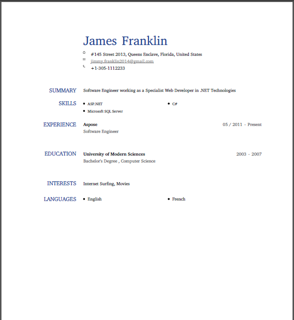
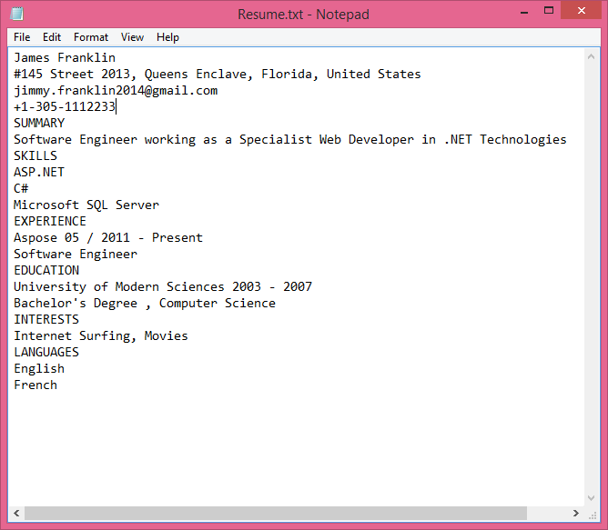
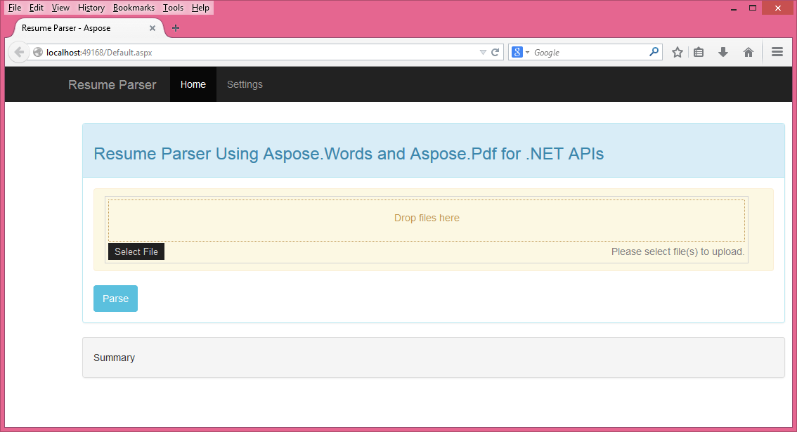
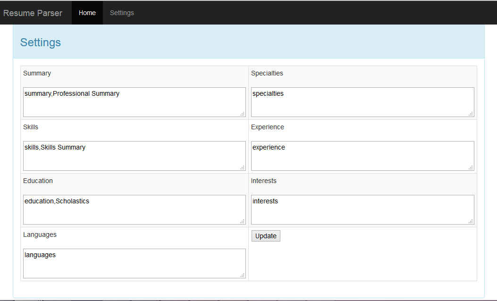
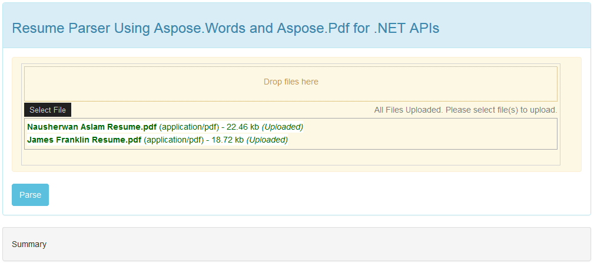
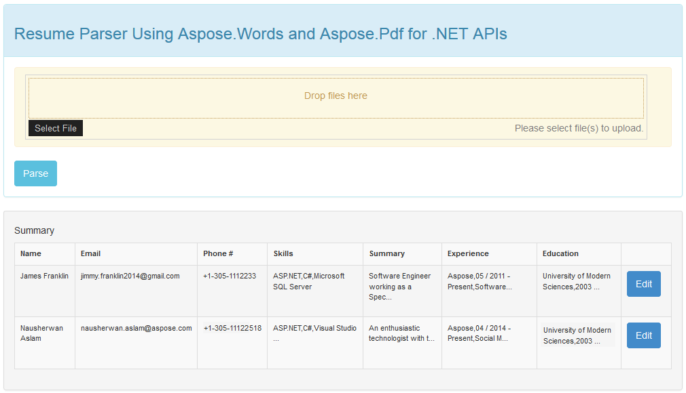
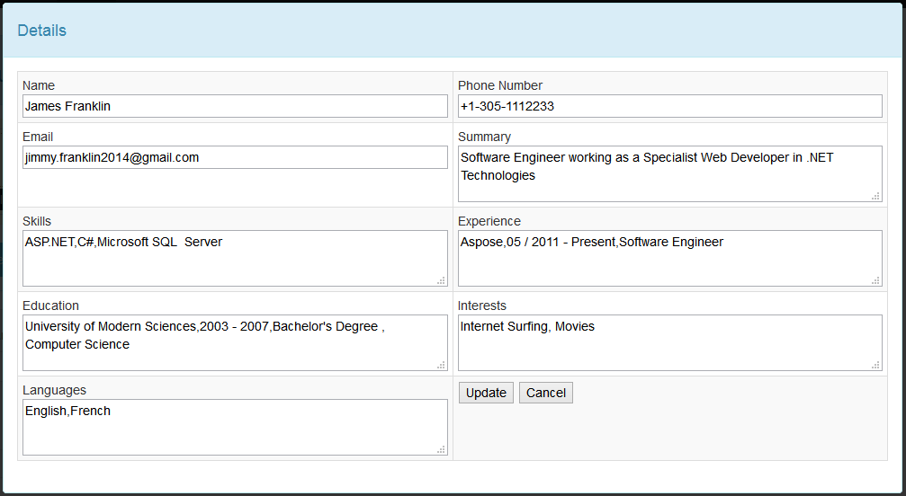

# Resume Parser by Aspose for .NET
## Requires
- Visual Studio 2010
## License
- Apache License, Version 2.0
## Technologies
- C#
- AJAX
- ASP.NET
- Aspose
- Aspose.Words for .NET
## Topics
- parsing
- resume parsing
## Updated
- 10/15/2014
## Description

<h1>Introduction</h1>

<em>Sample application to parse specific format resumes online using Aspose.Words for .NET. 
</em>

<h2>What is Resume Parsing</h2>

Resume parsing is a process to convert a free-form resume into structured information suitable for storage, reporting and manipulation. &nbsp;It is helpful to handle large number of resumes, organizes the process and makes it more efficient. However, resume
 parsing is a very complex process due to the fact that everyone writes a resume in his own style. So, it is very hard to parse each and every resume.

<h2>Purpose &amp; Feature</h2>

The purpose of this application is to give you the idea regarding how you can use
<a href="http://goo.gl/pJA9al" target="_blank">Aspose.Words for .NET</a> to parse resumes. We chose to use
<a href="http://goo.gl/svb9wC" target="_blank">LinkedIn Resume</a> format for this sample application. You can download your LinkedIn resume and try it.

Following are some of the features which are supported in this application:

1: Upload multiple resumes to be parsed.

2: Extract relevant information from each resume.

3: View &amp; Edit details of every resume.

4: Setting screen to provide mapping for different resume sections.

Aspose.Words for .NET provides a variety of features to create and manipulate documents. It doesn&rsquo;t require MS Office to be installed and coding is very simple as compare to other Word Automation components. In this project, we have used Aspose.Words
 for .NET to parse the resumes and extract relevant information from the resume. UI of the application is kept pretty simple and you can use this to parse the resumes online.

<h2>Sample Resume</h2>

Following are the screenshots of the sample resumes in PDF and Text file format. The supported formats for resumes are doc, docx, PDF, RTF and txt. For PDF files, we are using
<a href="http://goo.gl/smJX1C" target="_blank">Aspose.Pdf for .NET</a> to convert the PDF files to Doc Files and then process them.

&nbsp;

&nbsp;

<h2>How Resume Parser Works</h2>

Following is a screenshot of the main screen of the application:

A &ldquo;Settings&rdquo; screen has been provided to allow the users to customize the tags for searching different fields in the resume. You can specify the commonly used tags / titles which are to be searched in your uploaded resumes. Following is a screenshot
 of the &ldquo;Settings&rdquo; screen for your reference.

Based on your requirement, you can specify multiple items against one field separating them with a comma. For example, in the above screenshot Skills field is showing &ldquo;skills&rdquo; and &ldquo;Skills Summary&rdquo; both as tags to be search. So, if
 a resume contains any of the two, it will return the data accordingly.

Now, to parse resumes, you can select multiple files and upload them.

Once the resumes are uploaded, you can simply press the &ldquo;Parse&rdquo; button to parse and extract the information from the files.

As you can see in the above screenshot, the summary of different candidates is shown like Name, Email, Skills etc. Now, if you want to view and edit the information extracted from resumes, you can simply press &ldquo;Edit&rdquo; button and a popup screen
 will appear with details of the specific resume as shown below.

You can view or modify any information and press &ldquo;Update&rdquo; button. This will update the information for the specific candidate.&nbsp;

As mentioned above, this is a sample project created with Aspose.Words for .NET to extract information from resumes which are in LinkedIn format. However, you can modify it further to support other formats as per your requirement. You can download the application
 with complete source code and check how it works with LinkedIn resumes. Also, you can further modify the features as per your requirement to incorporate different formats. You can also suggest any improvements or let us know about any specific requirements
 you have and we will try to address them as well.

