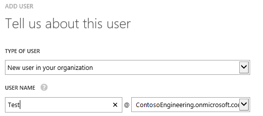

# Role-Based and ACL-Based Authorization in a Windows Azure AD Application
## Requires
- Visual Studio 2012
## License
- Apache License, Version 2.0
## Technologies
- windows azure active directory
## Topics
- Authorization
- Role Based Access Control
- ACL-Based Access Control
- Windows Azure AD Graph
## Updated
- 01/10/2015
## Description

<h1>NOTE: This sample is outdated. The technology, methods, and/or user interface instructions used in this sample are still supported, but have been succeeded by newer features. &nbsp;The scenario addressed by this sample is accomplished
 using the latest technology in&nbsp;<a href="https://github.com/AzureADSamples/WebApp-RoleClaims-DotNet" target="_blank">WebApp-RoleClaims-DotNet</a>.</h1>
<h1>Introduction</h1>

This sample application demonstrates how to use Windows Azure Active Directory (AD) for authorization. TaskTracker is a Windows Azure Active Directory ASP.NET application that uses Role-Based Access Control (RBAC) and ACLs to ensure that only authorized
 users can access secured resources. You can use one or both of these techniques in your Windows Azure AD apps, or adapt your own methods to permit selective access to resources. &nbsp;&nbsp;

The app&nbsp;creates four application-specific roles and grants access to&nbsp;users and groups that have that role. When a user logs in, it immediately&nbsp;checks the user's assigned application&nbsp;roles&nbsp;customizes the UI based on permissions granted
 to the roles.&nbsp;App users with the &quot;Admin&quot; app&nbsp;role can assign roles to users and to&nbsp;groups to which the user belongs.&nbsp; 

Access to the &quot;Users&quot; page in the app is controlled by an ACL, which is represented by entries in an ACL.xml file. Only users and groups that are specified in an ACL entry can see the content of the Users page; others see
 an &quot;access denied&quot; message.

 
The&nbsp;sample application uses <a href="http://msdn.microsoft.com/en-us/library/ee748475.aspx">
Windows Identity Foundation</a> (WIF) to authenticate users from Windows Azure AD.&nbsp;It extends
WIF by adding role and group claims to the <a href="http://msdn.microsoft.com/en-us/library/system.security.claims.claimsprincipal(v=vs.110).aspx">
ClaimsPrincipal</a>&nbsp;object that represents the user. For details, see the ReadMe in the ZIP file and
<strong>How the Sample App Works</strong>, below.

 
The&nbsp;ZIP file that you download includes a ReadMe file with conceptual details, a code walkthrough, and detailed instructions for working with Windows Azure AD, an AD directory, and organizational users and groups. It explains in detail how to customize
 your <em>web.config</em> file to&nbsp;point to and use resources in your Windows Azure AD tenant.

&nbsp;

<h1>Download Tip</h1>

When you download the code, rename the ZIP file to TaskTracker.zip or, when you extract from the ZIP file, change the destination directory name to TaskTracker. Otherwise, you might&nbsp;get errors&nbsp;because the length of
 the path&#43;filename exceeds the maximum value.

&nbsp;

<h1>Requirements</h1>

The following resources are required to run the TaskTracker 
sample application.

<ul>
<li>An Internet connection 
</li><li>Visual Studio 2012 
</li><li>&nbsp;<a href="http://go.microsoft.com/fwlink/?LinkID=245849">Identity and Access Tool</a>&nbsp;for Visual Studio 2012 
</li><li>&nbsp;A Windows Azure subscription. If you
don't have one, can get a <a href="http://www.windowsazure.com/en-us/pricing/free-trial/">
90-day free trial</a>.  
</li><li>&nbsp;A Windows Azure AD tenant.
If you don't have a tenant, it's&nbsp;easy to create one. You can find&nbsp;instructions in the &quot;How to get a Windows Azure AD tenant&quot;
section of <a href="http://go.microsoft.com/fwlink/?LinkID=288845">
What is a Windows Azure AD tenant?</a> &nbsp;To see these instructions used in the context
of application development, see &quot;Working with Your Windows Azure AD Directory 
Tenant&quot; in <a href="http://msdn.microsoft.com/en-us/library/dn151790.aspx">
Adding Sign-On to You Web Application Using Windows Azure AD</a>.  
</li><li>A user with an organizational account, such as User@ContosoEnterprises.com or User@Contoso.onmicrosoft.com. You cannot use a Microsoft account, such as User@Live.com or
<a href="mailto:User@Outlook.com">User@Outlook.com</a>.  
 
For this sample, it's best to have two users; one with the Global Administrator role&nbsp;and one with the User role. For more information, see
<strong>How to Create a User with an Organizational Account</strong>, below. 
</li><li>Add the sample app to your Windows Azure AD tenant. For&nbsp;instructions, see&nbsp;the ReadMe in the ZIP file. 
</li><li>Edit the <em>web.config</em> file in the app to associate it with your Windows Azure AD tenant. When you do, the app has access to the resources in your tenant. For&nbsp;instructions, see&nbsp;the ReadMe in the ZIP file.
</li></ul>
<h1> 
Recommendations</h1>
<ul>
<li><a href="http://msdn.microsoft.com/en-us/library/windowsazure/dn151791.aspx">Using the Graph API to Query Windows Azure AD Walkthrough</a>. This sample builds 
directly upon the results of this walkthrough.&nbsp;&nbsp;
</li></ul>
<h1>&nbsp; 
Directory Roles, Organizational Roles,&nbsp;and Application Roles</h1>

It's important to distinguish the Windows Azure AD&nbsp;organizational roles, the Windows Azure AD&nbsp;built-in directory roles, and&nbsp;the application roles that the sample app creates.
 

In Windows Azure AD, you can assign users to one of two organizational&nbsp;roles, Global Administrator and User. Users with these roles have different privileges in Windows Azure AD. For more information, see
<a href="http://technet.microsoft.com/en-us/library/dn468213.aspx">Assigning Admin Roles</a>.

 
Windows Azure AD also has built-in directory roles, such as Company Administrator, HelpDesk Administrator, and User. When you query the Windows Azure AD Graph, you use these built-in&nbsp;roles. For a list of roles in your directory, use the
<a href="http://technet.microsoft.com/en-us/library/dn194100.aspx">Get-MsolRole</a> cmdlet. (The User role, which is included in every directory, is not returned because it is implicit.)

 
Users with the Global Administrator organizational&nbsp;role have the Company Administrator built-in role. Users with the User organizational&nbsp;role have the User built-in role.

 
In addition, the sample app creates four application roles: Admin, Writer, Approver, and Observer. By default, users with the Global Administrators organizational role&nbsp;have the Admin application&nbsp;role. They can do anything in the app, except see the
 Users page, which is controlled by the ACL. Users with the User organizational role have the Observer application role. They can't do anything in the app. To change a user's application role, users with the Admin app role can&nbsp;use the RoleMapping page
 in the app. 

&nbsp;&nbsp;

<h1>How to Create a User with an Organizational Account&nbsp;</h1>

This sample app requires a user with an organizational account. If your Windows Azure AD tenant is based on a Microsoft account, such as User@hotmail.com, you can create a user with an organizational account. 
 
For this sample, it's best to have two users, one who is a Global Administrator and one who is a User. 

<ol>
<li>

Go to the Windows Azure Management Portal (<a href="https://manage.WindowsAzure.com">https://manage.WindowsAzure.com</a>) and log in.
 

</li><li>

Click <strong>Active Directory</strong>. 

</li><li>If your directory is&nbsp;named &quot;Default Directory&quot;, add a directory, such as &quot;ContosoEngineering&quot;. To add a directory, at the bottom of the
<strong>Active Directory </strong>page, click <strong>Add</strong>. 
</li><li>Double-click the directory and then click <strong>
Domains</strong>. When you create your users, use the domain name that appears on the page. For example, if your domain is ContosoEngineering@onmicrosoft.com, create usernames in that domain, such as Test@ContosoEngineering@onmicrosoft.com. 
</li><li>To create a user in the domain, click <strong>Users</strong>. (If you don't see a Users tab, double-click the directory name. The Users tab&nbsp;appears on each directory-specific page.) At the bottom of the page, click
<strong>Add User</strong>. 
</li><li>Add a user in your new domain, such as Test@ContosoEngineering.onmicrosoft.com, and then click the checkmark at the bottom of the page. 
 

</li><li>

On the User Profile page, assign an&nbsp;organizational role to the user. For this app, it's best to have one user with the&nbsp;Global Administrator role and&nbsp;one user with the User role.

</li></ol>

<em>&nbsp;</em>

&nbsp;

<h1>Assign Roles to Groups</h1>

The TaskTracker app lets you assign application roles to
Active Directory security groups. Users in the security group have the
privileges that are granted to the application role. You can also add a
security group to the ACL. Members of group have access to the Users page that
the ACL controls.

 
To test the ACL implementation, use the preview of the Group Management features in the Windows Azure Management Portal to add a security
group to your Windows Azure AD tenant.&nbsp;For instructions, see
<a href="http://go.microsoft.com/fwlink/?LinkID=331384">Add a group</a>.

&nbsp;

<h1>How the Sample App Works</h1>

This section provides highlights of how the TaskTracker sample app uses the Windows Identity Foundation and Windows Azure AD graph to implement role-based and ACL-based authorization.

<h2>Determine a User&rsquo;s Roles at Login</h2>

The TaskTracker sample application uses <a href="http://msdn.microsoft.com/en-us/library/ee748475.aspx">
Windows Identity Foundation</a> (WIF) to authenticate users from Windows Azure AD. We'll extend WIF by adding role and group claims to the
<a href="http://msdn.microsoft.com/en-us/library/system.security.claims.claimsprincipal(v=vs.110).aspx">
ClaimsPrincipal</a> object that represents the user. 

As soon as a user logs in, the TaskTracker sample app gets the user's application role. To ensure that this is executed at login, in
<em>web.config</em>, we add the <strong>GraphClaimsAuthenticationManager</strong> class, a subclass of
<a href="http://msdn.microsoft.com/en-us/library/system.security.claims.claimsauthenticationmanager.aspx">
ClaimsAuthenticationManager</a>,&nbsp; to the WIF pipeline. 

&nbsp;

XML

Edit|Remove

xml

<pre class="xml">//From:&nbsp;web.config&nbsp;
&nbsp;
&nbsp;&nbsp;&lt;system.identityModel&gt;&nbsp;
&nbsp;&nbsp;&nbsp;&nbsp;&lt;identityConfiguration&gt;&nbsp;
&nbsp;&nbsp;&nbsp;&nbsp;&nbsp;&nbsp;&lt;claimsAuthenticationManager&nbsp;type=&quot;TaskTracker.GraphClaimsAuthenticationManager,TaskTracker&quot;&nbsp;/&gt;&nbsp;
&nbsp;
...</pre>

<strong>Authenticate()</strong>, the&nbsp; main function of the
<strong>GraphClaimsAuthenticationManager</strong> class, begins by querying the Windows Azure AD Graph to determine the user&rsquo;s built-in Windows Azure AD roles. If the user has the &quot;Company Administrator&quot; built-in role, which corresponds to the Global
 Administrator organizational role in the Windows Azure Management Portal, the app assigns the app-specific &ldquo;Admin&rdquo; role to that user.

&nbsp;

C#

Edit|Remove

csharp

<pre class="js">//From:&nbsp;GraphClaimsAuthenticationManager.cs&nbsp;
&nbsp;
public&nbsp;override&nbsp;ClaimsPrincipal&nbsp;Authenticate(string&nbsp;resourceName,&nbsp;ClaimsPrincipal&nbsp;incomingPrincipal&nbsp;
{&nbsp;
...&nbsp;
&nbsp;
&nbsp;&nbsp;&nbsp;&nbsp;//&nbsp;get&nbsp;the&nbsp;user's&nbsp;built-in&nbsp;roles&nbsp;
&nbsp;&nbsp;&nbsp;&nbsp;new&nbsp;WebRetryHelper&lt;object&gt;(()&nbsp;=&gt;&nbsp;graphService.LoadProperty(currentUser,&nbsp;&quot;memberOf&quot;));&nbsp;
&nbsp;&nbsp;&nbsp;&nbsp;List&lt;Role&gt;&nbsp;currentRoles&nbsp;=&nbsp;currentUser.memberOf.OfType&lt;Role&gt;().ToList();&nbsp;
&nbsp;
&nbsp;&nbsp;&nbsp;&nbsp;//if&nbsp;the&nbsp;user&nbsp;is&nbsp;a&nbsp;Company&nbsp;Administrator&nbsp;(Global&nbsp;Administrator),&nbsp;&nbsp;
&nbsp;&nbsp;&nbsp;&nbsp;//assign&nbsp;them&nbsp;the&nbsp;&quot;Admin&quot;&nbsp;role&nbsp;in&nbsp;the&nbsp;app.&nbsp;&nbsp;
&nbsp;&nbsp;&nbsp;&nbsp;foreach(Role&nbsp;role&nbsp;in&nbsp;currentRoles)&nbsp;
&nbsp;&nbsp;&nbsp;&nbsp;{&nbsp;
&nbsp;&nbsp;&nbsp;&nbsp;&nbsp;&nbsp;&nbsp;&nbsp;if&nbsp;(role.displayName.Equals(&quot;Company&nbsp;Administrator&quot;))&nbsp;
&nbsp;&nbsp;&nbsp;&nbsp;&nbsp;&nbsp;&nbsp;&nbsp;{&nbsp;
&nbsp;&nbsp;&nbsp;&nbsp;&nbsp;&nbsp;&nbsp;&nbsp;&nbsp;&nbsp;&nbsp;&nbsp;((ClaimsIdentity)incomingPrincipal.Identity).AddClaim(new&nbsp;Claim(ClaimTypes.Role,&nbsp;&quot;Admin&quot;,&nbsp;ClaimValueTypes.String,&nbsp;&quot;TaskTrackerSampleApplication&quot;));&nbsp;
&nbsp;&nbsp;&nbsp;&nbsp;&nbsp;&nbsp;&nbsp;&nbsp;}&nbsp;
&nbsp;&nbsp;&nbsp;&nbsp;}&nbsp;
&nbsp;
...&nbsp;
</pre>

&nbsp;

Next, it gets the user's group memberships, stores them in a
&quot;Group&quot; type claim, and adds the claim to the
<a href="http://msdn.microsoft.com/en-us/library/microsoft.identitymodel.claims.claimsidentity.aspx">
ClaimsIdentity</a>&nbsp;class. To get the user's groups, including groups that the user belongs to
because they are members of another group, it uses the
<strong>getCompleteGroupMembership</strong> function (defined in DirectoryDataService_partial.cs), 
which calls the <a href="http://msdn.microsoft.com/en-us/library/dn424889.aspx">
<strong>getMemberGroups</strong></a><strong> </strong>REST API function, which returns all groups to which the user
belongs. For more information about the Windows Azure AD Graph REST API, see
<a href="http://msdn.microsoft.com/en-us/library/hh974476.aspx">Windows Azure Active Directory Graph</a>.

&nbsp;

C#

Edit|Remove

csharp

<pre class="csharp">From:&nbsp;GraphClaimsAuthenticationManager.cs&nbsp;
&nbsp;
&nbsp;&nbsp;&nbsp;&nbsp;//&nbsp;Now,&nbsp;query&nbsp;transitive&nbsp;group&nbsp;membership&nbsp;of&nbsp;the&nbsp;user&nbsp;
&nbsp;&nbsp;&nbsp;&nbsp;List&lt;string&gt;&nbsp;completeGroupMembership&nbsp;=&nbsp;new&nbsp;WebRetryHelper&lt;List&lt;String&gt;&gt;(()&nbsp;=&gt;&nbsp;graphService.getCompleteGroupMembership(tenantId,&nbsp;currentUserObjectId,&nbsp;token)).Value;&nbsp;
&nbsp;
&nbsp;&nbsp;&nbsp;&nbsp;//Store&nbsp;the&nbsp;user's&nbsp;groups&nbsp;as&nbsp;claims&nbsp;of&nbsp;type&nbsp;&quot;Group&quot;&nbsp;
&nbsp;&nbsp;&nbsp;&nbsp;foreach&nbsp;(string&nbsp;groupId&nbsp;in&nbsp;completeGroupMembership)&nbsp;
&nbsp;&nbsp;&nbsp;&nbsp;{&nbsp;
&nbsp;&nbsp;&nbsp;&nbsp;&nbsp;&nbsp;&nbsp;&nbsp;Debug.WriteLine(&quot;adding&nbsp;&quot;&nbsp;&#43;&nbsp;groupId);&nbsp;
&nbsp;&nbsp;&nbsp;&nbsp;&nbsp;&nbsp;&nbsp;&nbsp;((ClaimsIdentity)incomingPrincipal.Identity).AddClaim(new&nbsp;Claim(&quot;Group&quot;,&nbsp;groupId,&nbsp;ClaimValueTypes.String,&nbsp;&quot;WindowsAzureADGraph&quot;));&nbsp;
&nbsp;&nbsp;&nbsp;&nbsp;}&nbsp;
</pre>

&nbsp;

Then it determines the user's application roles by comparing the user&rsquo;s group membership with the role mappings stored in the Roles.xml file and creates a &quot;Role&quot; claim.

C#

Edit|Remove

csharp

<pre class="csharp">From:&nbsp;GraphClaimsAuthenticationManager.cs&nbsp;
&nbsp;
//Get&nbsp;role&nbsp;assignments&nbsp;
foreach(string&nbsp;role&nbsp;in&nbsp;getRoles(currentUserObjectId,&nbsp;completeGroupMembership))&nbsp;
{&nbsp;
&nbsp;&nbsp;&nbsp;&nbsp;//Store&nbsp;the&nbsp;user's&nbsp;application&nbsp;roles&nbsp;as&nbsp;claims&nbsp;of&nbsp;type&nbsp;&quot;Role&quot;&nbsp;
&nbsp;&nbsp;&nbsp;&nbsp;((ClaimsIdentity)incomingPrincipal.Identity).AddClaim(new&nbsp;Claim(ClaimTypes.Role,&nbsp;role,&nbsp;ClaimValueTypes.String,&nbsp;&quot;TaskTrackerSampleApplication&quot;));&nbsp;
}&nbsp;
</pre>

&nbsp;
<h2>Use Application Roles to Enforce Policy</h2>
To enforce access to resources, the application uses the
<a href="http://msdn.microsoft.com/en-us/library/microsoft.identitymodel.claims.claimsprincipal.isinrole.aspx">
ClaimsPrincipal.IsInRole</a>() method. This method returns True if the user has a role claim that matches the
string parameter passed to the IsInRole() function, and returns False otherwise. &nbsp;
 
 
For example, in TaskTrackerController.cs, the IsInRole()
method determines whether the user has the Admin or Writer role. If they do,
they are permitted to add a task.

C#

Edit|Remove

csharp

<pre class="js">//From:&nbsp;TaskTrackerController.cs&nbsp;
&nbsp;
if&nbsp;(User.IsInRole(&quot;Admin&quot;)&nbsp;||&nbsp;User.IsInRole(&quot;Writer&quot;))&nbsp;
{&nbsp;
&nbsp;&nbsp;&nbsp;&nbsp;//add&nbsp;new&nbsp;task&nbsp;
&nbsp;&nbsp;&nbsp;&nbsp;if&nbsp;(formCollection[&quot;newTask&quot;]&nbsp;!=&nbsp;null&nbsp;&amp;&amp;&nbsp;formCollection[&quot;newTask&quot;].Length&nbsp;!=&nbsp;0)&nbsp;
&nbsp;&nbsp;&nbsp;&nbsp;{&nbsp;
&nbsp;&nbsp;&nbsp;&nbsp;&nbsp;&nbsp;&nbsp;&nbsp;XmlHelper.AppendTaskElemToXml(formCollection);&nbsp;
&nbsp;&nbsp;&nbsp;&nbsp;}&nbsp;
}&nbsp;
</pre>

&nbsp;

The TaskTracker application also uses the
<a href="http://msdn.microsoft.com/en-us/library/system.web.mvc.authorizeattribute(v=vs.108).aspx">
Authorize attribute</a> to enforce access control. For example, in RoleController.cs, [Authorize(Roles= &quot;Admin&quot;)] grants access to the RoleMappings controller/page only to users with the Admin role.

C#

Edit|Remove

csharp

<pre class="csharp">//From:&nbsp;RoleController.cs&nbsp;
&nbsp;
[HttpPost]&nbsp;
[Authorize(Roles&nbsp;=&nbsp;&quot;Admin&quot;)]&nbsp;
public&nbsp;ActionResult&nbsp;ACLSubmit(FormCollection&nbsp;formCollection)&nbsp;
{&nbsp;
&nbsp;&nbsp;&nbsp;&nbsp;//remove&nbsp;ACL&nbsp;assignments&nbsp;marked&nbsp;by&nbsp;checkboxes&nbsp;
&nbsp;&nbsp;&nbsp;&nbsp;XmlHelper.RemoveACLElemFromXml(formCollection);&nbsp;
...&nbsp;
</pre>

&nbsp;
<h2>Use an Access Control List to Enforce Access&nbsp;</h2>

In addition to RBAC, this app also demonstrates how to use an access control list (ACL) to restrict access to resources. In this app, only users and members of groups listed in the ACL can see the contents of the Users page.
 To change the ACL, use the <strong>Users Resource Access Control List</strong> feature of the RoleMappings page. Only users with the Admin application role can edit the ACL. All changes to the ACL are saved in the ACL.xml file in the App_Data directory.

The ACL-based permission in the application works by storing the user&rsquo;s group memberships as claims of type &quot;Group&quot; at sign on. Then, when the app needs to determine whether to allow you to see the Users page, it cross-references
 the user&rsquo;s group membership claims with the stored ACL.

Because access to the Users page is determined entirely by the ACL, not by roles, even users with the Admin app role cannot view the Users page unless they (or a group to which they belong) appear in the ACL.

&nbsp;

&nbsp;

C#

Edit|Remove

csharp

<pre class="js">//From:&nbsp;HomeController.cs&nbsp;
&nbsp;
[HttpGet]&nbsp;
public&nbsp;ActionResult&nbsp;Users()&nbsp;
{&nbsp;
&nbsp;
...&nbsp;
&nbsp;&nbsp;&nbsp;&nbsp;&nbsp;&nbsp;&nbsp;&nbsp;//is&nbsp;user's&nbsp;objectId&nbsp;in&nbsp;the&nbsp;ACL?&nbsp;
&nbsp;&nbsp;&nbsp;&nbsp;&nbsp;&nbsp;&nbsp;&nbsp;if&nbsp;(elem.ObjectId.Equals(userObjectId))&nbsp;
&nbsp;&nbsp;&nbsp;&nbsp;&nbsp;&nbsp;&nbsp;&nbsp;{&nbsp;
&nbsp;&nbsp;&nbsp;&nbsp;&nbsp;&nbsp;&nbsp;&nbsp;&nbsp;&nbsp;&nbsp;&nbsp;onACL&nbsp;=&nbsp;true;&nbsp;
&nbsp;&nbsp;&nbsp;&nbsp;&nbsp;&nbsp;&nbsp;&nbsp;}&nbsp;
&nbsp;&nbsp;&nbsp;&nbsp;&nbsp;&nbsp;&nbsp;&nbsp;else&nbsp;
&nbsp;&nbsp;&nbsp;&nbsp;&nbsp;&nbsp;&nbsp;&nbsp;{&nbsp;
&nbsp;&nbsp;&nbsp;&nbsp;&nbsp;&nbsp;&nbsp;&nbsp;&nbsp;&nbsp;&nbsp;&nbsp;foreach&nbsp;(Claim&nbsp;groupClaim&nbsp;in&nbsp;((ClaimsIdentity)User.Identity).FindAll(&quot;Group&quot;))&nbsp;
&nbsp;&nbsp;&nbsp;&nbsp;&nbsp;&nbsp;&nbsp;&nbsp;&nbsp;&nbsp;&nbsp;&nbsp;{&nbsp;
&nbsp;&nbsp;&nbsp;&nbsp;&nbsp;&nbsp;&nbsp;&nbsp;&nbsp;&nbsp;&nbsp;&nbsp;&nbsp;&nbsp;&nbsp;&nbsp;//is&nbsp;a&nbsp;group&nbsp;the&nbsp;user&nbsp;belongs&nbsp;to&nbsp;in&nbsp;the&nbsp;ACL?&nbsp;
&nbsp;&nbsp;&nbsp;&nbsp;&nbsp;&nbsp;&nbsp;&nbsp;&nbsp;&nbsp;&nbsp;&nbsp;&nbsp;&nbsp;&nbsp;&nbsp;if&nbsp;(elem.ObjectId.Equals(groupClaim.Value))&nbsp;
&nbsp;&nbsp;&nbsp;&nbsp;&nbsp;&nbsp;&nbsp;&nbsp;&nbsp;&nbsp;&nbsp;&nbsp;&nbsp;&nbsp;&nbsp;&nbsp;{&nbsp;
&nbsp;&nbsp;&nbsp;&nbsp;&nbsp;&nbsp;&nbsp;&nbsp;&nbsp;&nbsp;&nbsp;&nbsp;&nbsp;&nbsp;&nbsp;&nbsp;&nbsp;&nbsp;&nbsp;&nbsp;onACL&nbsp;=&nbsp;true;&nbsp;
&nbsp;&nbsp;&nbsp;&nbsp;&nbsp;&nbsp;&nbsp;&nbsp;&nbsp;&nbsp;&nbsp;&nbsp;&nbsp;&nbsp;&nbsp;&nbsp;&nbsp;&nbsp;&nbsp;&nbsp;break;&nbsp;
&nbsp;&nbsp;&nbsp;&nbsp;&nbsp;&nbsp;&nbsp;&nbsp;&nbsp;&nbsp;&nbsp;&nbsp;&nbsp;&nbsp;&nbsp;&nbsp;}&nbsp;
&nbsp;&nbsp;&nbsp;&nbsp;&nbsp;&nbsp;&nbsp;&nbsp;&nbsp;&nbsp;&nbsp;&nbsp;}&nbsp;
&nbsp;&nbsp;&nbsp;&nbsp;&nbsp;&nbsp;&nbsp;&nbsp;}&nbsp;
&nbsp;
&nbsp;
...&nbsp;
&nbsp;&nbsp;&nbsp;&nbsp;&nbsp;&nbsp;&nbsp;&nbsp;&nbsp;&nbsp;&nbsp;&nbsp;//if&nbsp;user&nbsp;is&nbsp;not&nbsp;in&nbsp;ACL,&nbsp;do&nbsp;not&nbsp;grant&nbsp;permission&nbsp;
&nbsp;&nbsp;&nbsp;&nbsp;&nbsp;&nbsp;&nbsp;&nbsp;&nbsp;&nbsp;&nbsp;&nbsp;if&nbsp;(!onACL)&nbsp;
&nbsp;&nbsp;&nbsp;&nbsp;&nbsp;&nbsp;&nbsp;&nbsp;&nbsp;&nbsp;&nbsp;&nbsp;{&nbsp;
&nbsp;&nbsp;&nbsp;&nbsp;&nbsp;&nbsp;&nbsp;&nbsp;&nbsp;&nbsp;&nbsp;&nbsp;&nbsp;&nbsp;&nbsp;&nbsp;return&nbsp;RedirectToAction(&quot;Error&quot;,&nbsp;&quot;Home&quot;,&nbsp;new&nbsp;{&nbsp;errorMessage&nbsp;=&nbsp;&quot;Access&nbsp;Denied.&nbsp;To&nbsp;view&nbsp;this&nbsp;resource,&nbsp;have&nbsp;an&nbsp;admin&nbsp;add&nbsp;you&nbsp;or&nbsp;your&nbsp;group&nbsp;to&nbsp;the&nbsp;ACL.&quot;&nbsp;});&nbsp;
&nbsp;&nbsp;&nbsp;&nbsp;&nbsp;&nbsp;&nbsp;&nbsp;&nbsp;&nbsp;&nbsp;&nbsp;}&nbsp;
...&nbsp;
</pre>

&nbsp;&nbsp;&nbsp;&nbsp;&nbsp;&nbsp;&nbsp;

&nbsp;

<h1>Troubleshooting</h1>

<strong>Microsoft Account </strong>&lt;account&gt;
<strong>is not supported for sign-in to this application</strong>. This error typically indicates that you signed into the sample app with&nbsp;a Microsoft account, such as an account in the Hotmail.com, Live.com, or Outlook.com
 domains. This app requires users to have an organizational account. For instructions, see
<strong>How to Create a User with an Organizational Account</strong> above.

&nbsp;

