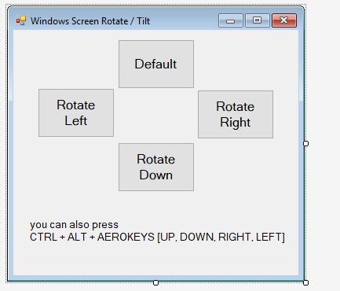

# Rotate Windows Screen
## Requires
- Visual Studio 2015
## License
- MIT
## Technologies
- C#
- Windows Forms
- Visual Studio
- Visual Studio 2015
- windows form application
## Topics
- C#
- Rotate Screen
- Tilt Screen
## Updated
- 08/30/2017
## Description

This code sample demonstartes how to rotate screen in c# application.

Build Instructions:

<ul>
<li>download source file </li><li>extract it, open .sln file </li><li>build and run </li></ul>

Note: while using this application, if your screen is tilted it migt be difficult for you to control mouse. you can press short key
<strong>CTRL &#43; ALT &#43; UP_KEY</strong> to make screen in default position.

You can change orientation of screen by pressing CTRL &#43; ALT &#43; AEROKEYS [UP, DOWN, RIGHT, LEFT].

this application uses same technique to change orientation of windows screen [potrait or landscape].

in this code sample keys are pressing virtually to roate screen.

&nbsp;

Create a new windows form application project

 

Add 4 buttons and label, change the button properties as desired from properties windows&nbsp;

&nbsp; 

double click on each buttons to create event handling functions

Now add following references in your code

C#

Edit|Remove

csharp 

<pre class="csharp">using&nbsp;<a class="libraryLink" href="https://msdn.microsoft.com/en-US/library/System.Threading.aspx" target="_blank" title="Auto generated link to System.Threading">System.Threading</a>;&nbsp;
using&nbsp;<a class="libraryLink" href="https://msdn.microsoft.com/en-US/library/System.Runtime.InteropServices.aspx" target="_blank" title="Auto generated link to System.Runtime.InteropServices">System.Runtime.InteropServices</a>;</pre>

&nbsp;we are using windows API so we need to reference &quot;user32.dll&quot; file

C#

Edit|Remove

csharp 

<pre class="csharp">&nbsp;[DllImport(&quot;user32.dll&quot;)]&nbsp;
private&nbsp;static&nbsp;extern&nbsp;void&nbsp;keybd_event(byte&nbsp;bVk,&nbsp;byte&nbsp;bScan,&nbsp;uint&nbsp;dwFlags,&nbsp;int&nbsp;dwExtraInfo);</pre>

&nbsp;

we need to define our button keys ,we are using hex code , their is different code for differnet virtual key

you can check it from

https://msdn.microsoft.com/en-us/library/windows/desktop/dd375731(v=vs.85).aspx

C#

Edit|Remove

csharp 

<pre class="csharp">const&nbsp;byte&nbsp;VK_RETURN&nbsp;=&nbsp;0x0D;&nbsp;
const&nbsp;uint&nbsp;KEYEVENTF_KEYUP&nbsp;=&nbsp;0x0002;&nbsp;
const&nbsp;byte&nbsp;VK_CTRL&nbsp;=&nbsp;0x11;&nbsp;
const&nbsp;byte&nbsp;VK_SNAPSHOT&nbsp;=&nbsp;0x2C;&nbsp;
const&nbsp;byte&nbsp;VK_ALT&nbsp;=&nbsp;0x12;&nbsp;
const&nbsp;byte&nbsp;VK_RIGHT&nbsp;=&nbsp;0x27;&nbsp;
const&nbsp;byte&nbsp;VK_UP&nbsp;=&nbsp;0x26;&nbsp;
const&nbsp;byte&nbsp;VK_LEFT&nbsp;=&nbsp;0x25;&nbsp;
const&nbsp;byte&nbsp;VK_DOWN&nbsp;=&nbsp;0x28;</pre>

in order to release pressed keys use&nbsp;

const uint KEYEVENTF_KEYUP = 0x0002;

we must released pressed keys, otherwise it might create problem

&nbsp; 

here are different functions for buttons to make screen rotate right, left, default position and upside down

C#

Edit|Remove

csharp 

<pre class="csharp">&nbsp;&nbsp;private&nbsp;void&nbsp;btnDefault_Click(object&nbsp;sender,&nbsp;EventArgs&nbsp;e)&nbsp;
&nbsp;&nbsp;&nbsp;&nbsp;&nbsp;&nbsp;&nbsp;&nbsp;{&nbsp;
&nbsp;&nbsp;&nbsp;&nbsp;&nbsp;&nbsp;&nbsp;&nbsp;&nbsp;&nbsp;&nbsp;&nbsp;keybd_event(VK_CTRL,&nbsp;0,&nbsp;0,&nbsp;0);&nbsp;
&nbsp;&nbsp;&nbsp;&nbsp;&nbsp;&nbsp;&nbsp;&nbsp;&nbsp;&nbsp;&nbsp;&nbsp;keybd_event(VK_ALT,&nbsp;0,&nbsp;0,&nbsp;0);&nbsp;
&nbsp;&nbsp;&nbsp;&nbsp;&nbsp;&nbsp;&nbsp;&nbsp;&nbsp;&nbsp;&nbsp;&nbsp;keybd_event(VK_UP,&nbsp;0,&nbsp;0,&nbsp;0);&nbsp;
&nbsp;
&nbsp;&nbsp;&nbsp;&nbsp;&nbsp;&nbsp;&nbsp;&nbsp;&nbsp;&nbsp;&nbsp;&nbsp;Thread.Sleep(100);&nbsp;
&nbsp;
&nbsp;&nbsp;&nbsp;&nbsp;&nbsp;&nbsp;&nbsp;&nbsp;&nbsp;&nbsp;&nbsp;&nbsp;keybd_event(VK_CTRL,&nbsp;0,&nbsp;KEYEVENTF_KEYUP,&nbsp;0);&nbsp;
&nbsp;&nbsp;&nbsp;&nbsp;&nbsp;&nbsp;&nbsp;&nbsp;&nbsp;&nbsp;&nbsp;&nbsp;keybd_event(VK_ALT,&nbsp;0,&nbsp;KEYEVENTF_KEYUP,&nbsp;0);&nbsp;
&nbsp;&nbsp;&nbsp;&nbsp;&nbsp;&nbsp;&nbsp;&nbsp;&nbsp;&nbsp;&nbsp;&nbsp;keybd_event(VK_UP,&nbsp;0,&nbsp;KEYEVENTF_KEYUP,&nbsp;0);&nbsp;
&nbsp;&nbsp;&nbsp;&nbsp;&nbsp;&nbsp;&nbsp;&nbsp;}&nbsp;
&nbsp;
&nbsp;&nbsp;&nbsp;&nbsp;&nbsp;&nbsp;&nbsp;&nbsp;private&nbsp;void&nbsp;btnRotateRight_Click(object&nbsp;sender,&nbsp;EventArgs&nbsp;e)&nbsp;
&nbsp;&nbsp;&nbsp;&nbsp;&nbsp;&nbsp;&nbsp;&nbsp;{&nbsp;
&nbsp;&nbsp;&nbsp;&nbsp;&nbsp;&nbsp;&nbsp;&nbsp;&nbsp;&nbsp;&nbsp;&nbsp;keybd_event(VK_CTRL,&nbsp;0,&nbsp;0,&nbsp;0);&nbsp;
&nbsp;&nbsp;&nbsp;&nbsp;&nbsp;&nbsp;&nbsp;&nbsp;&nbsp;&nbsp;&nbsp;&nbsp;keybd_event(VK_ALT,&nbsp;0,&nbsp;0,&nbsp;0);&nbsp;
&nbsp;&nbsp;&nbsp;&nbsp;&nbsp;&nbsp;&nbsp;&nbsp;&nbsp;&nbsp;&nbsp;&nbsp;keybd_event(VK_RIGHT,&nbsp;0,&nbsp;0,&nbsp;0);&nbsp;
&nbsp;&nbsp;&nbsp;&nbsp;&nbsp;&nbsp;&nbsp;&nbsp;&nbsp;&nbsp;&nbsp;&nbsp;&nbsp;
&nbsp;&nbsp;&nbsp;&nbsp;&nbsp;&nbsp;&nbsp;&nbsp;&nbsp;&nbsp;&nbsp;&nbsp;Thread.Sleep(100);&nbsp;
&nbsp;
&nbsp;&nbsp;&nbsp;&nbsp;&nbsp;&nbsp;&nbsp;&nbsp;&nbsp;&nbsp;&nbsp;&nbsp;keybd_event(VK_CTRL,&nbsp;0,&nbsp;KEYEVENTF_KEYUP,&nbsp;0);&nbsp;
&nbsp;&nbsp;&nbsp;&nbsp;&nbsp;&nbsp;&nbsp;&nbsp;&nbsp;&nbsp;&nbsp;&nbsp;keybd_event(VK_ALT,&nbsp;0,&nbsp;KEYEVENTF_KEYUP,&nbsp;0);&nbsp;
&nbsp;&nbsp;&nbsp;&nbsp;&nbsp;&nbsp;&nbsp;&nbsp;&nbsp;&nbsp;&nbsp;&nbsp;keybd_event(VK_RIGHT,&nbsp;0,&nbsp;KEYEVENTF_KEYUP,&nbsp;0);&nbsp;
&nbsp;&nbsp;&nbsp;&nbsp;&nbsp;&nbsp;&nbsp;&nbsp;}&nbsp;
&nbsp;
&nbsp;&nbsp;&nbsp;&nbsp;&nbsp;&nbsp;&nbsp;&nbsp;private&nbsp;void&nbsp;btnRotateDown_Click(object&nbsp;sender,&nbsp;EventArgs&nbsp;e)&nbsp;
&nbsp;&nbsp;&nbsp;&nbsp;&nbsp;&nbsp;&nbsp;&nbsp;{&nbsp;
&nbsp;&nbsp;&nbsp;&nbsp;&nbsp;&nbsp;&nbsp;&nbsp;&nbsp;&nbsp;&nbsp;&nbsp;keybd_event(VK_CTRL,&nbsp;0,&nbsp;0,&nbsp;0);&nbsp;
&nbsp;&nbsp;&nbsp;&nbsp;&nbsp;&nbsp;&nbsp;&nbsp;&nbsp;&nbsp;&nbsp;&nbsp;keybd_event(VK_ALT,&nbsp;0,&nbsp;0,&nbsp;0);&nbsp;
&nbsp;&nbsp;&nbsp;&nbsp;&nbsp;&nbsp;&nbsp;&nbsp;&nbsp;&nbsp;&nbsp;&nbsp;keybd_event(VK_DOWN,&nbsp;0,&nbsp;0,&nbsp;0);&nbsp;
&nbsp;
&nbsp;&nbsp;&nbsp;&nbsp;&nbsp;&nbsp;&nbsp;&nbsp;&nbsp;&nbsp;&nbsp;&nbsp;Thread.Sleep(100);&nbsp;
&nbsp;
&nbsp;&nbsp;&nbsp;&nbsp;&nbsp;&nbsp;&nbsp;&nbsp;&nbsp;&nbsp;&nbsp;&nbsp;keybd_event(VK_CTRL,&nbsp;0,&nbsp;KEYEVENTF_KEYUP,&nbsp;0);&nbsp;
&nbsp;&nbsp;&nbsp;&nbsp;&nbsp;&nbsp;&nbsp;&nbsp;&nbsp;&nbsp;&nbsp;&nbsp;keybd_event(VK_ALT,&nbsp;0,&nbsp;KEYEVENTF_KEYUP,&nbsp;0);&nbsp;
&nbsp;&nbsp;&nbsp;&nbsp;&nbsp;&nbsp;&nbsp;&nbsp;&nbsp;&nbsp;&nbsp;&nbsp;keybd_event(VK_DOWN,&nbsp;0,&nbsp;KEYEVENTF_KEYUP,&nbsp;0);&nbsp;
&nbsp;&nbsp;&nbsp;&nbsp;&nbsp;&nbsp;&nbsp;&nbsp;}&nbsp;
&nbsp;
&nbsp;&nbsp;&nbsp;&nbsp;&nbsp;&nbsp;&nbsp;&nbsp;private&nbsp;void&nbsp;btnRotateLeft_Click(object&nbsp;sender,&nbsp;EventArgs&nbsp;e)&nbsp;
&nbsp;&nbsp;&nbsp;&nbsp;&nbsp;&nbsp;&nbsp;&nbsp;{&nbsp;
&nbsp;&nbsp;&nbsp;&nbsp;&nbsp;&nbsp;&nbsp;&nbsp;&nbsp;&nbsp;&nbsp;&nbsp;keybd_event(VK_CTRL,&nbsp;0,&nbsp;0,&nbsp;0);&nbsp;
&nbsp;&nbsp;&nbsp;&nbsp;&nbsp;&nbsp;&nbsp;&nbsp;&nbsp;&nbsp;&nbsp;&nbsp;keybd_event(VK_ALT,&nbsp;0,&nbsp;0,&nbsp;0);&nbsp;
&nbsp;&nbsp;&nbsp;&nbsp;&nbsp;&nbsp;&nbsp;&nbsp;&nbsp;&nbsp;&nbsp;&nbsp;keybd_event(VK_LEFT,&nbsp;0,&nbsp;0,&nbsp;0);&nbsp;
&nbsp;
&nbsp;&nbsp;&nbsp;&nbsp;&nbsp;&nbsp;&nbsp;&nbsp;&nbsp;&nbsp;&nbsp;&nbsp;Thread.Sleep(100);&nbsp;
&nbsp;
&nbsp;&nbsp;&nbsp;&nbsp;&nbsp;&nbsp;&nbsp;&nbsp;&nbsp;&nbsp;&nbsp;&nbsp;keybd_event(VK_CTRL,&nbsp;0,&nbsp;KEYEVENTF_KEYUP,&nbsp;0);&nbsp;
&nbsp;&nbsp;&nbsp;&nbsp;&nbsp;&nbsp;&nbsp;&nbsp;&nbsp;&nbsp;&nbsp;&nbsp;keybd_event(VK_ALT,&nbsp;0,&nbsp;KEYEVENTF_KEYUP,&nbsp;0);&nbsp;
&nbsp;&nbsp;&nbsp;&nbsp;&nbsp;&nbsp;&nbsp;&nbsp;&nbsp;&nbsp;&nbsp;&nbsp;keybd_event(VK_LEFT,&nbsp;0,&nbsp;KEYEVENTF_KEYUP,&nbsp;0);&nbsp;
&nbsp;&nbsp;&nbsp;&nbsp;&nbsp;&nbsp;&nbsp;&nbsp;}</pre>

<strong>Potrait View when rotated right</strong>

if you have any suggestions or queries you can ask me at Q &amp; A area. or email me

at

umairnadeem20@hotmail.com&nbsp;

 

