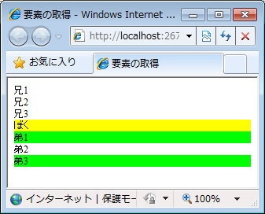

# prev、prevAll、next、nextAll、parent などのメソッドを使用して現在の要素から相対的な位置関係の要素を取得する
## License
- Apache License, Version 2.0
## Technologies
- Visual Studio 2010
- jQuery 1.4.4
## Topics
- 逆引きサンプル コード
- jQuery
## Updated
- 02/22/2011
## Description

執筆者: <a href="http://msdn.microsoft.com/ja-jp/gg585574#yamada" target="_blank">
有限会社 WINGS プロジェクト 山田 祥寛</a>

動作確認環境: Visual Studio 2010、jQuery 1.4.4

prev、prevAll、next、nextAll、parent などのメソッドを利用することで、現在の要素を基点にして、その前、次など相対的な関係にある要素を取り出すことができます。

たとえば、以下のサンプルは、id 属性が &quot;iam&quot; である要素を基点として、兄弟要素や親子要素を取り出し、そのスタイルを変更する例です。

HTML

スクリプトの編集

html

<pre id="codePreview" class="html">&lt;div&gt;&nbsp;
&nbsp;&nbsp;祖先&nbsp;
&nbsp;&nbsp;&lt;div&gt;&nbsp;
&nbsp;&nbsp;&nbsp;&nbsp;親&nbsp;
&nbsp;&nbsp;&nbsp;&nbsp;&lt;div&nbsp;class=&quot;border&quot;&gt;兄1&lt;/div&gt;&nbsp;
&nbsp;&nbsp;&nbsp;&nbsp;&lt;div&gt;兄2&lt;/div&gt;&nbsp;
&nbsp;&nbsp;&nbsp;&nbsp;&lt;div&nbsp;id=&quot;iam&quot;&gt;&nbsp;
&nbsp;&nbsp;&nbsp;&nbsp;&nbsp;&nbsp;ぼく&nbsp;
&nbsp;&nbsp;&nbsp;&nbsp;&nbsp;&nbsp;&lt;div&gt;子供&nbsp;1&lt;/div&gt;&nbsp;
&nbsp;&nbsp;&nbsp;&nbsp;&nbsp;&nbsp;&lt;div&gt;子供&nbsp;2&lt;/div&gt;&nbsp;
&nbsp;&nbsp;&nbsp;&nbsp;&lt;/div&gt;&nbsp;
&nbsp;&nbsp;&nbsp;&nbsp;&lt;div&nbsp;class=&quot;border&quot;&gt;弟1&lt;/div&gt;&nbsp;
&nbsp;&nbsp;&nbsp;&nbsp;&lt;div&gt;弟2&lt;/div&gt;&nbsp;
&nbsp;&nbsp;&lt;/div&gt;&nbsp;
&lt;/div&gt;&nbsp;
&nbsp;
&lt;script&nbsp;src=&quot;../Scripts/jquery-1.4.4.min.js&quot;&nbsp;type=&quot;text/javascript&quot;&gt;&lt;/script&gt;&nbsp;
&lt;script&nbsp;type=&quot;text/javascript&quot;&gt;&nbsp;
$('#iam')&nbsp;&nbsp;//&nbsp;id&nbsp;属性が&nbsp;&quot;iam&quot;&nbsp;である要素を取得&nbsp;
&nbsp;&nbsp;.css('background-color',&nbsp;'Yellow')&nbsp;&nbsp;//&nbsp;背景を黄色に&nbsp;
&nbsp;
&nbsp;&nbsp;.children()&nbsp;&nbsp;//&nbsp;子要素群を取得&nbsp;
&nbsp;&nbsp;.css('font-weight',&nbsp;'bold')&nbsp;&nbsp;//&nbsp;フォントを太字に&nbsp;
&nbsp;&nbsp;.end()&nbsp;&nbsp;//&nbsp;カレント要素を元の位置に&nbsp;
&nbsp;
&nbsp;&nbsp;.prev()&nbsp;&nbsp;//&nbsp;直前の兄要素を取得&nbsp;
&nbsp;&nbsp;.css('background-color',&nbsp;'Lime')&nbsp;&nbsp;//&nbsp;背景をライム色に&nbsp;
&nbsp;&nbsp;.end()&nbsp;&nbsp;//&nbsp;カレント要素を元の位置に&nbsp;
&nbsp;
&nbsp;&nbsp;.prevAll()&nbsp;&nbsp;//&nbsp;すべての兄要素を取得&nbsp;
&nbsp;&nbsp;.css('color',&nbsp;'Red')&nbsp;&nbsp;//&nbsp;テキストを赤色に&nbsp;
&nbsp;&nbsp;.end()&nbsp;&nbsp;//&nbsp;カレント要素を元の位置に&nbsp;
&nbsp;
&nbsp;&nbsp;.prevUntil('.border')&nbsp;&nbsp;//&nbsp;class&nbsp;属性が&nbsp;&quot;border&quot;&nbsp;である兄要素まで取得&nbsp;
&nbsp;&nbsp;.css('font-style',&nbsp;'italic')&nbsp;&nbsp;//&nbsp;フォントを斜体に&nbsp;
&nbsp;&nbsp;.end()&nbsp;&nbsp;//&nbsp;カレント要素を元の位置に&nbsp;
&nbsp;
&nbsp;&nbsp;.next()&nbsp;&nbsp;//&nbsp;直後の弟要素を取得&nbsp;
&nbsp;&nbsp;.css('background-color',&nbsp;'Aqua')&nbsp;&nbsp;//&nbsp;背景をアクア色に&nbsp;
&nbsp;&nbsp;.end()&nbsp;&nbsp;//&nbsp;カレント要素を元の位置に&nbsp;
&nbsp;
&nbsp;&nbsp;.nextAll()&nbsp;&nbsp;//&nbsp;すべての弟要素を取得&nbsp;
&nbsp;&nbsp;.css('color',&nbsp;'Blue')&nbsp;&nbsp;//&nbsp;テキストを青色に&nbsp;
&nbsp;&nbsp;.end()&nbsp;&nbsp;//&nbsp;カレント要素を元の位置に&nbsp;
&nbsp;
&nbsp;&nbsp;.nextUntil('.border')&nbsp;&nbsp;//&nbsp;class&nbsp;属性が&nbsp;&quot;border&quot;&nbsp;である弟要素まで取得&nbsp;(=該当なし)&nbsp;
&nbsp;&nbsp;.css('font-size',&nbsp;'xx-small')&nbsp;&nbsp;//&nbsp;フォントサイズを最小に&nbsp;
&nbsp;&nbsp;.end()&nbsp;&nbsp;//&nbsp;カレント要素を元の位置に&nbsp;
&nbsp;
&nbsp;&nbsp;.parent()&nbsp;&nbsp;//&nbsp;親要素を取得&nbsp;
&nbsp;&nbsp;.css('border',&nbsp;'solid&nbsp;1px&nbsp;Black');&nbsp;&nbsp;//&nbsp;黒の枠線を付与&nbsp;
&lt;/script&gt;&nbsp;
&nbsp;
</pre>

サンプルではそれぞれのメソッドでカレント要素を移動し、スタイル変更した後、基点 (id 属性が &quot;iam&quot;) の要素に戻り、また移動して&hellip;という動作を繰り返しています。それぞれのメソッドの意味については、サンプル内のコメントを参照すれば直感的に理解できると思いますので、注意すべき点のみ以下に補足しておきます。

<strong>(1) prevUntil、nextUntil メソッドの境界</strong>

prevAll、nextAll は、セレクター式に合致する要素が見つかるまで、その兄/弟要素を取得します。ただし、セレクター式に合致した要素そのものは結果に含まれない点に注意してください。よって、サンプルでも「nextUntil('.border')」に合致する要素は存在しないことになります。

<strong>(2) その他のメソッドでセレクター式を指定した場合</strong>

prev/prevAll、next/nextAll、parents メソッドでも引数としてセレクター式を指定できます。その場合、たとえば prev メソッドであれば、直前の兄要素がセレクター式に合致した場合のみ取得しますし、prevAll メソッドであれば、セレクター式に合致した兄要素のみを取得します。

HTML

スクリプトの編集

html

<pre id="codePreview" class="html">&lt;div&gt;兄1&lt;/div&gt;&nbsp;
&lt;div&nbsp;class=&quot;new&quot;&gt;兄2&lt;/div&gt;&nbsp;
&lt;div&gt;兄3&lt;/div&gt;&nbsp;
&lt;div&nbsp;id=&quot;iam&quot;&gt;ぼく&lt;/div&gt;&nbsp;
&lt;div&nbsp;class=&quot;new&quot;&gt;弟1&lt;/div&gt;&nbsp;
&lt;div&gt;弟2&lt;/div&gt;&nbsp;
&lt;div&nbsp;class=&quot;new&quot;&gt;弟3&lt;/div&gt;&nbsp;
&nbsp;
&lt;script&nbsp;src=&quot;../Scripts/jquery-1.4.4.min.js&quot;&nbsp;type=&quot;text/javascript&quot;&gt;&lt;/script&gt;&nbsp;
&lt;script&nbsp;type=&quot;text/javascript&quot;&gt;&nbsp;
$('#iam')&nbsp;&nbsp;//&nbsp;id&nbsp;属性が&nbsp;&quot;iam&quot;&nbsp;である要素を取得&nbsp;
&nbsp;&nbsp;.css('background-color',&nbsp;'Yellow')&nbsp;&nbsp;//&nbsp;背景を黄色に&nbsp;
&nbsp;
&nbsp;&nbsp;.prev('.new')&nbsp;&nbsp;//&nbsp;直前の兄要素が&nbsp;class=&quot;new&quot;&nbsp;である場合のみ取得&nbsp;(＝該当なし)&nbsp;
&nbsp;&nbsp;.css('background-color',&nbsp;'Aqua')&nbsp;&nbsp;//&nbsp;背景をアクア色に&nbsp;
&nbsp;&nbsp;.end()&nbsp;&nbsp;//&nbsp;カレント要素を元の位置に&nbsp;
&nbsp;
&nbsp;&nbsp;.nextAll('.new')&nbsp;&nbsp;//&nbsp;class=&quot;new&quot;&nbsp;である弟要素を取得&nbsp;
&nbsp;&nbsp;.css('background-color',&nbsp;'Lime');&nbsp;&nbsp;//&nbsp;背景をライム色に&nbsp;
&lt;/script&gt;&nbsp;
&nbsp;
</pre>

<table>
<tbody>
<tr>
<td></td>
<td></td>
<td>
<ul>
<li>もっと他のコンテンツを見る &gt;&gt; <a href="http://msdn.microsoft.com/ja-jp/ff363212" target="_blank">
逆引きサンプル コード一覧へ</a> </li><li>もっと他のレシピを見る &gt;&gt; <a href="http://msdn.microsoft.com/ja-jp/samplecode.recipe">
Code Recipe へ</a> </li><li>もっと ASP.NET の情報を見る &gt;&gt; <a href="http://msdn.microsoft.com/ja-jp/asp.net" target="_blank">
ASP.NET デベロッパーセンターへ</a> </li></ul>
</td>
</tr>
</tbody>
</table>

<a href="#top">ページのトップへ</a>

